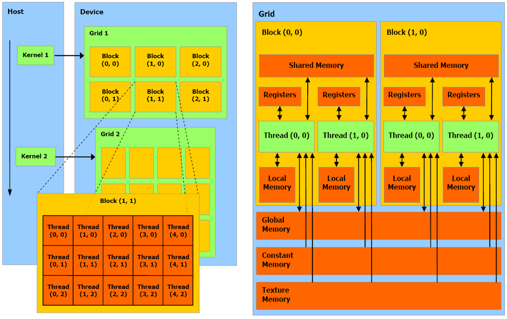

# WEEK #2

# 1. CPU와 GPU

CPU와 GPU의 가장 핵심적인 차이는 코어 수와 성능에 있다.

CPU와 다르게 GPU는 굉장히 많은 코어를 보유하지만, 고성능의 코어를 적게 사용하는 CPU와는 다르게 저성능의 코어를 대량으로 사용한다.

이는 설계 원칙의 차이에서 오는 것이다.

- CPU - 하나의 복잡한 일을 잘 처리
- GPU - 단순한 일을 병렬로 처리

GPU가 단순한 일을 병렬로 처리하는 구조인 이유는 GPU의 초기 목적인 그래픽 랜더링(수많은 픽셀을 동시에 처리)에 달려있다.

AI가 부상함에 따라서 AI 연산의 기반인 행렬과 텐서 연산과 같이 동일한 연산을 대량의 데이터에 반복 적용해야되는 구조에 적합하여 GPU의 중요도가 높아지고 있다. 

## 데이터 병렬성

데이터 병렬성은 같은 연산을 다른 데이터들에 동일하게 적용하는 것으로, FOR문을 예시로 들 수 있다.

CPU에게 FOR문을 통해 1부터 10000까지의 데이터에 대해 2씩 곱하게하면 순차적으로 하나씩 처리한다.

하지만 GPU는 병렬처리를 하기에 1부터 10000까지의 데이터를 수천개의 코어가 나누어 계산하게 되기에 CPU보다 압도적으로 빠르게 처리한다.

## 연속,규칙적인 메모리 접근

GPU는 메모리를 본인의 VRAM에서 Transaction이라는 묶음 단위로 가져오며 메모리의 접근 구조는 다음과 같다.

```jsx
VRAM (글로벌 메모리)
        ↓
   L2 Cache (오프칩)
        ↓
   L1 Cache / Shared Memory  (온칩)
        ↓
   Register (온칩)
        ↓
   Thread 실행
```

PCIe 터널을 경유해 RAM에 있는 데이터를 접근하는 것도 굉장히 많은 오버헤드를 가지지만, 그에 못지않게 오프칩에서 온칩으로 데이터를 가져오는 과정 또한 많은 오버헤드를 지닌다.
연속된 메모리가 아니라면 단 한 번의 Transaction으로 해결될 것이 수십 번의 Transaction으로 늘어나며, 이는 오프칩-온칩 구간의 병목을 더욱 심화시킨다.

## 지연시간 숨기기

CPU가 메모리로부터 가져오는 오버헤드를 줄이기위해 거대한 캐시 구조를 사용하듯, GPU도 VRAM으로부터 데이터를 온칩까지 가져오는데 막대한 오버헤드를 피하기 위해 워프 교체 방식을 사용한다.

SM내부에 워프가 여러 개 존재하며, A워프가 VRAM에 데이터를 요청하며 대기 상태에 돌입하는 순간 다른 워프가 본인의 일을 수행하는 형태로 동작한다.

이렇게된다면 외부에서 감지할 때 SM은 지속적으로 행동을 하고 있는 것으로 보이며 지연시간이 없는 것처럼 생각이 되어 지연시간 숨기기라고 부른다.

## 높은 메모리 대역폭

GPU는 수천 개의 코어가 동시에 데이터들을 요청하기에 메모리 대역폭이 커야한다.

CPU가 사용하는 대표적인 메모리 타입인 DDR5와 GPU가 사용하는 HBM3에는 위 이유로 큰 차이가 존재한다.

DDR5의 최대 대역폭은 멀티 채널 기준 약 100GB/s인 반면, HBM은 500GB/s을 아득히 초월한 수치를 지닌다.

# 2. GPU 메모리 구조



### 쓰레드 수준 메모리

쓰레드는 N개의 레지스터를 지닐 수 있다(1:N)

|  | Register | Local Memory |
| --- | --- | --- |
| 접근 | Thread 단독 | Thread 단독 |
| 위치 | On-chip (SM 내부) | Off-chip (GPU Device Memory) |
| 레이턴시 | ~1 cycle | ~500 cycle(전역메모리와 동일) |
| 크기 단위 | **32bit = 1개, 한계값 존재** | 쓰레드 당 최대 512KB |
| 쓰임새 | 커널 내부 지역변수 | Thread가 필요로 하는 레지스터 > SM 실제 레지스터일 때 초과분 저장 |

### 블록 수준 메모리

|  | Shared Memory | L1 캐시 |
| --- | --- | --- |
| 접근 | Block 내 Thread 간 공유 | Block 내 Thread 간 공유 |
| 위치 | On-chip (SM 내부) | On-chip (SM 내부) |
| 레이턴시 | ~5 cycle | ~5 cycle |
| 크기 | A100: SM당 최대 164KB / H100: SM당 최대 228KB | Hopper 기준 최대 256KB (L1 + Shared Memory 통합)인 Unified Data Cache에서 Shared Memory를 뺀 값 |
| 쓰임새 | Block 내 Thread들이 공통으로 자주 쓰는 데이터, 사람이 직접 컨트롤 | 전역 메모리에서 자주 쓰는 데이터, 하드웨어가 자동 관리 |

### 그리드 수준 메모리

|  | 전역 메모리 | 상수 메모리 | 텍스처 메모리 | L2 캐시 |
| --- | --- | --- | --- | --- |
| 접근 | 전체 Thread | 전체 Thread (읽기 전용) | 전체 Thread (읽기 전용) | 전체 Thread |
| 위치 | Off-chip (GPU Device Memory) | Off-chip (GPU Device Memory) + 전용 Constant Cache On-chip | Off-chip (GPU Device Memory) + 전용 Texture Cache On-chip | On-chip |
| 레이턴시 | ~500 cycle (가장 느림) | 캐시 히트 달성 시에 빠름 | 캐시 히트 달성 시에 빠름 | 전역 메모리보다 빠름 |
| 크기 | H100: 80GB / H200: 141GB
**가장 큼!** | 64KB (Constant Cache: 8KB) | 가변 (Hopper 기준 28KB~256KB) | H100 기준 50MB |
| 쓰임새 | CUDA 프로그램의 기본 데이터 저장, Host CPU에서 접근 가능 | 커널 실행 전 선언, 실행 중 읽기 전용인 상수값 | GPU 본래 기능인 그래픽스 연산  | 전역 메모리와 SM 사이에 존재하여 모든 SM이 공유, 하드웨어가 자동 관리 |

# 3. GPU 하드웨어 실행 단위


### 쓰레드

gpu 내 최소 실행 단위, 각 쓰레드는 고유한 N개의 레지스터와 데이터 상태를 지님.

### Warp

32개의 쓰레드로 구성, gpu내 하나의 실제 실행 단위, warp내부 쓰레드들은 동일한 작업을 수행

### 쓰레드 블록

한 SM위에서 실행되는 쓰레드 집합을 의미, 동일한 쓰레드 블록 내의 쓰레드들은 공유 메모리를 통하여 데이터 공유 가능

### 쓰레드 블록 클러스터

쓰레드 블록들을 실제 물리적으로 가까운 블록들끼리 배치시켜 서로 다른 쓰레드 블록끼리의 데이터 접근을 가능케하고 속도 향상을 가져옴

### 그리드

하나의 CUDA Kernal Launch를 구성하는 모든 쓰레드 블록들의 집합. 

커널 실행 → 그리드 생성

# 4. GPU 내부 동작 흐름

데이터 준비 → 그리드 결정(일을 몇 개의 블록으로 나눌까?) →블록 분할(쓰레드 블록에 몇 개의 쓰레드 둘까?) → SM 할당 → Warp 실행

# 5. 헷갈려서 정리한 부분

CPU랑 GPU의 차이가 머리에서 그림으로 잘 안그려져서 한 번 간략하게 정리해뒀습니다.

### CPU와 GPU의 차이점이 담긴 아키텍처


CPU와 GPU의 설계 철학이 담긴 그림

CPU : 레이턴시 최적화(하나의 복잡한 작업을 빠르게!)

GPU : 처리량 최적화(많은 작업을 동시에!)

- CPU : 컨트롤 로직이 크고 캐시 계층이 두터움
- GPU : 코어 수가 굉장히 많음. 컨트롤 로직이 단순하고 여러 개의 코어가 공유

참고

https://www.linkedin.com/pulse/cpu-vs-gpu-understanding-architecture-daniel-attali-lo6hf/

https://blog.damavis.com/en/cuda-tutorial-blocks-and-grids/

https://cuda-programming.blogspot.com/2013/01/thread-and-block-heuristics-in-cuda.html