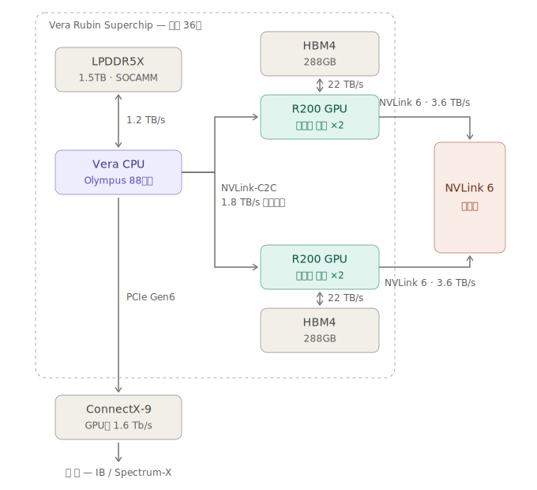
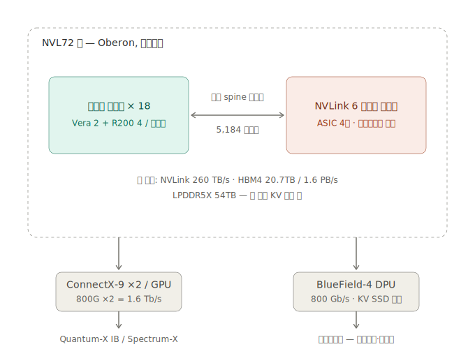
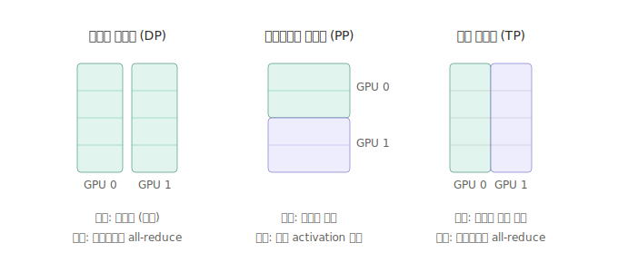
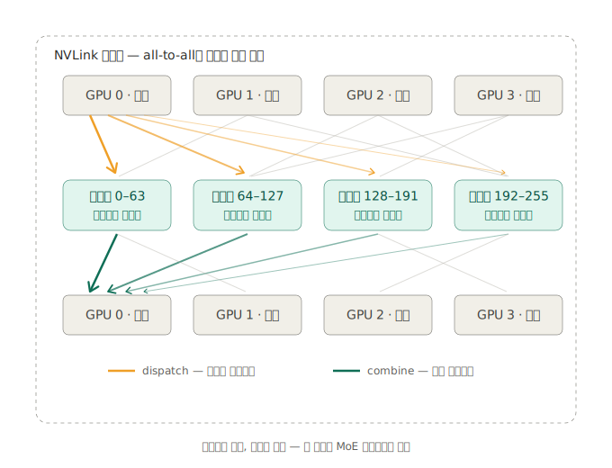

# GPU 톺아보기 스터디 Week#4 : Vera Rubin 아키텍처와 Scale-up 패브릭

## 01. 들어가며 — H100 세대의 한계

REF.
- https://developer.nvidia.com/blog/inside-the-nvidia-rubin-platform-six-new-chips-one-ai-supercomputer/
- https://blogs.nvidia.co.kr/blog/rubin-platform-ai-supercomputer/

H100 세대 듀얼 소켓 GPU 서버(HPE XD670, HGX 계열 — Week#3에서 다룸)는 다음 전제 위에 서 있다.

- CPU(x86)가 토폴로지의 중심이며, GPU·NIC은 PCIe 트리에 매달린 주변장치다.
- Host Memory ↔ GPU Memory 간 데이터 이동의 기본 통로는 PCIe다.
- 성능 분기점은 소켓 간 NUMA 경계(UPI)이며, `nvidia-smi topo -m`의 PIX/PXB/NODE/SYS가 이를 표현한다.

2026년 하반기 출하 예정인 NVIDIA Vera Rubin 플랫폼은 이 전제를 모두 재편한다. "서버 한 대"라는 단위가 트레이/랙으로 바뀌고, CPU↔GPU 본선에서 PCIe가 빠지며, NUMA 경계는 "소켓 간"에서 "NVLink 도메인 안 vs 밖"으로 이동한다.

## 02. Vera Rubin 플랫폼 개요

### 02.01. 구성 단위와 수량

- **Superchip** : Vera CPU 1개 + R200 GPU 2개를 한 패키지에 NVLink-C2C로 묶은 단위
- **컴퓨트 트레이** : Superchip 2개 (= Vera 2 + R200 4)
- **랙 (NVL72)** : 컴퓨트 트레이 18개 = Superchip 36개 = GPU 패키지 72개 = 레티클 다이 144개

| 구성요소 | 사양 |
|---|---|
| Vera CPU | 커스텀 ARM "Olympus" 88코어 / SMT-X 176스레드 |
| Vera 메모리 | LPDDR5X (SOCAMM) 최대 1.5TB, 1.2 TB/s |
| R200 GPU | 레티클 한계 다이 2개, NVFP4 50 PFLOPS |
| GPU 메모리 | HBM4 288GB, ~22 TB/s |
| 랙 합산 | NVFP4 추론 3.6 EFLOPS / 학습 2.5 EFLOPS, HBM4 20.7TB (1.6 PB/s), LPDDR5X 54TB |

### 02.02. NVL72 vs NVL144 — 네이밍 주의

- GB200 NVL72와 VR200의 GPU **패키지 수는 72개로 동일**하다.
- Rubin 세대부터 NVL 숫자를 패키지가 아닌 **레티클 다이 기준**으로 세겠다고 발표(GTC25)했다가, CES 2026에서는 다시 NVL72 명칭을 사용. 자료마다 NVL144 / NVL72가 혼용되므로 "다이 144 = 패키지 72"로 읽으면 된다.
- Blackwell도 패키지당 다이 2개였으나 소급 개명하지 않았다.

## 03. 링크 분류 — 선마다 역할이 다르다

H100 세대의 PCIe 트리는 제어와 데이터가 한 통로를 공유했다. Rubin에서는 통로가 목적별로 분화된다.

| 링크 | 연결 | 대역폭 | 역할 |
|---|---|---|---|
| 메모리 버스 | Vera ↔ LPDDR5X | 1.2 TB/s | CPU 로컬 메모리 |
| NVLink-C2C (2세대) | Vera ↔ R200 | 1.8 TB/s | 코히런트, 단일 주소 공간 |
| HBM4 | R200 온패키지 | ~22 TB/s | GPU 로컬 메모리 |
| NVLink 6 | GPU ↔ GPU (랙 내) | GPU당 3.6 TB/s 양방향 | Scale-up 패브릭 |
| PCIe Gen6 | Vera ↔ ConnectX-9 | x16 기준 ~128 GB/s | NIC/스토리지 attach |
| CX9 → IB/Ethernet | 랙 ↔ 랙 | GPU당 1.6 Tb/s (800G ×2) | Scale-out |



### 03.01. 메모리 버스 (CPU ↔ LPDDR5X)

- DDR5 대신 모바일 계열 LPDDR5X를 SOCAMM 모듈로 채택. 대역폭 1.2 TB/s.
- 채택 이유는 전력 — LPDDR5X 서브시스템 전체 30W 미만 vs DDR5 등가 구성 100W+ (NVIDIA 공개 수치).

### 03.02. NVLink-C2C (CPU ↔ GPU)

- 1.8 TB/s 코히런트 링크. Grace 세대(900GB/s) 대비 2배, PCIe Gen6 대비 약 7배.
- CPU의 LPDDR5X와 GPU의 HBM4가 **하나의 코히런트 주소 공간**으로 묶인다.
- 활용: KV 캐시를 CPU측 대용량 DRAM에 두고 필요 시 스트리밍(KV-cache offload), 멀티모델 실행.
- H100 세대의 "Host ↔ GPU 메모리 이동은 PCIe 경유"가 이 링크로 대체되는 지점.

### 03.03. HBM4 (GPU 온패키지)

- GPU 패키지당 288GB / ~22 TB/s. 링크라기보다 패키지 내 배선.
- 주의: HBM은 **GPU별 로컬 메모리**다. GPU0은 GPU5의 HBM을 자기 메모리처럼 읽을 수 없고, NVLink를 타야 한다(3.6 TB/s). 자기 HBM(22 TB/s)과의 격차가 GPU 스케일의 NUMA locality다.

### 03.04. NVLink 6 (GPU ↔ GPU, scale-up)

- GPU의 NVLink 6 칩렛에 커스텀 400G SerDes **36개** 탑재 → GPU당 양방향 3.6 TB/s.
- 랙 내 72개 GPU 패키지(144 다이)가 전부 all-to-all 패브릭으로 연결. 합산 260 TB/s.

### 03.05. PCIe Gen6 (NIC attach)

- PCIe가 사라진 것은 아니다. Rubin은 Vera와 C2C로 붙고, Vera가 PCIe Gen6 레인으로 ConnectX-9에 연결된다 (SemiAnalysis).
- 역할이 "CPU↔GPU 본선"에서 "NIC/스토리지 attach"로 축소되었다고 이해하면 정확하다.

## 04. 랙 레벨 구조



### 04.01. 트레이 구성

- 컴퓨트 트레이 18개 (트레이당 Vera 2 + R200 4) + NVLink 6 스위치 트레이.
- 케이블리스 모듈러 트레이 설계로 부품 교체 시간 단축, NVLink 무중단 유지보수 등 RAS 강화.
- 전체 액체냉각.

### 04.02. 구리 Spine

- 랙 등뼈를 따라 GPU ↔ 스위치를 직결하는 **수동(passive) 구리 케이블 5,184개**. 리타이머·트랜시버 없는 순수 구리선.
- 구리인 이유: 랙 내 거리(1~2m)는 구리로 충분하며, 광으로 가면 링크마다 트랜시버가 붙어 전력·비용·고장률이 급증한다. → 설계 원칙: **scale-up은 구리, scale-out은 광**.
- NVLink 6의 핵심 설계 제약은 Blackwell Oberon 랙 spine의 **재사용**. 같은 도체 수로 대역폭 2배를 내기 위해 케이블이 아니라 양 끝 SerDes 속도를 2배(400G)로 올렸다. 랙 인프라·공급망을 유지한 채 세대 전환.
- 구리가 닿는 거리 = NVLink 도메인의 물리적 한계.

### 04.03. NVLink 6 스위치와 In-network 연산

- 스위치 트레이당 NVLink ASIC 4개 (NVL72 세대 2개에서 증가). 트레이당 28.8 TB/s.
- 트레이당 **FP8 14.4 TFLOPS의 인네트워크 연산** — all-reduce 같은 집합 연산 일부를 GPU 대신 스위치에서 1회 처리 (NVLink SHARP 계열). 스위치를 단순 패스스루가 아니라 연산 노드로 봐야 한다.
- 스위치 트레이도 액체냉각 필수.

### 04.04. Scale-out — ConnectX-9와 BlueField-4

- **ConnectX-9** : GPU당 800G ×2 = 1.6 Tb/s. 랙 간 백엔드(학습 트래픽), Quantum-X InfiniBand / Spectrum-X Ethernet으로 연결. rail 구성.
- **BlueField-4** : 800 Gb/s DPU. Vera CPU 2개와 짝지어 프런트엔드(스토리지·관리·서빙 인입) 담당. KV 캐시 저장용 SSD 내장.
- 즉 망 자체가 백엔드/프런트엔드로 분리된다.
- SuperPOD = NVL72 랙 8개 + Spectrum-6 / Quantum 스위치(co-packaged optics).

## 05. H100 세대와의 비교 — 무엇이 바뀌었나

| 항목 | H100 세대 (x86 듀얼 소켓 HGX) | Vera Rubin |
|---|---|---|
| 토폴로지 중심 | CPU + PCIe 트리 | NVLink 패브릭 |
| CPU↔GPU 본선 | PCIe (Gen5 x16, ~50GB/s 실효) | NVLink-C2C 1.8 TB/s 코히런트 |
| 메모리 모델 | Host/GPU 메모리 분리, cudaMemcpy | 단일 코히런트 주소 공간 |
| NUMA 경계 | 소켓 간 (UPI) | NVLink 도메인 안 vs 밖 |
| NVLink 도메인 | GPU 8개 (서버 1대) | GPU 72개 (랙 1대) |
| PCIe 역할 | 제어 + 데이터 본선 | NIC/스토리지 attach |
| 단위 | 서버 (노드) | 트레이 / 랙 |

- locality 개념 자체는 살아 있다. Superchip마다 LPDDR + HBM을 가지므로 사실상 NUMA node 36개짜리 시스템이며, remote 접근 페널티를 UPI 대신 NVLink 패브릭이 흡수한다. `nvidia-smi topo -m`을 읽는 훈련은 그대로 유효하다 — 라벨 체계가 바뀔 뿐이다.

## 06. 왜 "MoE에 필수"인가

NVIDIA 공식 자료의 "MoE 모델에 필수적인 GPU 간 통신"이라는 문구의 배경. 병렬화 기법의 통신 구조에서 따라 나온다.

### 06.01. Dense 모델 분할 — DP / PP / TP

모델이 GPU 한 장에 들어가지 않거나 한 장으로는 느릴 때 사용하는 분할 전략. 기준 예시: 모든 레이어가 `Y = X·W` (X = 액티베이션, W = 가중치 행렬)인 4-레이어 모델, GPU 2장. 세 기법의 차이는 절단 방향이며, 수학적 결과는 동일하다.



1. **DP (Data Parallel)** — 데이터를 분할
    1. 두 GPU 모두 W 전체를 보유. 배치를 분할 (GPU0: 샘플 1~512, GPU1: 513~1024).
    2. Forward/Backward는 각자 독립 수행. 통신 없음.
    3. 각 GPU의 ∂L/∂W는 자기 샘플 기준 값이라 서로 다름. `grad = (grad₀ + grad₁) / 2` 평균(all-reduce) 후 동일하게 업데이트해야 두 복제본이 일치 유지됨.
    4. 합쳐지는 것 = 그라디언트, 시점 = 스텝당 1회. 레이어 N의 grad는 backward가 레이어 N-1을 계산하는 동안 전송 가능 → 통신을 연산 뒤에 숨길 수 있음(overlap). 느린 링크(IB)로 충분한 이유.
    5. 전제: 모델이 GPU 한 장에 적재 가능해야 함.
2. **PP (Pipeline Parallel)** — 레이어 묶음을 분할
    1. GPU0: 레이어 1~2, GPU1: 레이어 3~4.
    2. Forward: GPU0이 `h = L2(L1(X))` 계산 후 h 텐서를 GPU1로 전달, GPU1이 `Y = L4(L3(h))` 수행. Backward는 역방향으로 ∂L/∂h 전달.
    3. 합치는 연산 없음. 점대점 액티베이션 전달뿐이라 통신 부담 최소.
    4. 약점: 전달 후 앞 GPU가 유휴 상태(bubble). 마이크로배치로 파이프라인을 채워 완화.
3. **TP (Tensor Parallel)** — 레이어 내부 행렬을 분할
    1. 한 레이어의 W 자체를 분할. 블록 행렬 곱:

```
Y = X·W = [X_A | X_B] · [W_A]  =  X_A·W_A + X_B·W_B
                        [W_B]
```

    2. GPU0: `X_A·W_A`, GPU1: `X_B·W_B`. 각 결과는 부분합(partial sum) — Y와 shape은 같으나 절반의 기여분이므로 단독으로는 틀린 값.
    3. 실제 Y = 두 부분합의 원소별 덧셈 → all-reduce(sum) 필수. **합산이 끝나기 전에는 다음 레이어의 입력이 존재하지 않음.**
    4. 레이어마다 발생하며 숨길 수 없음(임계 경로).

핵심 구분 기준 — 합치기가 막는 단위:

| 기법 | 합쳐지는 것 | 못 합치면 막히는 단위 | 결과 |
|---|---|---|---|
| DP | 그라디언트 평균 (스텝 끝 1회) | 다음 **스텝** | overlap 가능 → IB로 충분 |
| PP | 없음 (액티베이션 전달) | 다음 GPU의 시작 | 통신량 최소, 대신 bubble |
| TP | 부분합 덧셈 (레이어마다) | 다음 **레이어** | 숨길 수 없음 → 최고속 링크 필수 |

- 통신 요구: **TP ≫ PP > DP**
- 실전 3D 배치: TP는 NVLink 안(전통적으로 8), PP는 인접 노드 간, DP는 최외곽 IB. 통신이 빡센 축일수록 빠른 링크에 배정.

### 06.02. EP — 분할 기법이 아닌, MoE 구조가 강제하는 배치

EP(Expert Parallel)는 06.01의 세 기법과 층위가 다르다.

- DP/PP/TP : dense 모델이라는 동일 대상을 자르는 세 방향. 순수 시스템 레벨 분할 전략.
- EP : 모델 아키텍처 변경(MoE)이 선행된 결과. MoE는 "FFN을 전문가 N개로 복제하고 라우터가 토큰마다 top-k개만 활성화"하는 모델 설계이며, EP는 그 독립적인 전문가들을 GPU에 분산 배치하는 방식. dense 모델에는 자를 전문가가 없으므로 EP가 성립하지 않음.
- 통신의 성격 차이: DP/TP의 all-reduce = 모든 GPU가 같은 값을 갖기 위한 수학적 합산. EP의 all-to-all = 합산이 아닌 **라우팅** (토큰을 해당 전문가에게 배달·회수하는 물류).

동작 (전문가 256개를 GPU 4장에 64개씩 배치, EP=4):

1. **Dispatch (배달)** — attention을 마친 토큰이 MoE 레이어에 도착하면 라우터가 전문가를 배정 (예: 전문가 137번 → 가중치는 GPU2의 HBM에 존재). 수 GB의 가중치 대신 KB 단위의 토큰 액티베이션이 GPU2로 이동. **가중치는 고정, 토큰이 이동** — EP가 성립하는 전제.
2. **Expert 연산** — 도착한 토큰을 해당 GPU의 전문가 가중치로 처리.
3. **Combine (회수)** — 처리된 토큰을 원래 GPU로 반환. 다음 attention 레이어가 시퀀스 순서를 요구하기 때문.



모든 GPU가 동시에 배달/회수를 수행하므로 모든 쌍 사이에 트래픽 발생 = all-to-all. MoE 레이어마다 왕복 ×2.

- **불규칙** : GPU별 토큰 수가 라우터 출력에 따라 매 배치 변동. 고정 패턴 최적화 곤란, 토큰 쏠림(load imbalance) 시 핫스팟 발생.
- **임계 경로** : dispatch 완료 후 expert 연산, combine 완료 후 다음 레이어. TP의 all-reduce처럼 "완료 전에는 다음 단계의 입력이 존재하지 않는" 통신 → 숨길 수 없고 레이턴시가 스텝 타임에 직결.
- 메시지가 GPU 쌍 단위로 잘게 분할되므로 대역폭 외에 링크 레이턴시·메시지 오버헤드에도 민감.

NVLink 도메인 크기와의 관계:

- Dense의 랙 내 통신(TP)은 ~8 GPU에서 한계효용 감소 (행렬 조각이 작아져 연산 효율 하락). DP는 overlap이 되므로 IB로 충분. → dense에게 72-GPU 도메인은 과투자.
- EP는 통신 성격이 TP급(임계 경로)이면서 degree는 8에서 멈추지 않고 전문가 수만큼 확장을 요구. 도메인이 넓을수록 끝까지 이득.
- H100 세대: NVLink 도메인 8 GPU → EP 확장 시 즉시 IB로 추락. GB200/VR200: 랙 전체 72 GPU가 한 도메인 → EP=72까지 all-to-all 전체가 3.6 TB/s 패브릭 위에서 처리.
- 결론: NVLink 도메인 로드맵 8 → 72 → 576(Rubin Ultra)은 **"TP급 통신을 72-way로" 라는 EP의 요구에 맞춘 설계**. MoE 전용 하드웨어가 아니라 MoE를 타겟으로 한 범용 패브릭 확장.

