# GPU 스터디 4주차 배포용 노트: AI 워크로드 네트워크

## Index
1. [AI Workload Network](#1-ai-workload-network)
2. [AI 워크로드에서 네트워크가 중요한 이유](#2-ai-워크로드에서-네트워크가-중요한-이유)
3. [GPU 서버 내부 통신과 서버 간 통신의 차이](#3-gpu-서버-내부-통신과-서버-간-통신의-차이)
4. [RDMA: CPU를 덜 거치고 메모리 사이를 직접 잇는 모델](#4-rdma-cpu를-덜-거치고-메모리-사이를-직접-잇는-모델)
5. [InfiniBand](#5-infiniband)
6. [RoCE/RoCEv2: Ethernet 위의 RDMA](#6-rocerocev2-ethernet-위의-rdma)
7. [NCCL과 collective communication](#7-nccl과-collective-communication)
8. [Collective별 데이터 흐름](#8-collective별-데이터-흐름)
9. [현대 AI fabric 사례: MRC와 AWS EFA](#9-현대-ai-fabric-사례-mrc와-aws-efa)
10. [정리 및 핵심 요약](#10-정리-및-핵심-요약)

---

## 1. AI Workload Network

GPU 한 장은 자기 계산을 빠르게 끝낼 수 있지만, 여러 GPU가 하나의 모델을 같이 학습하려면 중간중간 각 노드가 계산한 조각의 결과를 서로 맞춰야 한다. 한 rank의 통신 지연은 전체 step을 지연시킨다.

AI 워크로드 네트워크의 동작은 계층적으로 동작한다. (아래의 다이어그램 참고)
- PyTorch나 Megatron 같은 프레임워크가 직접 AI 워크로드 네트워크의 packet을 만들지 않는다.
- 1) 프레임워크가 collective를 요청
- 2) NCCL 같은 통신 런타임이 GPU와 네트워크 토폴로지를 보고 실행 경로 선택
- 3) RDMA verbs, libfabric provider, InfiniBand, RoCE, EFA 같은 경로가 실제 전송 담당

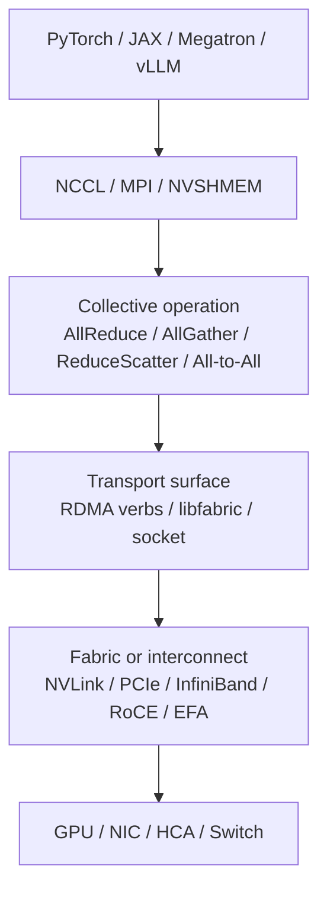

```text
Framework
  -> communication runtime
  -> collective operation
  -> transport API or provider
  -> fabric / interconnect
  -> GPU, NIC, HCA, switch
```


| 층         | 핵심 질문                            | 대표 용어                                            |
| --------- | -------------------------------- | ------------------------------------------------ |
| 프레임워크     | 어느 rank들이 같이 학습하거나 추론하는가         | DDP, FSDP, tensor parallel, expert parallel      |
| 통신 런타임    | 어떤 collective를 어떤 알고리즘으로 실행할 것인가 | NCCL, MPI, NVSHMEM                               |
| 데이터 이동 모델 | CPU와 커널 복사를 얼마나 줄일 수 있는가         | RDMA, GPUDirect RDMA, libfabric                  |
| Fabric    | 실제 packet이 어떤 네트워크 위를 지나가는가      | InfiniBand, RoCEv2, EFA, Ethernet                |
| 운영 검증     | 느림·hang·loss가 어느 층에서 생겼는가        | `NCCL_DEBUG`, `fi_info`, GID, PFC, ECN, QP state |

> [!note] 층을 나누는 이유
> "AllReduce가 느리다"는 증상은 하나지만 원인은 여러 층에 있을 수 있다. rank 배치가 틀렸을 수도 있고, NCCL이 잘못된 NIC를 골랐을 수도 있고, RoCE fabric에서 PFC/ECN이 맞지 않을 수도 있다. 층을 나누면 디버깅 질문도 같이 나뉜다.

---

## 2. AI 워크로드에서 네트워크가 중요한 이유

### 2.1. GPU를 늘리면 계산만 늘어나는 것이 아니다.

단일 GPU에서 학습할 때는 대부분의 시간이 GPU 내부 계산과 메모리 이동에 쓰인다. 하지만 여러 GPU로 나누는 순간, 각 GPU는 자기 몫을 계산한 뒤 다른 GPU와 중간 결과를 맞춰야 한다. 데이터 병렬 학습에서는 gradient를 합쳐야 하고, tensor parallel에서는 layer 안의 activation이나 partial result를 주고받아야 하며, MoE에서는 token을 expert가 있는 rank로 보내야 한다.

다음은 간단한 데이터 병렬 학습 Step 다이어그램이다.
- (참고) [Forward / Backward / Gradient 이해를 돕기 위한 Youtube 영상](https://youtu.be/kFDvDPj6D4U?si=elFOCxKIAZSH_jrW)

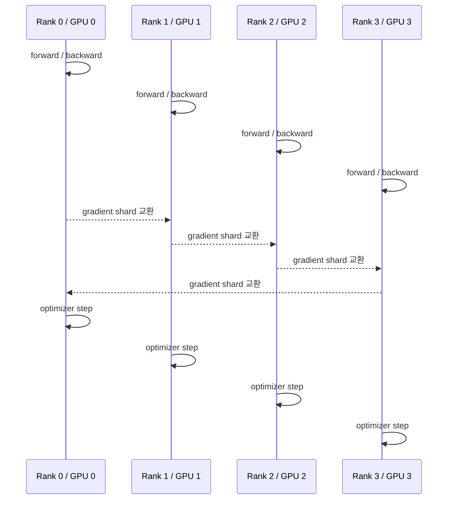

```text
각 rank가 계산한다
  -> gradient / activation / token을 서로 교환한다
  -> 모든 rank가 필요한 데이터를 받는다
  -> 다음 step으로 넘어간다
```

여기서 한 rank가 늦으면 나머지 rank도 기다린다. AI 학습은 많은 경우 동기식(synchronous)으로 움직이기 때문이다. 평균 대역폭이 좋아도 tail latency가 길면 step time이 흔들리고, step time이 흔들리면 비싼 GPU가 기다리는 시간이 늘어난다. 

##### 기존 네트워크 방식이 AI 워크로드에 부적절한 이유

기존 데이터센터 네트워크는 주로 north-south 트래픽, 즉 사용자 요청이 서버로 들어가고 결과가 나가는 패턴에 맞춰 설명되는 경우가 많았다. 

AI 학습 클러스터는 다르다. 같은 rack 또는 cluster 안의 GPU 서버들이 서로 계속 데이터를 교환한다. east-west 트래픽이 크고, burst가 동기적으로 몰리며, 특정 collective 구간에서는 모든 rank가 비슷한 시점에 네트워크를 통한다.

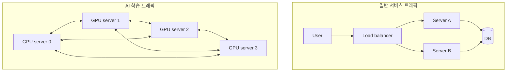

| 구분      | 일반적인 애플리케이션 네트워크            | AI 학습·추론 네트워크                    |
| ------- | --------------------------- | -------------------------------- |
| 주된 방향   | 사용자 ↔ 서버, north-south       | 서버 ↔ 서버, GPU ↔ GPU, east-west    |
| 트래픽 모양  | 요청마다 비교적 독립적                | step 경계에서 동기식 burst              |
| 지연 민감도  | 일부 요청이 늦어도 전체 서비스는 계속 진행 가능 | 한 rank가 늦으면 전체 step이 늦어짐         |
| CPU 역할  | 네트워크 stack 처리 가능            | CPU copy와 kernel path가 병목이 되기 쉬움 |
| 네트워크 목표 | 연결성, 처리량, 장애 격리             | 낮은 지연, 높은 대역폭, 낮은 tail, 경로 예측성   |

특히 전통적인 TCP/IP 경로에서는 데이터가 애플리케이션 메모리, 커널 버퍼, NIC 버퍼를 오가며 복사될 수 있다. 

> [!warning] Gb/s와 GB/s 혼동
> - 네트워크 장비 스펙은 보통 **Gb/s**(기가비트)로, GPU 메모리와 tensor 이동량은 **GB/s**(기가바이트)로 표기되는 경우가 많다. 둘은 8배 차이다. 
> - `400Gb/s` NIC는 단순 환산으로 약 `50GB/s`이고, `900GB/s` NVLink는 `7,200Gb/s`에 해당한다. 대역폭 계산을 시작하기 전에 모든 값을 같은 단위로 통일해야 한다.

### 2.2. 네트워크 병목은 GPU idle time으로 보인다

AI 클러스터에서 네트워크 문제는 "네트워크가 느립니다"라는 로그로만 보이지 않는다. 더 자주 보이는 증상은 GPU utilization이 출렁이는 것이다.

모델이 커지고 GPU 수가 늘수록 각 GPU의 계산량은 나뉘지만, 동기화 비용은 사라지지 않는다. 그래서 대규모 학습에서는 "GPU를 더 넣었는데 왜 선형으로 빨라지지 않는가"라는 질문이 네트워크 질문으로 바뀐다.

---

## 3. GPU 서버 내부 통신과 서버 간 통신의 차이

**GPU끼리 데이터를 주고받는다고 해서 모두 같은 네트워크를 타는 것은 아니다.** 
- (GPU 서버 내부) 같은 서버 안의 GPU는 NVLink, NVSwitch, PCIe 등의 경로를 사용할 수 있다. 
- (GPU 서버 간) 다른 서버와 데이터를 주고 받으려면 NIC 또는 HCA를 거쳐 InfiniBand, RoCE, EFA 같은 fabric을 통해야 한다.

```mermaid
flowchart LR
    subgraph NodeA[GPU 서버 A]
        A0[GPU 0]
        A1[GPU 1]
        A2[GPU 2]
        HCAA[HCA / NIC]
        A0 <-->|NVLink / NVSwitch / PCIe| A1
        A1 <-->|NVLink / NVSwitch / PCIe| A2
        A2 <-->|PCIe / GPUDirect RDMA| HCAA
    end

    subgraph Fabric[서버 간 fabric]
        SW[IB switch / Ethernet switch / EFA network]
    end

    subgraph NodeB[GPU 서버 B]
        HCAB[HCA / NIC]
        B0[GPU 0]
        B1[GPU 1]
        HCAB <-->|PCIe / GPUDirect RDMA| B0
        B0 <-->|NVLink / NVSwitch / PCIe| B1
    end

    HCAA <-->|InfiniBand / RoCE / EFA| SW
    SW <-->|InfiniBand / RoCE / EFA| HCAB
```

```text
서버 내부: GPU -> NVLink/NVSwitch/PCIe -> GPU
서버 간:  GPU -> PCIe -> NIC/HCA -> fabric -> NIC/HCA -> PCIe -> GPU
```

### 3.1. 내부 통신: NVLink, NVSwitch, PCIe, shared memory

서버 내부 통신은 다음 경로 중 하나를 통한다.

| 경로       | 내용                               | 직관                 |
| -------- | -------------------------------- | ------------------ |
| NVLink   | GPU와 GPU를 고대역폭으로 직접 연결           | GPU끼리 가까운 전용 통로    |
| NVSwitch | 여러 GPU의 NVLink를 switch처럼 연결      | 서버 내부 GPU fabric   |
| PCIe P2P | PCIe topology상 GPU끼리 직접 접근 가능할 때 | 같은 서버 안의 범용 I/O 경로 |

### 3.2. 서버 간 통신: NIC/HCA와 Fabric

서버 내부를 넘어 다른 서버의 GPU와의 통신은 네트워크 문제가 된다. NIC 또는 HCA가 필요하고, Fabric switch도 필요하며, 주소·경로·혼잡 제어·재전송·Flow control를 잘 수행해야 한다.

GPU 서버 간 통신 시 다음 사항들이 중요하다.

1. GPU memory에서 NIC/HCA까지 데이터가 어떻게 이동하는가.
2. NIC/HCA가 CPU를 거치지 않고 데이터를 읽고 쓸 수 있는가.
3. fabric은 loss, congestion, path imbalance를 어떻게 다루는가.
4. NCCL이 실제로 기대한 network path를 골랐는가.

### 3.3. AI 네트워크 Scale-up과 Scale-out, 그리고 네트워크 아키텍처

GPU 통신을 키우는 방향은 크게 두 가지다.

1. (Scale-Up) 서버 한 대나 Rack-scale 안에서 GPU를 더 촘촘히 잇거나, 대역폭 키우기.
2. (Scale-Out) 여러 서버를 Fabric으로 묶어 더 큰 클러스터를 만들기.

일반적인 GPU 클러스터의 Fabric은 Leaf-Spine으로 구성된 Fat-Tree 계열의 모양을 갖는다. 
Leaf switch는 GPU 서버와 가깝고, Spine switch는 여러 leaf를 묶어 서로 다른 GPU 노드 간 경로를 만든다.


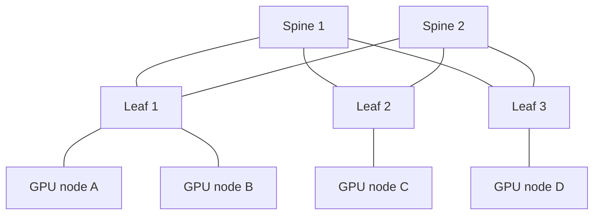

네트워크 아키텍처 설계 시 주요 고려사항

1. **bisection bandwidth**
	1. 클러스터를 상하로 나눴을 때(Leaf 기준 위아래), 나눈 부분들의 총 대역폭이 다르다면 All-to-All처럼 전체로 퍼지는 트래픽에서 병목이 발생한다.
2. **GPU-NIC/rail locality**
	1. GPU local index, NIC, leaf 또는 rail 배치가 잘 맞으면 불필요한 PCIe/NUMA hop과 Cross-rail 이동을 줄일 수 있다. 
	2. 반대로 Locality가 어긋나면 같은 링크 속도와 같은 NCCL 호출에서도 성능이 눈에 띄게 떨어질 수 있다.

> [!note] 내부 통신 vs 서버 간 통신을 나누는 이유
> 같은 AllReduce라도 8 GPU 단일 서버에서는 대부분 NVLink/NVSwitch가 중요할 수 있고, 64 서버 학습에서는 InfiniBand/RoCE/EFA fabric이 중요해진다. 그래서 성능 문제를 볼 때 "NCCL이 느리다"에서 멈추지 말고, 내부 경로와 외부 경로를 분리해서 봐야 한다.

---

## 4. RDMA: CPU를 덜 거치고 메모리 사이를 직접 잇는 모델

### 4.1. RDMA는 protocol 이름 하나가 아니다

RDMA(Remote Direct Memory Access)는 원격 시스템의 메모리에 직접 접근해 데이터를 읽거나 쓰는 통신 모델이다. 핵심은 CPU와 kernel copy를 통신 과정에서 최대한 제거하는 것이다.

==CPU가 모든 packet을 만들고 복사하는 대신, 애플리케이션은 등록된 메모리와 work request를 준비하고 NIC/HCA가 실제 데이터 이동을 수행한다.

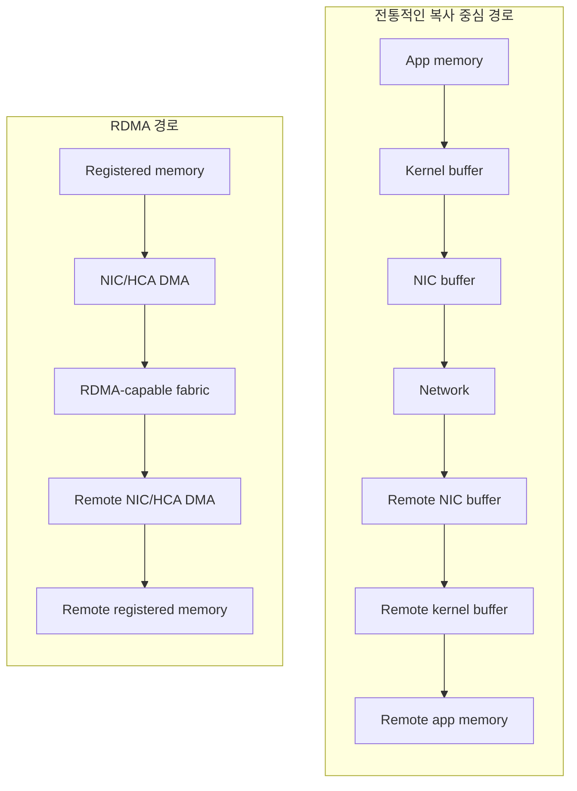

```text
전통적인 복사 중심 경로(단순화)

App memory
  -> kernel buffer
  -> NIC buffer
  -> network
  -> remote NIC buffer
  -> remote kernel buffer
  -> remote app memory

RDMA 경로(단순화)

Registered memory
  -> NIC/HCA가 직접 읽거나 씀
  -> network fabric
  -> remote registered memory
```

### 4.2. RDMA 관련 주요 용어

| 객체  | 의미                   | 설명                                          |
| --- | -------------------- | ------------------------------------------- |
| PD  | Protection Domain    | 어떤 QP와 MR이 서로 접근 가능한지 묶는 보호 범위              |
| MR  | Memory Region        | NIC/HCA가 접근할 수 있도록 등록한 메모리                  |
| QP  | Queue Pair           | 통신 endpoint. Send Queue와 Receive Queue를 가진다 |
| SQ  | Send Queue           | 보낼 work request를 올리는 큐                      |
| RQ  | Receive Queue        | 받을 buffer를 미리 올리는 큐                         |
| CQ  | Completion Queue     | 작업 완료 결과가 쌓이는 큐                             |
| WR  | Work Request         | "이 데이터를 보내라/읽어라/써라"라는 작업 지시                 |
| WC  | Work Completion      | WR 처리 결과                                    |
| HCA | Host Channel Adapter | InfiniBand/RDMA에서 통신을 처리하는 장치               |

### 4.3. RDMA verbs 흐름

RDMA verbs는 애플리케이션이 NIC/HCA에게 일을 맡기는 API 표면이다. 아주 단순화하면 흐름은 다음과 같다.

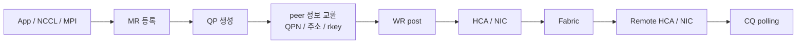

```text
메모리 등록 -> QP 생성 -> peer 정보 교환 -> WR post
  -> HCA/NIC가 전송 -> remote HCA/NIC 처리 -> CQ에서 완료 확인
```

주요 내용
1. 메모리 내 NIC/HCA를 위한 영역을 지정해야만 NIC/HCA가 안전하게 접근할 수 있다.
2. 작업을 올린 뒤 완료는 CQ에서 확인한다. 
	1. 즉 "보내기 함수 호출이 끝났다"와 "네트워크 작업이 끝났다"를 구분해야 한다.

---

## 5. InfiniBand

### 5.1. InfiniBand는 RDMA 그 자체가 아니다.

InfiniBand는 HPC/AI 용 고속의 Connection 을 위한 protocol 을 의미한다. 낮은 지연과 높은 대역폭을 제공하는 전용 고성능 Fabric이기에 주로 대규모 학습 클러스터에서 자주 등장한다.

InfiniBand와 RDMA는 구분해야 한다.

- RDMA는 원격 메모리 접근 모델이다.
- InfiniBand는 RDMA를 낮은 지연과 높은 대역폭으로 실어 나르기 좋은 프로토콜 및 경로다.
- InfiniBand Fabric에는 데이터 전송뿐 아니라 관리·주소·경로 설정을 위한 Control plane도 있다.


### 5.2. InfiniBand fabric의 구성 요소

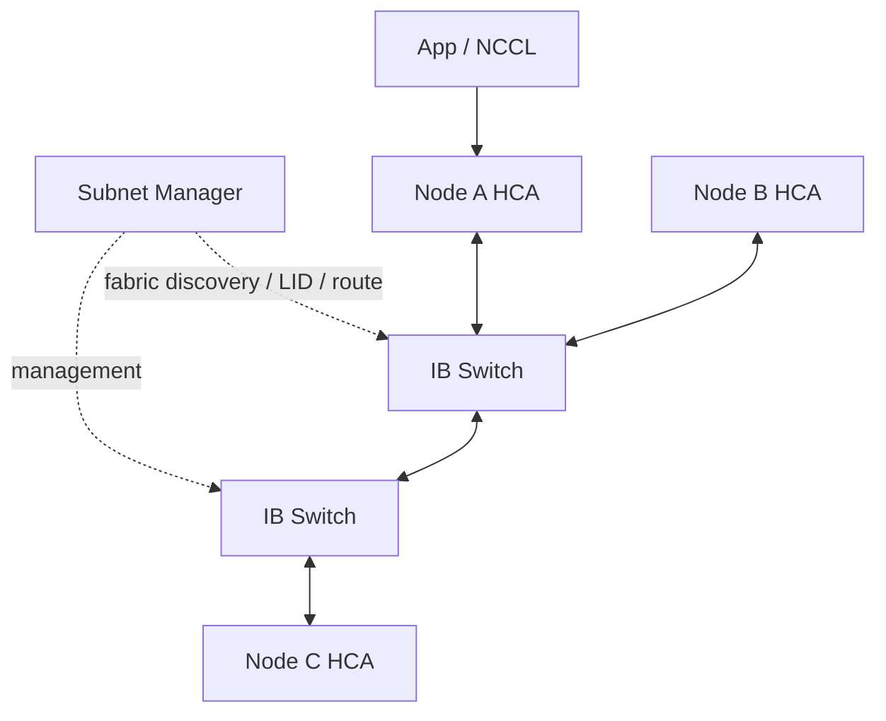

| 구성 요소          | 역할                                          |
| -------------- | ------------------------------------------- |
| HCA            | 서버의 InfiniBand endpoint. QP와 MR 기반 전송을 처리한다 |
| IB switch      | InfiniBand fabric 안에서 packet을 전달한다          |
| Subnet Manager | fabric의 노드 발견, 주소 배정, route 구성을 담당한다        |
| LID/GID        | fabric 안에서 endpoint를 식별하는 주소 정보             |

NDR InfiniBand 400Gb/s를 예시로 들면, 400Gb/s는 단순 환산하면 약 50GB/s지만, 실제 collective 성능은 link 수, rail 구성, message size, HCA/GPU locality, fabric congestion에 따라 달라진다. 

따라서 InfiniBand를 도입했다는 사실보다 "각 GPU가 어느 HCA와 얼마나 가까운가"와 "collective traffic이 fabric 전체에 어떻게 퍼지는가"가 더 중요하다.

---

## 6. RoCE/RoCEv2: Ethernet 위의 RDMA

### 6.1. RoCE는 "그냥 Ethernet"이 아니다

RoCE(RDMA over Converged Ethernet)는 RDMA semantics를 Ethernet 위에서 제공하는 방식이다.

##### InfiniBand와 RoCEv2의 차이

| 항목        | InfiniBand         | RoCEv2                                                   |
| --------- | ------------------ | -------------------------------------------------------- |
| Fabric 성격 | 전용 switched fabric | Ethernet/IP fabric                                       |
| 관리 모델     | Subnet Manager 중심  | Ethernet/L3 운영 모델 중심                                     |
| 주소        | LID/GID            | GID, IP, UDP encapsulation                               |
| API 표면    | RDMA verbs         | RDMA verbs API를 그대로 쓰지만 주소·경로 조건이 Ethernet/IP 모델에 맞춰 달라짐 |

##### RoCEv2 packet

RoCEv2는 RDMA operation을 IP layer 3 환경에서 전달하기 위해 UDP/IP encapsulation을 사용한다. well-known UDP destination port는 4791이다. 운영자가 packet capture나 ACL, QoS rule을 볼 때 이 사실이 중요해진다.

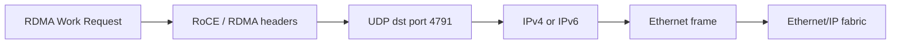


---

## 7. NCCL과 collective communication

### 7.1. NCCL은 어디에 있는가

PyTorch가 "다 같이 gradient를 맞춰"라고 말하면, NCCL은 실제로 어느 GPU가 누구와 어떤 순서로 데이터를 주고받을지 정하는 진행 요원에 가깝다. NCCL은 여러 GPU가 동시에 참여하는 통신 약속을 실제 하드웨어 경로에 맞춰 실행하는 런타임이다.

NCCL(NVIDIA Collective Communications Library)은 GPU 간 통신 기본 동작을 제공하는 라이브러리다. NVIDIA NCCL overview는 NCCL이 topology-aware inter-GPU communication 기본 동작를 제공하며, inter-GPU communication을 가속하는 라이브러리라고 설명한다.

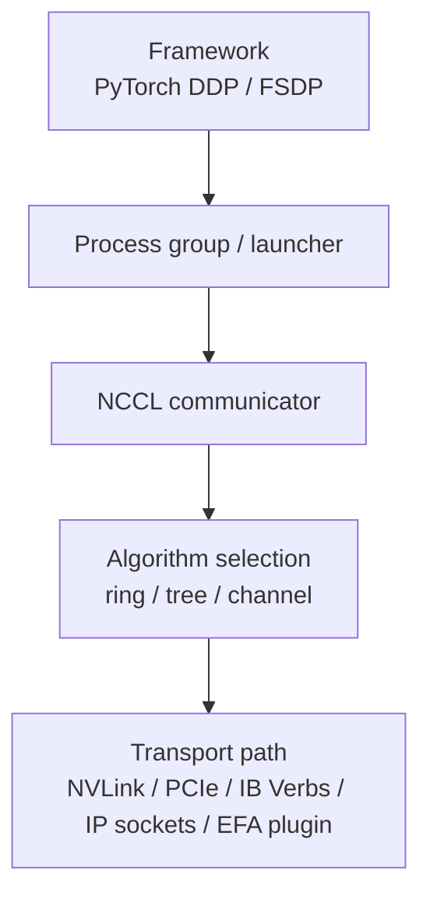

### 7.2. NCCL communicator와 transport 선택

NCCL은 다음 일을 한다.

- 여러 GPU/rank가 참여하는 collective operation을 실행한다.
- GPU와 NIC topology를 보고 경로를 고른다.
- 메시지 크기와 topology에 따라 ring, tree, channel 같은 실행 방식을 선택할 수 있다.
- CUDA stream과 통합되어 GPU 작업 흐름에 맞춰 통신을 수행한다.

### 7.3. collective communication 

Collective communication은 여러 rank가 함께 호출해야 완성되는 통신이다. Collective는 "rank 하나가 마음대로 보내는 함수"가 아니다. 모든 참여 노드가 같은 Operation에 있어야 한다.

```text
Rank 0: ncclAllReduce(... count=N, dtype=float16 ...)
Rank 1: ncclAllReduce(... count=N, dtype=float16 ...)
Rank 2: ncclAllReduce(... count=N, dtype=float16 ...)
Rank 3: ncclAllReduce(... count=N, dtype=float16 ...)

모두 같은 collective에 들어와야 전체 operation이 완성된다.
```

### 7.4. Collective를 Traffic Shape로 이해하기

| Collective    | 설명                               | 주요 사용 워크로드                                    |
| ------------- | -------------------------------- | --------------------------------------------- |
| AllReduce     | 모든 rank의 값을 reduce하고 결과를 모두에게 준다 | data parallel gradient sync                   |
| AllGather     | 각 rank의 조각을 모아 모두에게 준다           | tensor/model parallel 결과 조립                   |
| ReduceScatter | reduce 결과를 rank별 조각로 나눠 준다       | optimizer state sharding, FSDP/ZeRO 계열        |
| All-to-All    | 각 rank가 모든 rank에 서로 다른 조각을 보낸다   | MoE expert dispatch, sequence/expert parallel |

- `All`은 모든 rank가 결과를 받는다는 의미.
- `Reduce`는 합계·최댓값 같은 연산으로 합친다는 의미
- `Gather`는 조각을 모은다는 의미
- `Scatter`는 나눠 준다는 의미

실제 대규모 학습은 각 패턴을 섞는다. 
- 예를 들어 거대 LLM은 tensor parallel, pipeline parallel, data parallel을 동시에 쓰고 FSDP나 expert parallel을 추가하기도 한다. 
- 그러면 한 step 안에서 AllReduce, AllGather, ReduceScatter, All-to-All, Send/Recv가 서로 다른 rank group에서 함께 나타난다.

---

## 8. Collective별 데이터 흐름

### 8.1. AllReduce

AllReduce는 모든 rank의 값을 reduce한 뒤, 같은 결과를 모든 rank가 받는다. 

```text
입력
R0: [a0]
R1: [a1]
R2: [a2]
R3: [a3]

sum AllReduce 결과
R0: [a0+a1+a2+a3]
R1: [a0+a1+a2+a3]
R2: [a0+a1+a2+a3]
R3: [a0+a1+a2+a3]
```

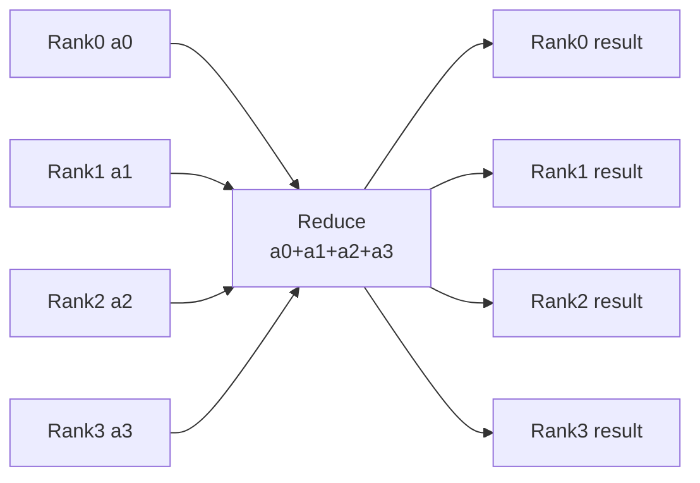

데이터 병렬 학습에서는 각 GPU가 자기 mini-batch로 gradient를 계산한 뒤, AllReduce로 전체 gradient 합 또는 평균을 맞춘다. 그래서 AllReduce는 분산 학습에서 가장 자주 만나는 collective다.

### 8.2. AllGather

AllGather는 각 rank의 조각을 모아, 모인 전체를 모든 rank에게 준다.

```text
입력
R0: [x0]
R1: [x1]
R2: [x2]
R3: [x3]

AllGather 결과
R0: [x0 x1 x2 x3]
R1: [x0 x1 x2 x3]
R2: [x0 x1 x2 x3]
R3: [x0 x1 x2 x3]
```

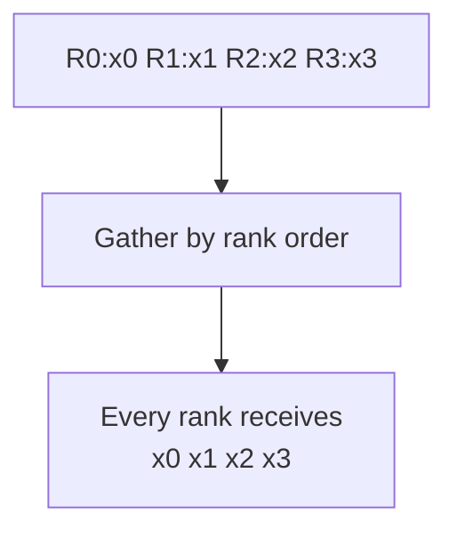

AllGather는 shard된 tensor 조각을 다시 모을 때 자주 등장한다. 단, 결과 buffer 크기가 rank 수에 비례해 커지므로 메모리와 대역폭 비용을 함께 봐야 한다.

### 8.3. All-to-All

All-to-All은 각 rank가 모든 rank에게 서로 다른 조각을 보내고, 모든 rank가 모든 rank로부터 자기에게 온 조각을 받는 패턴이다.

```text
입력: 각 rank가 목적지별 조각을 갖고 있다.

R0: [to0:a0  to1:a1  to2:a2  to3:a3]
R1: [to0:b0  to1:b1  to2:b2  to3:b3]
R2: [to0:c0  to1:c1  to2:c2  to3:c3]
R3: [to0:d0  to1:d1  to2:d2  to3:d3]

All-to-All 결과
R0: [a0 b0 c0 d0]
R1: [a1 b1 c1 d1]
R2: [a2 b2 c2 d2]
R3: [a3 b3 c3 d3]
```

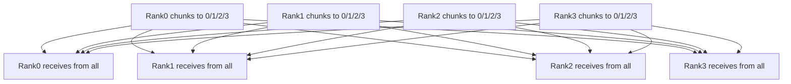

All-to-All은 MoE에서 특히 중요하다. token을 담당 expert가 있는 rank로 보내고, 계산이 끝난 뒤 다시 원래 위치로 모아야 하기 때문이다. AllReduce보다 패턴이 더 복잡하고, 네트워크 경로가 많이 벌어지므로 fabric 설계 영향을 크게 받는다.

### 8.4. Ring AllReduce를 흐름으로 보기

AllReduce를 구현하는 방법은 여러 가지지만, ring 방식은 직관을 잡기 좋다. 큰 메시지를 여러 chunk로 나누고, rank들이 ring을 따라 chunk를 주고받으며 reduce-scatter phase와 all-gather phase를 수행한다.

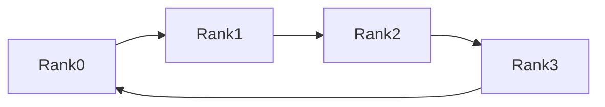

```text
Ring AllReduce의 큰 흐름

1단계 ReduceScatter
R0 -> R1 -> R2 -> R3 -> R0 방향으로 chunk를 돌리며 같은 shard를 reduce한다.
각 rank는 reduce된 shard 하나를 갖게 된다.

2단계 AllGather
reduce된 shard를 다시 ring으로 돌려 모든 rank가 전체 결과를 갖게 한다.
```

일반적으로 ring은 대역폭을 잘 채우기 좋고, tree는 작은 메시지나 지연 민감 구간에서 유리할 수 있다. 다만 실제 선택은 구현과 topology, 메시지 크기에 따라 달라진다. NCCL은 이런 선택을 사용자가 매번 손으로 구현하지 않도록 runtime 쪽에서 다룬다. 다만 runtime이 고른 경로가 실제 topology와 맞지 않으면 성능은 떨어질 수 있다.

---

### 9. 현대 AI fabric 사례: MRC와 AWS EFA

#### 9.1. MRC: 장애를 job failure가 아니라 throughput degradation으로 흡수하려는 흐름


#### 9.2. AWS EFA: cloud-specific high performance stack


---


### 10. 정리 및 핵심 요약

1. AI 워크로드에서 네트워크는 계산이 끝난 GPU들을 다음 step으로 보내기 위한 동기화 장치다. 한 rank의 지연은 전체 step time으로 커질 수 있다.
2. 대규모 GPU collective에서는 전통적인 TCP/IP 경로의 copy와 CPU/kernel path가 병목이 되기 쉽다.
3. GPU 서버 내부 통신은 NVLink/NVSwitch/PCIe가 중심이고, 서버 간 통신은 NIC/HCA와 InfiniBand/RoCE/EFA 같은 fabric이 중심이다.
4. RDMA는 CPU 개입과 copy를 줄이는 데이터 이동 모델이다. MR, QP, CQ, WR 같은 객체가 이 모델의 기본 언어다.
5. InfiniBand는 RDMA와 잘 맞는 channel-based switched fabric이며, AI/HPC에서는 전용 고성능 fabric처럼 배치되는 경우가 많다. Subnet Manager, LID/GID, MAD, QP lifecycle까지 포함해 봐야 한다.
6. RoCEv2는 Ethernet/IP 위에서 RDMA semantics를 제공한다. 같은 verbs surface를 보더라도 GID, MTU, PFC, ECN/DCQCN 같은 fabric contract가 맞아야 한다.
7. NCCL은 collective communication runtime이다. AllReduce, AllGather, ReduceScatter, All-to-All은 각각 다른 데이터 이동 모양이며, 어떤 collective가 많은지는 workload 병목을 크게 바꾼다.


> [!note] 스터디 후 스스로 점검할 질문
> - RDMA와 InfiniBand를 구분해서 설명할 수 있는가?
> - RoCEv2가 일반 Ethernet과 무엇이 다른지 말할 수 있는가?
> - AllReduce와 ReduceScatter의 결과 모양을 그림 없이 설명할 수 있는가?
> - NCCL이 느릴 때 fabric, topology, provider, rank placement 중 어느 층부터 확인할지 말할 수 있는가?
