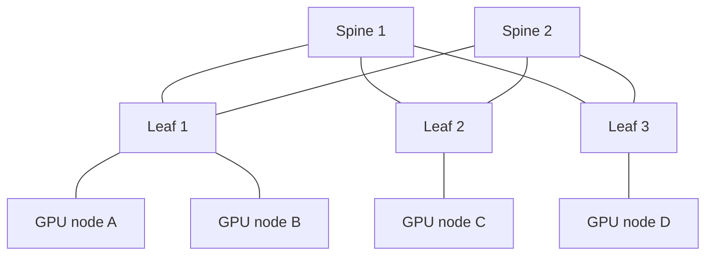
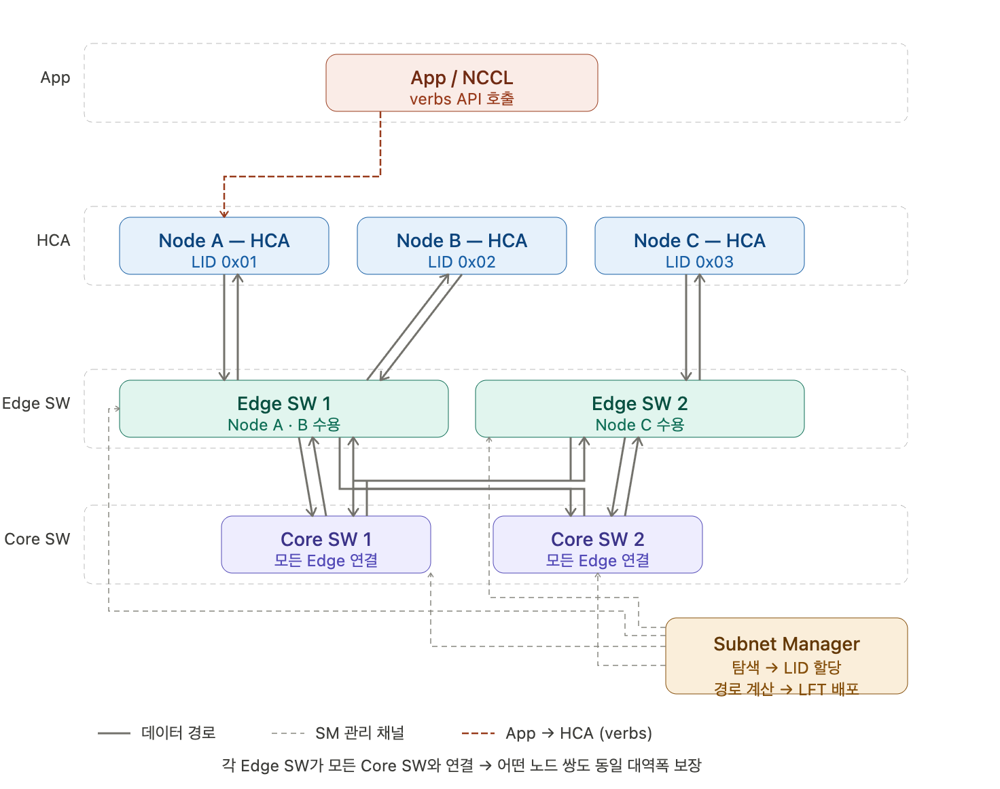
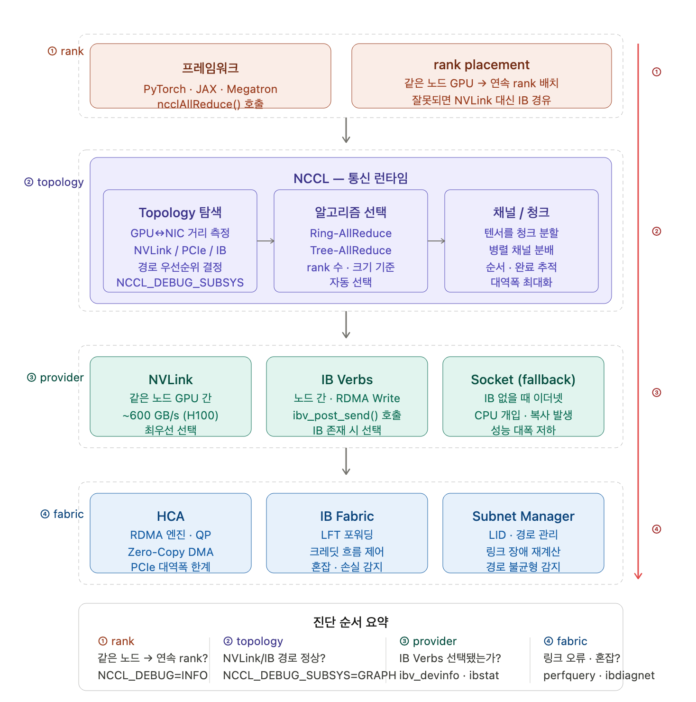

# Week 4: AI 워크로드 네트워크와 Collective Communication

---

### 개요

Week 3에서는 GPU 서버의 내부 구조를 살폈고, NUMA 아키텍처 내부의 통신 구조를 살펴보았다. GPUDirect RDMA는 GPU 메모리와 NIC 사이에서 CPU를 거치지 않고 데이터를 직접 이동시키는 기술이며, PIX 상태는 그 경로에서 GPU와 NIC이 같은 PCIe 도메인 안에 놓여 있어야 불필요한 hop이 줄어든다는 점이었다.

> 결국 GPU와 NIC의 통신이 높은 성능으로 연결되었는데, 이 기술이 어떤 방식으로 활용될 수 있을까?

이는 NIC를 통해 서버 내부의 통신을 넘어 **서버 간 통신**에서 강점이 발휘될 수 있다. 따라서 이번 주차는 서버 간의 통신에 대한 다음 내용을 다룬다.
- 여러 GPU 서버 간의 통신이 어떻게 이루어지는지
- 서버 간 통신에서 병목이 어떻게 발생하는지
- 병목을 해결하는 방식은 무엇인지

---

## 1. AI Workload Network

AI 워크로드 네트워크는 여러 계층으로 나뉜다. PyTorch 같은 프레임워크가 직접 네트워크 패킷을 만드는 것이 아니라, 각 계층이 역할을 나눠 맡는다.

```
프레임워크 (PyTorch / Megatron)        ← "이 GPU들이 함께 학습해야 해"
  → 통신 런타임 (NCCL)                 ← 어떤 방식으로 데이터를 주고받을지 결정
  → 데이터 이동 모델 (RDMA)             ← CPU를 얼마나 거치지 않고 보낼 수 있는가
  → Fabric (InfiniBand / RoCEv2)    ← 실제 데이터가 지나가는 네트워크
  → 하드웨어 (GPU / NIC / Switch)     ← 물리 장치
```

이 계층 구조를 나눠서 보는 이유는 **문제가 생겼을 때 어느 계층에서 생긴 건지 파악하기 위해서**다.

AllReduce가 느린 경우, GPU 배치, 네트워크 설정 등 많은 원인이 있을 수 있기 때문에 계층이 나뉘어 있어야 원인을 좁혀갈 수 있다.

4주차에서는 이 계층을 아래(Fabric)에서부터 위(프레임워크)로 올라가며 살핀다.

---

## 2. AI 워크로드에서 네트워크가 중요한 이유

모델이 커지면 GPU 한 장의 메모리만으로는 학습이 어려워진다. 그래서 여러 GPU에 나눠서 학습하게 된다. 나누는 방식은 크게 세 가지다.

| 방식 | 나누는 단위 | 통신 내용 |
|------|------------|-----------|
| Data Parallel | 데이터(mini-batch)를 GPU별로 나눔 | gradient를 모아서 평균 |
| Tensor Parallel | layer 안의 weight를 GPU별로 나눔 | 중간 계산 결과 교환 |
| Pipeline Parallel | layer를 GPU별로 나눔 | 앞 GPU의 결과를 뒷 GPU에 전달 |

어떤 방식이든 GPU들은 **중간에 반드시 서로 데이터를 주고받아야 한다**. 그 통신이 느리면 GPU 계산이 아무리 빨라도 전체 학습이 느려진다.

### 동기식 학습

AI 학습은 많은 경우 **동기식(synchronous)**으로 동작한다. 모든 GPU가 각자의 계산을 끝내고 데이터를 교환해야 다음 step으로 넘어갈 수 있다. 이때, 한 GPU가 느리면 나머지 GPU는 그 GPU를 기다리느라 쉬게 된다.

```
step N
  R0: [계산 완료] [대기 중] ← 빠름
  R1: [계산 중·····]        ← 느림
  R2: [계산 완료] [대기 중] ← 빠름
  R3: [계산 완료] [대기 중] ← 빠름
                ↑
       R1이 끝날 때까지 나머지 전부 idle
```

하나의 step은 이런 흐름으로 이루어진다.

```
각 rank가 계산한다
  → gradient / activation / token을 서로 교환한다
  → 모든 rank가 필요한 데이터를 받는다
  → 다음 step으로 넘어간다
```

여기서 주목할 점은 **평균 대역폭이 좋아도 한 rank가 늦으면 전체가 늦는다**는 것이다.

이 개념을 **tail latency**라고 한다. 평균이 빠르더라도 간헐적으로 특정 rank의 통신이 느려지는 순간이 생기면, 그 순간마다 다른 모든 rank가 기다려야 한다. step time이 한 번씩 튀게 되고, 그 시간 동안 GPU들이 유휴 상태가 된다.

### AI 클러스터의 학습

일반 서비스 네트워크는 사용자 요청이 서버로 들어가고 결과가 나가는 방향(north-south)이 주를 이룬다. 요청 하나가 늦어도 다른 요청은 독립적으로 처리된다.

하지만 AI 학습 클러스터는 GPU 서버들이 서로 끊임없이 데이터를 주고받는다(east-west). 게다가 모든 GPU가 비슷한 시점에 동시에 통신 구간에 진입하기 때문에 트래픽이 한꺼번에 몰린다.

| 구분 | 일반 서비스 네트워크 | AI 학습 네트워크 |
|------|---------------------|-----------------|
| 트래픽 방향 | 사용자 ↔ 서버 (north-south) | 서버 ↔ 서버 (east-west) |
| 하나가 늦으면 | 그 요청만 늦음 | 전체 step이 늦음 |
| 트래픽 패턴 | 요청마다 독립적 | step 경계마다 동시에 burst |

---

## 3. GPU 서버 내부 통신과 서버 간 통신은 경로가 다르다

GPU들이 통신한다고 해서 모두 같은 경로를 쓰는 것이 아니다. 다음과 같이 같은 서버인지, 다른 서버인지에 따라 통신 경로가 달라진다.

```
같은 서버 안:  GPU → NVLink / NVSwitch / PCIe → GPU
다른 서버 간:  GPU → PCIe → NIC/HCA → 네트워크 → NIC/HCA → PCIe → GPU
```

같은 서버 안이라면 NVLink가 매우 빠른 전용 통로 역할을 한다. 반면, 다른 서버와 통신하는 것은 네트워크 측면의 고려가 필요하다.

### 서버 간 네트워크: Leaf-Spine 구조

여러 GPU 서버를 묶는 클러스터 네트워크는 보통 **Leaf-Spine** 구조(Fat-Tree 계열)로 구성된다.

> Fat-Tree 계열 : 상층부로 갈수록 대역폭이 커지는 구조

- **Leaf 스위치**: GPU 서버와 직접 연결된다. 서버와 가장 가깝다.
- **Spine 스위치**: 여러 Leaf 스위치를 서로 연결한다. 다른 Leaf 아래의 서버끼리 통신할 때 거쳐 간다.



같은 Leaf 아래 서버끼리는 Leaf 스위치만 거치면 된다. 다른 Leaf 아래 서버끼리는 Leaf → Spine → Leaf를 거쳐야 한다.

**네트워크 설계의 핵심: Bisection Bandwidth**

클러스터를 위아래로 절반씩 나눴을 때, 두 그룹 사이를 연결하는 모든 링크를 통해 동시에 전송할 수 있는 총 대역폭을 **bisection bandwidth**라고 한다.

핵심은 이 경계의 대역폭이 **충분히 균형 잡혀 있는가**다. 아래쪽(GPU 서버 → Leaf)의 총 대역폭과 위쪽(Leaf → Spine)의 총 대역폭이 크게 차이 난다면, 서버들이 Leaf 경계를 넘어 통신할 때 병목이 생긴다.

All-to-All처럼 모든 서버가 모든 서버와 통신해야 하는 패턴에서 이 영향이 특히 크다. 각 링크 속도 자체는 빠르더라도 bisection bandwidth가 부족하면 전체 학습이 느려진다.

**GPU-NIC Locality와 Cross-rail 문제**

GPU 서버 안에서 GPU마다 가장 가까운 NIC이 정해져 있다. 따라서 GPU와 NIC 간의 locality도 중요하다.

locality가 잘 맞으면:
- GPU 데이터가 가장 가까운 NIC으로 바로 이동한다 (PCIe hop 최소)
- 같은 rail(Leaf 스위치)에 연결된 NIC끼리 통신하므로 Spine까지 올라갈 필요가 없다

locality가 어긋나면:
- GPU 데이터가 NUMA 경계를 넘어 먼 NIC으로 이동해야 한다 → 지연 증가
- 같은 rail이 아닌 다른 rail의 NIC으로 전달되면 **cross-rail 이동**이 생긴다 → Spine을 불필요하게 경유

> **cross-rail**: 데이터가 자기 rail(Leaf)을 벗어나 Spine을 거쳐 다른 rail로 이동하는 것. 불필요한 hop이 추가되어 지연이 늘어난다. 같은 링크 속도, 같은 NCCL 설정이라도 locality 배치가 어긋나면 성능이 눈에 띄게 떨어지는 원인이 된다.

> 같은 AllReduce라도 GPU 8장짜리 단일 서버에서는 NVLink가 핵심이고, 수십 대 서버 규모에서는 이 Leaf-Spine fabric이 핵심이 된다. "NCCL이 느리다"는 증상이 생겼을 때 서버 내부 문제인지, 서버 간 네트워크 문제인지를 먼저 구분해야 하는 이유다.

---

## 4. RDMA

### 기존 네트워크 경로의 문제

일반적인 네트워크 통신에서 데이터는 이런 경로를 거친다.

```
GPU 메모리
  → CPU가 복사
  → 커널 버퍼
  → NIC 버퍼
  → 네트워크
  → 상대방 NIC 버퍼
  → 커널 버퍼
  → GPU 메모리
```

데이터가 여러 번 복사되고, CPU가 중간에서 각 단계를 처리해야 한다. gradient처럼 용량이 큰 데이터를 step마다 빠르게 교환해야 하는 AI 학습에서는 이 복사 과정이 병목이 된다.

### RDMA란

RDMA(Remote Direct Memory Access)는 CPU를 최대한 배제하고 NIC이 직접 메모리에 접근해서 데이터를 보냄으로써 위 병목을 해결하는 방식이다.

```
등록된 메모리 영역
  → NIC이 직접 읽어서 전송
  → 상대방 NIC이 직접 받아서 메모리에 씀
```

CPU가 매번 복사하는 대신, NIC이 알아서 처리한다. CPU는 "이 데이터를 보내"라고 요청만 하고, 완료됐는지 나중에 확인하면 된다.

### RDMA의 핵심 개념

| 객체  | 의미                   | 설명                                          |
| --- | -------------------- | ------------------------------------------- |
| PD  | Protection Domain    | 어떤 QP와 MR이 서로 접근 가능한지 묶는 보호 범위              |
| **MR**  | Memory Region        | NIC/HCA가 접근할 수 있도록 등록한 메모리                  |
| **QP**  | Queue Pair           | 통신 endpoint. 두 노드 사이의 통신 연결 단위로, Send Queue와 Receive Queue를 가진다 |
| SQ  | Send Queue           | 보낼 work request를 올리는 큐                      |
| RQ  | Receive Queue        | 받을 buffer를 미리 올리는 큐                         |
| **CQ**  | Completion Queue     | 작업 완료 결과가 쌓이는 큐                             |
| **WR**  | Work Request         | NIC에 올리는 "이 데이터를 보내라/읽어라/써라"라는 작업 지시                 |
| WC  | Work Completion      | WR 처리 결과                                    |
| HCA | Host Channel Adapter | InfiniBand/RDMA에서 통신을 처리하는 네트워크 카드              |

통신은 NIC/HCA에게 작업을 위임하는 RDMA verbs라는 API로 동작하는데, 흐름은 다음과 같다.

```
메모리 영역 등록(MR) → 연결 생성(QP) → peer 정보 교환 → 작업 지시 올리기(WR) [보내기 작업 완료]
 → NIC/HCA가 전송 → remote NIC/HCA 처리 → 완료 확인(CQ) [네트워크 작업 완료]
```

---

## 5. InfiniBand

### 5.1. RDMA와 InfiniBand의 차이

- **RDMA**: CPU를 최대한 거치지 않고 메모리 간에 데이터를 직접 이동시키는 **방식(모델)**이다.
- **InfiniBand**: 이 RDMA를 빠르고 안정적으로 실어 나르기 위해 설계된 **전용 네트워크 기술**이다.

InfiniBand는 처음부터 HPC/AI처럼 낮은 지연과 높은 대역폭이 필요한 환경을 위해 만들어졌다.

### 5.2. InfiniBand의 구성 요소



1. NCCL이 collective operation을 호출하여 HCA와 Verbs API 사이를 연결한다.
2. HCA는 서버에 PCIe로 꽂히는 InfiniBand 전용 네트워크 카드이다.
    - **RDMA 엔진이 내장되어 CPU 개입 없이 메모리 간 직접 전송을 처리한다.**
3. Edge Switch(Leaf Switch) 스위치는 일반 이더넷 스위치와 다르게 Subnet Manager의 지시에 따라 미리 계산된 경로로만 패킷을 전달한다.
4. Core Switch는 여러 Edge Switch를 연결하여 Edge Switch 간 단일 연결을 방지하여 bisection bandwidth를 보장한다.
5. Subnet Manager는 Fabric 전체를 관리하는 소프트웨어이다.

> Subnet Manager가 특별한 이유 
>
> 앞서 설명했듯이, 일반 Ethernet 스위치는 MAC 주소를 보고 스스로 경로를 학습한다. InfiniBand는 다르다. Subnet Manager가 먼저 네트워크 전체를 파악하고, 각 노드에 주소를 배정하고, 경로를 설정해줘야 통신을 시작할 수 있다. 중앙에서 관리하는 만큼 경로를 제어하기 쉽지만, Subnet Manager가 없으면 아무것도 동작하지 않는다.

---

## 6. RoCE/RoCEv2: Ethernet 위의 RDMA

### InfiniBand의 한계

InfiniBand는 성능이 뛰어나지만 전용 스위치, 전용 케이블, 전용 HCA가 필요하다. 기존 Ethernet 인프라와 별도로 구축해야 해서 비용이 높다.

그래서 나온 아이디어가 RoCE(RDMA over Converged Ethernet)다. **이미 있는 Ethernet 위에서 RDMA를 사용**하는 것이다.

### RoCEv2의 구조

RoCEv2는 RDMA 데이터를 UDP/IP 패킷으로 감싸서 Ethernet 위로 보낸다.

```
RDMA 데이터
  → UDP (포트: 4791)로 감싸기
  → IP로 감싸기
  → Ethernet 프레임으로 감싸기
  → Ethernet 네트워크로 전송
```

애플리케이션 입장에서는 InfiniBand와 같은 RDMA 방식으로 쓸 수 있다.

---

## 7. NCCL과 Collective Communication

### 7.1. NCCL이 하는 일

지금까지 배운 InfiniBand, RoCEv2, RDMA는 "어떻게 데이터를 빠르게 보내는가"의 인프라 계층이다. 그런데 큰 관점에서 보면 결국, AI 학습에서 GPU들은 데이터를 보내는 것이 아닌, 여러 GPU가 함께 특정 계산을 수행하는 것이 가장 중요하다.

예를 들어 8개 GPU가 각자 gradient를 계산했다면, 이것들을 어떻게 합쳐야 할까? 누가 누구에게 어떤 순서로 보내야 전체 합계가 모든 GPU에 전달될까? 이걸 직접 구현하면 매우 복잡하다.

**NCCL(NVIDIA Collective Communications Library)**이 이 역할을 한다. NCCL은 GPU 간 통신을 추상화해주는 라이브러리이다. 딥러닝 프레임워크(PyTorch, JAX 등)에서 AllReduce, AllGather, Broadcast 같은 집합 통신(collective operation)을 호출하면, NCCL이 그 아래 InfiniBand 통신으로 변환한다.

### NCCL의 위치

섹션 1에서 정리한 계층 구조에서 NCCL은 프레임워크와 인프라 사이의 **통신 런타임** 계층을 담당한다. 프레임워크가 "이 rank들이 gradient를 맞춰야 해"라고 요청하면, NCCL이 GPU/NIC topology를 탐색해 실제 실행 경로와 알고리즘을 결정한다.



1. 토폴로지 탐색 - GPU와 NIC 사이의 물리적 거리를 측정
2. 알고리즘 선택 - rank 수와 데이터 크기를 보고 알고리즘을 선택
3. 채널과 청크 관리 - 하나의 큰 텐서를 여러 청크로 쪼개서 여러 채널에 병렬로 전달

### 7.3. Collective Communication이란

Collective communication은 **여러 GPU가 모두 참여해야 완성되는 통신**이다. 한 GPU만 호출해서는 아무 일도 일어나지 않는다. 참여하는 모든 GPU가 같은 명령에 들어와야 전체 작업이 실행된다.

---

## 8. Collective별 데이터 흐름

### Collective 종류

- `All` → 모든 GPU가 결과를 받는다
- `Reduce` → 여러 값을 하나로 합친다 (합계, 평균 등)
- `Gather` → 조각들을 모은다
- `Scatter` → 나눠 준다

| Collective | 하는 일 | 주로 쓰이는 곳 |
|-----------|---------|--------------|
| **AllReduce** | 모든 GPU의 값을 합쳐서 모든 GPU에 돌려준다 | Data Parallel 학습의 gradient 합산 |
| **AllGather** | 각 GPU의 조각을 모아서 모든 GPU에 전체를 준다 | Tensor Parallel 결과 조립 |
| **ReduceScatter** | 값을 합친 뒤 결과를 GPU별로 나눠 준다 | FSDP/ZeRO 메모리 최적화 |
| **All-to-All** | 각 GPU가 모든 GPU에 서로 다른 조각을 보낸다 | MoE에서 token을 expert GPU로 보낼 때 |

### AllReduce

Data Parallel 학습에서 가장 자주 만나는 collective다. 각 GPU가 자기 mini-batch로 gradient를 계산한 뒤, 전체 gradient의 합(또는 평균)을 모든 GPU가 갖게 한다.

```
입력                   AllReduce 결과
R0: [a0]         →    R0: [a0+a1+a2+a3]
R1: [a1]              R1: [a0+a1+a2+a3]
R2: [a2]              R2: [a0+a1+a2+a3]
R3: [a3]              R3: [a0+a1+a2+a3]
```

모든 GPU가 같은 결과를 갖기 때문에, 이후 모든 GPU가 동일하게 weight를 업데이트할 수 있다.

### AllGather와 ReduceScatter

weight를 여러 GPU에 나눠 저장하는 방식에서 등장한다.

- **AllGather**: 나눠 저장한 조각들을 모아서 전체를 복원할 때 사용한다. (합하는 것이 아닌, 모으는 것이다.)
- **ReduceScatter**: gradient를 합산한 뒤, 결과를 GPU별로 나눠 각자 담당하는 부분만 갖게 한다.

```
AllGather
R0: [x0]   →  R0: [x0, x1, x2, x3]
R1: [x1]      R1: [x0, x1, x2, x3]

ReduceScatter
R0: [g0]   →  R0: [합산 결과의 0번 조각]
R1: [g1]      R1: [합산 결과의 1번 조각]
```

### All-to-All

All-to-All은 각 rank가 모든 rank에게 서로 다른 조각을 보내고, 모든 rank가 모든 rank로부터 자기에게 온 조각을 받는 패턴이다.

```
R0: [R0행, R1행, R2행, R3행]    →    R0: [모든 GPU에서 온 R0 담당 조각]
R1: [R0행, R1행, R2행, R3행]         R1: [모든 GPU에서 온 R1 담당 조각]
...
```

통신 경로가 가장 많이 벌어지는 collective이기 때문에 네트워크 설계의 영향을 크게 받는다.

### Ring AllReduce

AllReduce를 구현하는 방법 중 하나다. GPU들이 ring 형태로 연결되어 chunk를 순환시키는 방식이다.

```
R0 → R1 → R2 → R3 → R0

1단계: 각 GPU가 자기 chunk를 옆 GPU로 보내며 reduce한다 (ReduceScatter)
2단계: reduce된 결과를 다시 ring으로 돌려 모든 GPU가 전체를 갖게 한다 (AllGather)
```

모든 링크가 고르게 사용되기 때문에 대역폭 낭비가 적다는 장점이 있다.

---

## 9. 현대 AI Fabric 사례

카카오페이 : 인피니밴드 및 GPUDirect 기반 AI 플랫폼

https://tech.kakaopay.com/post/ai-platform/#%EA%B7%B8-%EB%8B%B5%EC%9D%84-%ED%98%84%EC%8B%A4%EB%A1%9C-%EB%A7%8C%EB%93%9C%EB%8A%94-%EC%97%AC%EC%A0%95

---

## 정리

| 주제 | 핵심 한 줄 |
|------|-----------|
| AI 워크로드 네트워크 계층 | 프레임워크 → NCCL → RDMA → Fabric → 하드웨어 순서로 역할을 나눈다 |
| 왜 네트워크가 중요한가 | 동기식 학습에서 한 GPU가 느리면 전체 step이 느려진다 |
| 서버 내부 vs 서버 간 | 내부는 NVLink, 서버 간은 NIC/HCA와 외부 Fabric을 탄다 |
| RDMA | CPU 복사를 줄이고 NIC이 직접 메모리를 읽고 쓰는 방식 |
| InfiniBand | RDMA를 위한 전용 고성능 네트워크. Subnet Manager가 필수 |
| RoCEv2 | Ethernet 위의 RDMA. 더 저렴하지만 혼잡 제어를 직접 설정해야 함 |
| NCCL | GPU 토폴로지를 보고 collective communication을 최적으로 실행하는 라이브러리 |
| Collective | AllReduce(합산), AllGather(수집), ReduceScatter(분산), All-to-All(전체 교환) |

> [!note] 스터디 후 스스로 점검할 질문

> RDMA와 InfiniBand를 구분해서 설명할 수 있는가?
> RoCEv2가 일반 Ethernet과 무엇이 다른지 말할 수 있는가?
> AllReduce와 ReduceScatter의 결과 모양을 그림 없이 설명할 수 있는가?
> NCCL이 느릴 때 fabric, topology, provider, rank placement 중 어느 층부터 확인할지 말할 수 있는가?
