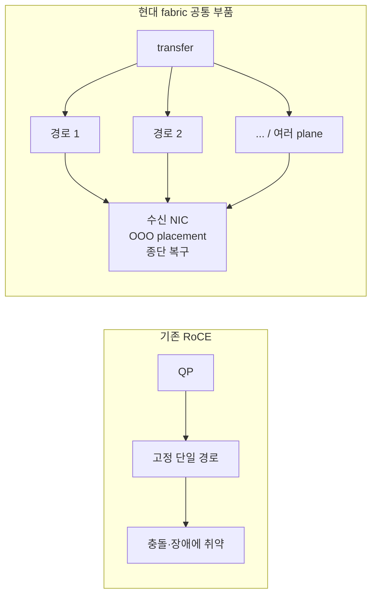

# GPU 스터디 배포용 노트: 현대 AI fabric — 장애를 흡수하는 transport (MRC와 AWS EFA)

## Index
1. [AI fabric은 왜 계속 다시 설계되는가](#1-ai-fabric은-왜-계속-다시-설계되는가)
2. [기존 RoCE 모델과 그 한계](#2-기존-roce-모델과-그-한계)
3. [현대 fabric의 접근: loss를 가정한다](#3-현대-fabric의-접근-loss를-가정한다)
4. [현대 fabric의 공통 빌딩블록](#4-현대-fabric의-공통-빌딩블록)
5. [사례 1 — AWS EFA / SRD](#5-사례-1--aws-efa--srd)
6. [사례 2 — MRC: Multipath Reliable Connection](#6-사례-2--mrc-multipath-reliable-connection)
7. [SRD와 MRC 비교](#7-srd와-mrc-비교)
8. [정리 및 핵심 요약](#8-정리-및-핵심-요약)

---

## 1. AI fabric은 왜 계속 다시 설계되는가

AI 학습 클러스터의 네트워크는 일반 데이터센터 네트워크와 요구 조건이 다르다. 핵심 차이는 두 가지다.

1. **동기식(synchronous)이다.** 여러 GPU가 한 step을 같이 진행하고, AllReduce 같은 collective에서 서로를 기다린다. 한 링크가 느리면 그 흐름만 느린 게 아니라 **전체 step이 같이 늦어진다.**
2. **worst-case에 민감하다.** collective는 가장 느린 경로(tail)에 발목이 잡힌다. 평균 대역폭이 좋아도 한 경로가 출렁이면 step time이 흔들린다.

```text
한 링크 지연
  -> 그 경로의 collective 조각이 늦게 도착
  -> 모든 rank가 그 조각을 기다림 (동기식)
  -> step 전체가 지연
  -> 비싼 GPU 수만 장이 idle
```

그래서 AI fabric 설계는 "평균을 빠르게"가 아니라 **"느린 경로와 장애를 어떻게 흡수하는가"**의 문제가 된다. 이 노트는 그 흐름의 최신 사례 두 가지 — **AWS EFA/SRD**와 **MRC** — 를 같은 축 위에서 정리한다.

---

## 2. 기존 RoCE 모델과 그 한계

두 사례를 이해하려면, 그것들이 무엇을 극복하려 했는지부터 봐야 한다. 출발점은 널리 쓰이는 **RoCE(RDMA over Converged Ethernet)** 모델이다. RoCE의 두 가지 전제가 곧 한계가 된다.

### 2.1. 전제 ①: 흐름을 단일 경로에 고정한다 (single-path)

RoCE의 기본 신뢰 연결(RC)은 **하나의 QP(통신 연결)를 하나의 ECMP 경로에 고정**한다. 패킷 순서를 지키기 위해서다. 그런데 이게 문제를 만든다.

> [!note] ECMP란
> **ECMP(Equal-Cost Multi-Path)**: 목적지까지 가는 길이 여러 개이고 그 길들의 비용(hop 수 등)이 같을 때, 트래픽을 그 여러 경로에 나눠 보내는 라우팅 기법이다. Fat-Tree에서 Spine 1을 거치든 Spine 2를 거치든 거리가 같으므로, 그 동등한 경로들을 함께 쓰는 게 ECMP다.
>
> 핵심은 **경로를 고르는 방식**이다. ECMP는 패킷을 아무 경로에나 뿌리지 않고, 패킷 헤더의 **5-tuple**(src IP, dst IP, src port, dst port, protocol)을 **해시(hash)**해 경로를 정한다.
>
> ```text
> hash(src IP, dst IP, src port, dst port, protocol) -> 경로 번호
> ```
>
> 그 결과:
> - **같은 흐름의 패킷은 항상 같은 경로로** 간다 (5-tuple이 같으니 해시값도 같음) → 순서가 안 깨진다.
> - **다른 흐름은 다른 경로로** 흩어진다 (5-tuple이 다르니 해시값도 다름).
>
> 즉 ECMP는 **"패킷 단위"가 아니라 "흐름 단위(per-flow)" 부하 분산**이다. **한 흐름은 통째로 한 경로에 묶이고, 분산은 흐름들 사이에서만 일어난다.** 이 per-flow 성질이 바로 아래 충돌의 원인이 된다.

- 두 AllReduce 흐름이 우연히 같은 출력 링크로 hash되면 대역폭이 떨어지는데, 이 충돌은 **스스로 풀리지 않는다(self-heal 안 됨).** 해시는 결정론적이라 다음 iteration도 같은 충돌을 반복한다.
- N-GPU collective는 대략 **O(N²)개의 QP**를 만든다. 클러스터가 커질수록 고정 경로들 사이의 hash 충돌은 사실상 불가피하다.

### 2.2. 전제 ②: PFC로 "lossless인 척" 만든다

RoCE의 RDMA는 패킷 손실에 매우 취약하다(전통적 go-back-N 재전송은 손실 한 번에 그 뒤를 통째로 다시 보낸다). 그래서 밑단 Ethernet을 **PFC(Priority Flow Control)**로 "패킷을 안 버리는 척"하는 lossless 네트워크로 만든다. PFC는 버퍼가 차기 직전 "멈춰(PAUSE)"를 보내 버림을 막는 backpressure 장치다.

이 "척"에는 대가가 따른다.

| 부작용 | 내용 |
| --- | --- |
| Head-of-line blocking | PFC는 흐름 하나가 아니라 우선순위 클래스 전체를 멈춰, 무관한 흐름까지 멈춘다 |
| Pause storm | 멈춤이 상류로 연쇄적으로 번진다 |
| PFC deadlock | 순환 의존이 생기면 서로 영영 못 푼다 |

### 2.3. 장애 시: blast radius

single-plane 구조에서 T0–T1 링크 하나만 flap(끊겼다 붙음)해도, 경로를 다시 계산하는 **BGP reconvergence가 수 초~수십 초** 걸린다. 동기식 학습에서는 그 1초가 AllReduce를 멈추고 **클러스터 전체 GPU가 fabric을 기다리게** 만든다. 최악의 경우 학습 job 자체가 실패한다.

> [!note] 2장 요약
> RoCE의 두 전제 — 단일 경로 고정 + PFC lossless — 가 (1) 풀리지 않는 경로 충돌, (2) PFC의 부작용, (3) 장애 시 긴 멈춤이라는 비용을 만든다. 다음 장의 사례들은 모두 이 비용을 줄이려는 시도다.

---

## 3. 현대 fabric의 접근: loss를 가정한다

현대 fabric은 RoCE의 두 전제를 반대로 둔다.

> **loss를 막으려 하지 말고, loss가 난다고 가정한다. 흐름을 단일 경로에 묶지 말고 여러 경로에 흩뿌린다. 신뢰성·순서·부하 분산을 네트워크 스위치(control plane)가 아니라 종단(endpoint, NIC)이 책임지게 한다.**

정리하면 세 가지가 달라진다.

| 기존 RoCE | 현대 fabric |
| --- | --- |
| loss를 막는다 (PFC lossless) | loss를 가정하고 빠르게 복구한다 |
| 흐름을 단일 경로에 고정한다 | 여러 경로에 packet을 흩뿌린다 |
| 스위치가 경로·혼잡을 똑똑하게 처리 | 스위치는 단순화, 지능은 NIC(종단)로 |

마지막 항목이 특히 중요하다. 스위치를 똑똑하게 만들면(동적 라우팅 등) 종단의 적응 메커니즘과 **서로 간섭**한다. 그래서 현대 fabric은 스위치를 의도적으로 단순(static)하게 두고, **부하 분산과 장애 처리를 전부 종단으로** 옮긴다.

---

## 4. 현대 fabric의 공통 빌딩블록

5·6장의 두 사례는 같은 부품들을 공유한다. 먼저 이 부품들을 정의해두면 사례가 빠르게 읽힌다.

1. **Packet spraying (다중 경로 분산)**
   하나의 transfer를 단일 경로에 보내지 않고, 여러 경로(그리고 여러 물리 plane)에 패킷 단위로 흩뿌린다. 한 경로가 느리거나 죽어도 전체가 둔감해진다.

   packet spraying은 2장 ECMP의 per-flow 한계를 푼다. ECMP는 흐름을 통째로 한 경로에 묶는 **per-flow** 분산이라 흐름끼리 충돌하면 풀리지 않았다. spraying은 흐름 하나를 쪼개 여러 경로에 뿌리는 **per-packet** 분산이다.

   | | ECMP | packet spraying |
   | --- | --- | --- |
   | 분산 단위 | 흐름 단위 (한 흐름 = 한 경로) | 패킷 단위 (한 흐름 → 여러 경로) |
   | 순서 | 자동 보존 | 깨짐 → **OOO placement 필요** |
   | 충돌 | 흐름 충돌 가능, self-heal 안 됨 | 흐름이 여러 경로에 퍼져 둔감 |

   spraying의 대가로 순서가 깨지기 때문에, 바로 아래 OOO placement가 항상 짝으로 따라온다.

2. **Out-of-order(OOO) placement**
   경로를 흩뿌리면 패킷이 순서 뒤섞여 도착한다. 이를 감당하려고 **각 패킷이 자신의 최종 메모리 주소를 들고 다닌다.** 수신 NIC는 도착하는 대로 그 주소에 직접 쓰고, 도착 순서는 무시한다.

   여기서 두 가지를 분리하는 게 핵심이다.
   - **메모리 배치**: 3,1,4,2 순서로 와도 각자 주소에 박히므로, 다 차면 메모리상으로는 올바른 순서가 된다. (페이지 번호 적힌 책장을 흩어 부쳐도 번호 보고 제자리에 꽂으면 완성되는 것과 같다.)
   - **완료 통보**: "전송 완료"는 **모든 조각이 도착해 빈 자리가 없을 때** 비로소 애플리케이션에 올린다. 그래서 앱 입장에선 "완료 = 메모리에 올바르게 다 채워짐"이 보장되고, 중간의 난잡한 도착 순서는 보이지 않는다.

   즉 순서는 "도착 순서"가 아니라 **"최종 메모리 배치 + 완료 시점"**으로 보장한다. RDMA가 메모리 직접 쓰기 모델이라(각 조각의 목적지 주소가 처음부터 정해짐) 가능한 방식이다. (SRD에서는 libfabric `FI_EP_RDM` endpoint가 이 reassembly를 맡아, 순서 없는 transport 위에 send-after-send 순서 보장을 얹는다.)

3. **Endpoint-driven reliability (종단 신뢰성)**
   손실·파손을 종단 NIC가 빠르게(sub-millisecond) 처리한다.
   - **파손(corruption)**: 패킷의 체크섬(CRC)이 안 맞으면 그 패킷을 버린다. 따라서 파손은 결국 **"유실"과 같은 문제로 환원**된다.
   - **유실 감지**: 각 패킷의 sequence number로 "몇 번이 비었는지"를 정확히 안다.
   - **selective retransmission**: 빠진 조각 그것만 다시 받아 제자리에 쓴다. 전통 RoCE의 go-back-N(손실 지점 뒤를 통째로 재전송)과 다른 점이다.
   - **packet trimming(MRC)**: 혼잡한 스위치가 패킷을 통째로 버리는 대신 payload만 잘라 **header(주소·번호)만 살려 보낸다.** 수신측이 "왔는데 알맹이가 없다 = 재전송 요청"을 버려졌을 때보다 훨씬 빨리 깨닫게 해, 유실 감지 지연을 줄인다.

4. **loss를 가정 (PFC 의존 축소/제거)**
   PFC로 lossless를 강제하지 않거나 아예 끈다. 대신 위의 종단 복구로 흡수한다.

5. **Multi-plane topology**
   NIC 하나를 여러 저속 포트(예: 8×100Gbps)로 쪼개 독립된 병렬 plane을 만든다. spraying이 흩뿌릴 경로 다양성을 물리적으로 확보한다.



### 4.1. per-packet 오버헤드 트레이드오프

위 방식은 비용이 있다. 패킷마다 **메타데이터(최종 메모리 주소, sequence number 등)를 더 싣고**, 종단 NIC가 **재조립·재전송 상태를 관리**해야 한다. 그런데도 이득인 이유는 세 가지다.

1. **헤더 오버헤드는 비율로 보면 작다.** AI 트래픽은 대부분 큰 메시지(수십 KB~MB collective)라 MTU를 꽉 채운 큰 패킷으로 쪼개진다. 패킷 payload(1500B, 점보 9000B) 대비 추가 메타데이터는 수~수십 바이트라 **1~2% 수준**이다. 단, **작은 메시지·짧은 거리에서는 이 고정 오버헤드 비율이 커진다** (5장 SRD의 T0-local 단문 지연에서 드러나는 부분).
2. **비교 대상이 더 비싸다.** 이 메타데이터가 대체한 것은 (a) PFC lossless 운영 비용(HOL blocking·deadlock·튜닝), (b) go-back-N의 BW×RTT 통째 재전송 낭비, (c) 장애 시 수 초의 BGP 멈춤이다. 패킷당 수십 바이트와 step 전체의 수 초 멈춤을 맞바꾸는 셈이다.
3. **비싼 부분은 HW로 내린다.** 재조립·selective 재전송·trimming은 CPU가 아니라 NIC/스위치 하드웨어가 처리한다(SRD는 Nitro 칩, MRC는 Spectrum-X/Arista가 packet trimming을 HW 가속). 종단 "지능"의 비용이 GPU 계산 경로를 갉아먹지 않는다.

> [!note] 핵심
> per-packet 오버헤드는 작고 예측 가능한 반면, 그게 없앤 비용(tail latency·장애 멈춤)은 크고 예측하기 어려웠다. AI fabric은 tail에 민감하므로(1장), 평균에 1~2%를 얹어 최악을 줄이는 쪽이 유리하다.

---

## 5. 사례 1 — AWS EFA / SRD

### 5.1. EFA란

**EFA(Elastic Fabric Adapter)**는 AWS EC2용 네트워크 장치로 2019년 GA됐고(General Availability, 누구나 프로덕션에 쓸 수 있는 정식 출시 상태), AWS **Nitro** 칩에 구현돼 있다. 전용 InfiniBand fabric이 없는 클라우드 환경에서 **OS-bypass RDMA급 통신**을 제공하는 것이 목적이다. 위의 공통 빌딩블록을 클라우드에서 일찍 실현한 초기 사례다.

### 5.2. 소프트웨어 스택

EFA는 애플리케이션이 직접 verbs를 만지지 않고 **libfabric(OFI)** 추상화를 통해 붙는다.

> **verbs(RDMA verbs)**: 애플리케이션이 NIC/HCA에게 일을 시키는 저수준 API. MR 등록(`ibv_reg_mr`), QP 생성(`ibv_create_qp`), 전송 요청(`ibv_post_send`)처럼 RDMA 객체(MR/QP/CQ/WR)를 직접 다루는 "날것의" 인터페이스다. 강력하지만 손이 많이 가서, libfabric이 그 위를 한 겹 감싸 추상화한다 — 밑단이 EFA든 InfiniBand든 같은 API로 쓰게 해주고(이식성), NCCL은 `aws-ofi-nccl` 플러그인으로 이 계층에 붙는다.

```text
App (NCCL / MPI / NIXL)
  -> libfabric (OFI) API
  -> EFA provider (fi_efa), kernel bypass
  -> SRD transport
  -> Ethernet / 여러 ECMP 경로
```

| 구성 요소 | 역할 |
| --- | --- |
| libfabric (OFI) | 통신 추상화 계층. NCCL/MPI가 fabric을 직접 안 만지고 이 API로 붙는다. EFA provider는 `fi_efa` |
| aws-ofi-nccl | NCCL을 libfabric/EFA에 연결하는 플러그인 |
| 인터페이스 모드 | 전통 EFA(EFA+ENA: EFA 장치 + 일반 IP용 ENA 장치 둘 다) 또는 EFA-only |
| RDMA 지원 | Nitro v4+ 인스턴스에서 RDMA write/read 지원 |

### 5.3. SRD: Scalable Reliable Datagram

EFA의 핵심 transport는 **SRD**다. InfiniBand의 Reliable Datagram에서 영감을 받되 그 단점을 뺐다.

- **신뢰성 있지만 순서 없음**: out-of-order delivery라 head-of-line blocking이 없다. 순서 복원은 필요할 때만 application/middleware가 한다(libfabric `FI_EP_RDM` endpoint가 reassembly해 send-after-send 순서를 보장). weak/relaxed memory ordering과 같은 동기다.
- **packet spraying over multiple ECMP paths**: hot spot에 빠르게 적응하고, 장애에서 빠르고 투명하게 복구한다.
- **TCP 대비**: TCP의 RTO(재전송 타임아웃)는 마이크로초 RTT 환경에서 너무 보수적이라, RTO가 터지면 지연이 µs → ms로 점프한다. SRD는 sub-millisecond + multipath 재전송으로 이미 혼잡한 경로 재시도를 피한다.
- **성능**: MPI ping-pong 약 15.5µs, 2세대 EFA는 1세대 대비 약 50% 지연 감소.

### 5.4. EFA의 위치

EFA/SRD는 **클라우드(IB가 없는 환경)에서 RDMA급 성능을 만든 초기 사례**다. 위 빌딩블록 중 spraying·OOO·endpoint 신뢰성을 2019년에 이미 제품화했다. 다만 AWS 단일 클라우드 전용 **proprietary**이고, IB Reliable Datagram을 변형한 형태다. 이 점이 6장 MRC와의 차이를 만든다.

---

## 6. 사례 2 — MRC: Multipath Reliable Connection

### 6.1. MRC란

**MRC(Multipath Reliable Connection)**는 OpenAI·Microsoft·NVIDIA·AMD·Intel·Broadcom이 함께 만든 transport 프로토콜로, 2026년 공개됐다. Microsoft Fairwater, Oracle OCI(Acceleron multiplanar fabric) 등 대규모 클러스터에 NVIDIA Spectrum-X와 함께 배치됐고, **UEC(Ultra Ethernet Consortium)**의 교훈을 끌어온다. EFA가 클라우드 단독 사례였다면, MRC는 같은 철학의 **오픈 멀티벤더 일반화**다.

### 6.2. 무엇을 바꿨나

MRC는 RoCE의 Reliable Connection(RC) transport를 **진짜 multipath로 확장**한다. 2장에서 본 RoCE의 두 전제를 정확히 겨냥한다.

1. **multipath spraying**: QP를 단일 경로에 묶는 대신, 한 transfer의 packet을 수백 개 경로와 여러 물리 plane에 흩뿌린다. (전제 ① 해소)
2. **out-of-order placement**: 모든 packet이 최종 메모리 주소를 담고 있어, 순서가 뒤섞여 도착해도 NIC가 도착하는 대로 메모리에 직접 놓는다.
3. **loss를 가정 (PFC 끔)**: PFC를 **완전히 끄고** best-effort로 돈다. selective ACK + 명시적 재전송 요청 + **packet trimming**(혼잡한 스위치가 payload를 잘라 header만 전달 → 수신측이 누락을 빠르게 식별해 재전송 요청)으로 loss를 직접 처리한다. (전제 ② 해소)
4. **SRv6 source routing**: 송신측이 경로를 packet에 인코딩한다. 스위치는 static route만 따르고, 라우팅 지능은 전부 NIC(종단)로 옮긴다. dynamic routing은 의도적으로 끈다(두 adaptive 메커니즘의 간섭 방지).
5. **multi-plane topology**: NIC 하나를 여러 저속 포트(예: 8×100Gbps)로 쪼개 독립된 병렬 plane을 만든다.

### 6.3. 결과: 네트워크 장애 = job failure가 아니라 throughput degradation

이 설계의 핵심 성과는 **네트워크 장애를 학습 job의 실패가 아니라 성능 저하로 흡수**한다는 것이다.

- NIC–T0 링크가 죽으면 job이 죽는 대신, **남은 경로 용량에 비례한 수준으로 throughput이 안정화**된다. 8포트 NIC가 1포트를 잃으면 최대 속도가 1/8만 줄고 job은 계속 진행된다.
- 복구가 BGP의 수 초가 아니라 **마이크로초 단위**다.

> [!warning] 범위와 전제
> 여기서 흡수되는 것은 링크 down/flap, 스위치 장애, 경로 손실 같은 **네트워크 fabric 장애**다. GPU·노드 자체의 고장(메모리 ECC 오류, 노드 다운 등)은 여전히 checkpoint/restart의 영역이다. 또한 흡수는 **남은 경로(multi-plane의 여분)가 있을 때**만 성립한다 — 대체 경로가 충분하면 대역폭 저하 없이 흡수하지만, 여분이 소진되면 그때부터 남은 용량에 비례해 throughput이 떨어진다.

```text
[기존]  링크 장애 -> BGP reconvergence (수 초~수십 초) -> 최악 시 job 실패
[MRC]   링크 장애 -> 남은 경로로 즉시 흡수 (µs) -> throughput만 비례 감소, job 생존
```

### 6.4. 누가 구현하나

MRC는 한 회사의 제품이 아니라 여러 벤더가 함께 구현하는 transport 계약에 가깝다. Arista의 AI Etherlink는 MRC를 hardware packet trimming과 buffering으로 가속하고, NVIDIA Spectrum-X는 multi-plane 간 hardware load balancing으로 MRC를 지원한다.

---

## 7. SRD와 MRC 비교

두 사례는 4장의 빌딩블록을 공유한다 — endpoint 신뢰성, packet spraying, OOO placement, loss를 가정. 차이는 "누가, 언제, 무엇 위에서" 만들었는가다.

| 항목 | AWS SRD (2019) | MRC (2026) |
| --- | --- | --- |
| 성격 | AWS 단일 클라우드 proprietary | open multi-vendor, UEC 영향 |
| 기반 | InfiniBand Reliable Datagram 변형 | RoCE Reliable Connection(RC) 확장 |
| 라우팅 | ECMP packet spraying | SRv6 source routing + multi-plane |
| 스위치 역할 | 단순화 | static routing만 (지능은 NIC) |
| 공통점 | endpoint-driven 신뢰성 · spraying · OOO · loss 가정 | (동일) |

시간순으로 보면 다음과 같은 흐름이다.

```text
RoCE (단일 경로 + PFC lossless, 스위치가 똑똑)
  -> SRD (2019): 클라우드에서 spraying + OOO + 종단 신뢰성 선구
  -> MRC (2026): 같은 철학을 오픈 멀티벤더로 일반화, SRv6 + multi-plane 추가
  -> UEC: 이 방향(modern RDMA, loss 가정)을 업계 표준으로
```

즉 현대 AI fabric은 **"스위치가 완벽한 lossless를 보장"하는 모델에서 "종단이 loss를 빠르게 흡수"하는 모델로** 이동하는 중이고, SRD가 그 초기 사례, MRC가 최근의 일반화다.

### 7.1. 그럼 TCP와 무엇이 다른가

SRD/MRC가 하는 일 — sequence number, 손실 감지, 재전송, reassembly — 은 TCP가 오래 해온 일과 겹친다. "신뢰성 있는 전송"이라는 목표가 같기 때문이다. 차이는 **무엇을 하느냐**가 아니라 **(1) 어디서 도느냐 (2) 어떤 정책으로 하느냐**에 있다.

##### 어디서 도느냐: 커널 SW vs NIC HW

TCP는 OS 커널의 소프트웨어 스택에서 돈다. 패킷마다 인터럽트 → 커널 처리 → 소켓 버퍼 → user space 복사 → context switch를 거친다. SRD/MRC는 같은 신뢰성 로직을 NIC 하드웨어에서 돌리고, 데이터를 등록된 메모리(또는 GPU 메모리)에 DMA로 직접 쓴다(kernel bypass + zero-copy). CPU 개입과 메모리 복사가 빠진다.

```text
[TCP]      NIC -> 커널 TCP 스택(CPU) -> 복사 -> 앱   (매 단계 CPU·복사·context switch)
[SRD/MRC]  NIC HW가 신뢰성 처리 -> 메모리에 DMA 직접 쓰기   (CPU 거의 미개입, 복사 없음)
```

##### 어떤 정책으로 하느냐

| | TCP | SRD / MRC |
| --- | --- | --- |
| 순서 보장 | 강한 in-order. 앞 패킷이 늦으면 뒤를 받아놓고도 앱에 못 올리고 기다림(HOL blocking) | 순서 포기. 주소 보고 메모리에 직접 배치, 완료만 보장 |
| 경로 | 한 연결 = 한 경로(5-tuple 고정) | 한 전송을 여러 경로에 spray |
| 재전송 | RTO가 보수적 → 손실 시 µs에서 ms로 점프 | sub-ms + multipath 재전송, 혼잡 경로 회피 |
| 혼잡 제어 | 범용 인터넷용(느린 수렴, 공정성 중심) | 데이터센터 전용(빠른 적응, tail 최소화) |

특히 순서 정책이 분기점이다. TCP의 강한 in-order는 인터넷에선 미덕이지만, 여러 경로에 흩뿌리는 순간 독이 된다. 패킷이 뒤섞여 오는 게 정상인데 TCP는 그것을 손실 의심으로 보고 멈추거나 재전송하기 때문이다. 그래서 spraying을 하려면 TCP의 in-order를 버리고 OOO placement로 바꿔야 한다.

##### 그럼 왜 TCP를 그대로 쓰지 않았나

두 가지다. (1) TCP는 커널 SW 경로 + 복사 + context switch 때문에 AI 학습의 µs 단위 동기화엔 느리고 CPU를 많이 먹는다. (2) TCP의 in-order + single-path가 spraying·OOO와 근본적으로 안 맞는다 — 멀티패스로 흩뿌리려면 TCP의 핵심 보장을 깨야 하고, 그러면 이미 TCP가 아니다.

> [!note] iWARP — "TCP 위 RDMA"는 이미 시도됐다
> RDMA를 TCP 위에 얹는 방식이 실제로 있다. **iWARP**는 TCP/IP 스택을 NIC에 구현하고 그 위에서 RDMA를 한다. 그러나 TCP 스택을 NIC에 넣는 복잡성과 TCP의 보수적 정책 때문에 RoCE/SRD만큼 빠르지 못했고, 그래서 널리 퍼지지 못했다. SRD/MRC가 "TCP를 옮기는" 대신 "TCP 정책을 버리는" 쪽을 택한 배경이다.

정리하면, SRD/MRC가 TCP와 같은 것은 목표(신뢰성)뿐이고, 도는 위치(커널 SW → NIC HW + zero-copy)와 정책(in-order·single-path·보수적 RTO → OOO·multipath·sub-ms 재전송)은 모두 다르다. 같은 문제를 AI 워크로드 조건에 맞게 다시 푼 transport이지, TCP를 NIC에 구현한 것이 아니다.

---

## 참고

- OpenAI, *Supercomputer networking using MRC* — https://openai.com/index/mrc-supercomputer-networking/
- *Resilient AI Supercomputer Networking using MRC and SRv6* (arXiv) — https://arxiv.org/html/2605.04333v1
- Microsoft, *Building resilient networks for AI supercomputers* — https://techcommunity.microsoft.com/blog/azurehighperformancecomputingblog/building-resilient-networks-for-ai-supercomputers/4516919
- AWS docs, *Elastic Fabric Adapter for AI/ML and HPC* — https://docs.aws.amazon.com/AWSEC2/latest/UserGuide/efa.html
- libfabric `fi_efa(7)` provider man page — https://ofiwg.github.io/libfabric/v1.11.2/man/fi_efa.7.html

> 본 노트의 MRC 관련 수치·세부(예: "8포트 중 1포트 손실 시 1/8 감소", 마이크로초 복구)와 EFA 성능 수치(15.5µs, 2세대 50% 감소)는 위 출처를 한 번 더 대조해 확정할 것. MRC는 2026년 발표된 최신 내용이다.