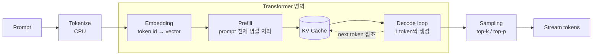
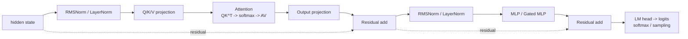

# Week 5: LLM 추론 구조와 병목 이해

1. 개요
2. 학습 워크로드와 추론 워크로드
3. LLM 추론 과정
4. Transformer 추론 흐름
5. 주요 성능 지표
6. Prefill/Decode
7. KV Cache

---

### 개요

지금까지 GPU 내부 구조부터 GPU 서버 간의 통신, 네트워크까지 학습을 진행했다.

이제 이러한 GPU 클러스터 환경에서 **LLM 추론이 어떻게 동작**하고, **병목이 발생할 수 있는 지점은 어디인지** 중심으로 학습해볼 예정이다.

> 이번 강의의 목표:
>
> - LLM 추론이 Prefill과 Decode로 나뉘는 이유를 설명할 수 있다.
> - Decode가 왜 자주 HBM bandwidth-bound가 되는지 설명할 수 있다.
> - KV cache 크기를 대략 계산하고, context/batch 증가가 어떤 문제를 만드는지 설명할 수 있다.
> - TTFT, TPOT/ITL, throughput을 구분할 수 있다.
> - TP, PP, DP, PD disaggregation이 어떤 병목을 해결하려는 전략인지 구분할 수 있다.

---

## 학습 워크로드와 추론 워크로드

LLM을 다룰 때, 가장 먼저 **학습 워크로드**와 **추론 워크로드**를 다뤄야 한다.

| 구분 | 학습(Training) | 추론(Inference) |
|---|---|---|
| 목적 | loss를 줄이며 weight 갱신 | 이미 학습된 weight로 token 생성 |
| 반복 단위 | training step (forward+backward+optimizer) | request, prefill, decode iteration |
| 상태 | weight, gradient, optimizer state | weight, KV cache, request queue |
| 통신 | gradient AllReduce/ReduceScatter | TP collective, KV transfer |
| 지표 | step time, samples/sec | TTFT, TPOT/ITL, tokens/sec |

학습은 "큰 batch로 forward/backward 돌리고 gradient를 GPU끼리 맞춘 뒤 weight 갱신"을 반복이다.

이번 주차에서 다룰 추론은 **"요청이 오면 첫 token을 빨리 내고, 이후 token을 일정 간격으로 계속 내는" 반복**이다.

---

## LLM 추론 과정

LLM 추론은 :
1. 사용자의 프롬프트를 입력 받고,
2. 프롬프트 문장을 토큰화 한 뒤,
3. transformer layer를 반복해서 다음 토큰의 확률을 계산해 나간 후,
4. sampling으로 token을 하나씩 뽑아내어 응답을 완성한다.

이때, 가장 중요한 것은 **다음 토큰의 확률 반복해서 계산해 나가는 작업**이다. 그 확률을 잘 계산할 수 있도록 Transformer가 사용되는 것이다.



Tokenize와 Sampling/Stream은 Transformer 바깥(CPU, 후처리) 작업이고, **Embedding ~ Decode까지가 실제 Transformer가 동작하는 영역**이다. Prefill과 Decode는 같은 Transformer를 통과하지만 "한 번에 여러 토큰" vs "한 토큰씩"이라는 차이 때문에 병목 성격이 달라진다 (Transformer 내부 구조는 `week5_note.md`의 "2-1. Transformer 구조 자세히 보기" 참고).

단계별로 무엇이 병목인지가 다르다는 게 핵심.

| 단계 | 하는 일 | 주 병목 | 이유 |
|---|---|---|---|
| Tokenize/Queue | 문자열 → token id | CPU, queue | GPU 계산 전에 CPU가 먼저 처리해야 함 |
| Embedding | token id → vector | HBM 접근 | embedding table lookup |
| Prefill | prompt 전체 한번에 처리 | Tensor Core compute | 큰 batched GEMM으로 arithmetic intensity가 높음 |
| KV Cache | 과거 K/V 저장 | HBM capacity | context/batch에 비례해 선형 증가 |
| Decode | token 1개씩 생성 | HBM bandwidth | 매 step마다 weight/KV를 반복해서 읽음 |
| Multi-GPU | shard 결과 동기화 | NVLink/IB/RDMA | layer/stage마다 동기화 필요 |

---

## Transformer 추론 흐름

이전에도 언급했듯이, Transformer의 목표는 "다음 토큰이 올 확률"을 계산하는 과정이다.

Transformer Layer는 아래와 같이 여러 Layer로 구성되어있고, 각 Layer에서 흐름을 반복하여 다음 토큰을 예측한다.

이때, Prefill 단계와 Decode 단계에서 같은 Transformer Layer를 사용한다.

```
Transformer
    ├── Layer1
    │   ├── Norm
    │   ├── QKV
    │   ├── Attention
    │   ├── MLP
    │   └── ...
    │
    ├── Layer2
    ├── Layer3
    └── ...
```

Decoder-only transformer layer 반복 구조:



- **Hidden State**

    Transformer Layer에 처음 입력되는 것은 **토큰의 임베딩 과정을 통해 반환된 벡터값**인데, 이를 **Hidden State**라고 한다.
    
    이는 현재까지의 문맥 정보를 담고 있는 벡터로, Layer를 통과할 때마다 담고 있는 문맥이 증가한다.

- **Norm**

    hidden 값 스케일 안정화 (LayerNorm/RMSNorm) 즉, 벡터의 크기를 일정하게 유지한다.
    
    연산량보다 메모리 read/write가 부각됨

- **Q/K/V projection**

    Hidden State 하나를 Attention에 활용할 Q, K, V로 변환한다.

    - Q : 지금 token이 던지는 질문
    - K : 과거 token들의 색인
    - V : 과거 token들의 내용

- **Attention**

    Attention은 토큰에 맥락을 반영하기 위해 **이전 토큰을 얼마나 참고할지** 결정하는 연산이다. 

    Q(지금 토큰의 질문) · K(과거 토큰의 색인)을 비교해 가중치를 만들고, 그 가중치로 V(과거 토큰의 내용)를 모은다.

    그 점수들을 softmax로 정규화해서 합이 1이 되는 가중치로 바꾸는데, 이 값이 **토큰들을 얼마나 참고할지의 비율**이 된다.

    > 맥락은 문법 관계, 시간 관계, 의미 관계, 주어 관계 등 여러 관계에서 고려되는 사항이다.
    >
    > 따라서 Attention이 하나라면 하나의 관계에 대해서만 학습이 진행되기 때문에 여러 Attention을 독립적으로 수행하는 **head**를 둔다. 그리고 각 head마다 Q, K, V를 따로 계산한다.
    
- **Output projection**

    이러한 Attention의 결과는 여러 Head에서 나온다.

    이렇게 출력된 벡터값이 이어 붙인 뒤, 원래 Hidden Size로 되돌리는 작업이다.

    그 결과로 새로운 Hidden State가 생성된다.

- **Residual Add**

    기존 입력 값에 산출된 Attention 결과를 더하여 출력값으로 사용하는 과정이다.

    이를 통해 정보 손실이 감소하고, 깊은 모델에서도 안정적인 학습이 가능하다.

- **MLP/FFN(MultiLayer Perceptron/Feed-Forward Network)** 

    token별 비선형 변환.
    
    Attention을 통해 맥락이 더해졌다면 MLP를 통해 정보를 가공한다.
    
    prefill은 compute-bound, decode는 weight read가 부담

- **Logits/Sampling**

    반복적인 Transformer 작업을 통해 완성된 마지막 Hidden State를 Vocabulary 크기로 변환하고, 그 결과가 Logits가 된다.

    logits 자체로 token이 결정되지 않고, **softmax**를 거쳐 확률 분포로 변환하고, 해당 지표를 바탕으로 **Sampling**을 통해 실제 출력 토큰을 선택한다.
    
    > 선택된 토큰은 출력으로 스트리밍되고, 동시에 다음 Decode 단계의 입력으로 사용된다.
    > 이 과정을 반복하여 문장이 한 토큰씩 생성됩니다.

---

## 주요 성능 지표

전체적인 LLM 추론 및 Transformer Layer의 흐름을 알아보았으니, 각 단계의 세부 작업을 병목과 함께 알아보기 위해 우선 지표에 대해 학습한다.

| 지표 | 의미 | 주로 보는 병목 및 시간 |
|---|---|---|
| TTFT(Time To First Token) | 요청 후 첫 token까지 걸리는 시간 | queue + tokenization + prefill + first decode |
| TPOT(Time Per Output Token) / ITL | 첫 token 이후 token 간 간격 | decode loop, HBM bandwidth, sampling overhead |
| Latency | 요청 전체 완료 시간 | TTFT + output length x TPOT |
| Request throughput | 초당 동시 처리 요청 수 | scheduler, batching, admission |
| Token throughput | 초당 처리 token 수 | GPU utilization, batch size |
| p99 | 가장 느린 요청들의 응답 시간 | congestion, queue, long prompt, straggler |

트레이드오프: batch를 키우면 GPU utilization·throughput은 오르지만 queue/KV footprint가 커져 TTFT·p99가 나빠질 수 있다. 워크로드 성격(챗봇은 TTFT/ITL, 오프라인 배치는 throughput/cost)에 따라 우선 지표가 다르다.

## Prefill과 Decode

앞서 언급했듯이, Prefill과 Decode는 같은 Transformer Layer에서 동작한다.

### Prefill

prompt token 전체를 **병렬로** 한 번에 통과시켜 각 layer의 K/V를 생성한다.

병렬 처리라 arithmetic intensity(메모리 접근량 대비 계산량)가 높음

- 병목: Tensor Core compute, attention IO 
- 영향 지표: TTFT
- 레버: FlashAttention, chunked prefill, prefix caching

### Decode

이전에 만든 token을 Prefill에서 사용한 동일한 Layer에 모두 통과시킨다.

토큰은 하나인데, 여러 Transformer Layer 이를 처리한다.

```
(Layer 하나 당) Weight 읽기 → KV 읽기 → 계산
```

그리고 위 반복 과정에서 메모리를 읽는 시간이 더 많이 걸린다.

- 이전에 만든 token에 의존하므로 **한 token씩 순차적으로** 생성 (완전 병렬화 불가)
- 병목: HBM bandwidth/capacity (매 step마다 weight+KV를 반복 읽지만 batch가 작으면 Tensor Core를 못 채움)
- 영향 지표: TPOT/ITL
- 레버: continuous batching, GQA/MQA, KV quantization, speculative decoding

### Roofline 직관

```
Prefill = 데이터를 한 번 읽고 많은 계산을 하기 때문에 높은 arithmetic intensity → Tensor Core compute-bound
Decode  = 데이터를 자주 읽지만 계산은 적기 때문에 낮은 arithmetic intensity → HBM bandwidth-bound
```
→ 둘을 같은 방식으로 튜닝하면 안 됨. Prefill이 느리면 계산/attention kernel을, decode가 느리면 HBM bandwidth/KV/batching/sampling을 본다.

---

## KV Cache

LLM 추론 과정에서 Prefill을 통해 프롬프트의 모든 토큰을 한번에 처리하고, 모든 토큰의 KV를 계산하여 KV Cache를 생성한다.

이후 Decode는 KV Cache를 통해 새로운 토큰 하나만 처리한다.

즉, KV Cache는 이미 처리한 token의 K/V를 저장해두는 메모리이다.

KV Cache가 없으면 decode마다 prompt 전체를 재계산해야 함 → compute는 아끼지만 HBM capacity/bandwidth를 계속 소모.

```
KV bytes
= layers                → Layer마다 K, V를 따로 저장하기 때문
  x batch               → 한번에 동시에 처리하는 요청의 개수 (사용자가 한 명이면 1)
  x seq_len             → 프롬프트 크기에 따라 K, V의 크기도 증가하기 때문에 Context가 크면 메모리를 많이 차지
  x 2                   → K + V
  x num_kv_heads        → Attention Head마다 KV를 저장하기 때문에 Head가 많으면 KV도 커진다. (GQA 탄생 배경)
  x head_dim            → head_dim = hidden_size ÷ head 수 → 하나의 head가 Hidden에서 담당하는 차원의 수
  x dtype_bytes         → 숫자를 저장하는 자료형
```

| 방식 | 의미 | KV 영향 |
|---|---|---|
| MHA(Multi-Head Attention) | Head 마다 K, V 각각 저장 (query head 수 = KV head 수) | KV 큼 |
| GQA(Grouped Query Attention) | 여러 query head가 KV head 공유 | KV 줄어듦 |
| MQA(Multi-Query Attention)| 모든 Query가 KV head 1개로 공유 | KV Cache 가장 작음 |

> weight가 GPU에 들어가는지만 보면 부족. weight + KV cache + activation/workspace + fragmentation 여유가 모두 HBM에 들어가야 함.

최적화 기법: PagedAttention(fragmentation 해결), Prefix caching(반복 prompt 재사용으로 TTFT 개선), KV quantization(capacity/bandwidth 절감), CPU/NVMe offload(capacity 부족 시 보조 수단, hot path엔 위험).

---

## Batching과 Scheduler

LLM 서버가 여러 사용자의 요청을 GPU에 어떻게 배분하는지에 대한 내용이다.

- **Static batching**: 묶음이 끝날 때까지 기다림 → 짧은 요청이 긴 요청에 막히고 padding으로 GPU가 낭비됨
- **Continuous batching**: decode iteration마다 끝난 요청을 빼고 새 요청을 끼워 넣음 → GPU utilization은 오르지만 batch를 무작정 키우면 KV/queue가 커짐
- **Chunked prefill**: 긴 prompt를 chunk로 잘라 decode 사이에 끼워 넣음 → 긴 prefill이 decode를 독점해 ITL/p99가 나빠지는 걸 막음.

---

## Prefill-Decode Disaggregation

**Colocated serving의 문제**

하나의 GPU Pool에서 prefill과 decode를 처리하는 것을 Colocated serving이라고 한다.  

하지만 이 경우, 여러 사용자의 프롬프트를 처리할 때 아래와 같이 요구되는 GPU 자원이 매우 다른 prefill과 decode가 한꺼번에 처리되는 문제가 발생한다.

```
prefill → Tensor Core 사용 → compute-heavy
decode → HBM 사용 → bandwidth-heavy + latency-sensitive
```

Prefill이 처리되는 과정에서 GPU의 사용량은 매우 커지고, 그 사이에 다른 사용자의 Decode가 들어오면 대기하게 된다.

따라서 거대한 양의 프롬프트가 들어올 경우, 긴 prefill batch가 decode의 ITL/p99에 악영향을 준다.

**→ 이를 해결하고자 PD disaggregation 개념이 나온다.**

prefill pool과 decode pool을 분리하고, prefill이 만든 KV를 RDMA/NVLink로 decode pool에 전송.

- 얻는 것: 자원 경쟁 완화, pool별로 다르게 sizing 가능, SLO별 routing(사용자마다 다른 Pool 사용)
- 새로 생기는 문제: **KV transfer(KV Cache 전송)**가 TTFT handoff와 p99의 새 병목이 됨 → **RDMA/NIC/PCIe/KV layout/congestion이 다 중요해짐**

감각(70B GQA, BF16, 100G 네트워크 기준): 8k context KV(~2.5GiB) 전송에 ~268ms, 32k(~10GiB)는 ~1.07s, 128k(~40GiB)는 ~4.3s. → 32k 이상부터는 overlap/compression/prefix locality 없이는 PD 자체가 TTFT 병목이 될 수 있음.

---

## 운영 관점 디버깅 순서

- **TTFT가 나쁘다**: queue time → tokenization → prompt length → prefill latency → prefix cache hit ratio → first decode latency → (PD라면) KV transfer time
- **TPOT/ITL이 나쁘다**: decode batch size → HBM bandwidth utilization → KV cache bytes/request → sampling overhead → TP collective latency → scheduler iteration time
- **OOM/낮은 concurrency**: weight memory → KV cache memory → context length → batch/concurrency → fragmentation → workspace 여유
- **Multi-node scaling 안 됨**: TP traffic이 node 밖으로 나가는지 → NCCL이 NVLink/IB/GDRDMA 쓰는지 → TCP fallback 여부 → GPU-NIC locality → RoCE 설정(PFC/ECN/MTU/GID) → rank skew/straggler

---

## 정리

1. 추론은 Prefill(compute-bound, TTFT)과 Decode(HBM bandwidth-bound, TPOT/ITL)로 나눠서 봐야 한다.
2. KV cache는 compute를 아끼지만 context·batch에 선형으로 비례해 HBM capacity/bandwidth를 계속 소모한다.
3. TTFT는 queue/prefill 쪽, TPOT/ITL은 decode loop 쪽 문제다.
4. TP=layer 내부 축, PP=layer 깊이 축, DP=request/replica 축으로 나누는 전략이다.
5. PD disaggregation은 prefill/decode 경쟁을 줄이지만 KV transfer라는 새 병목을 만든다.

