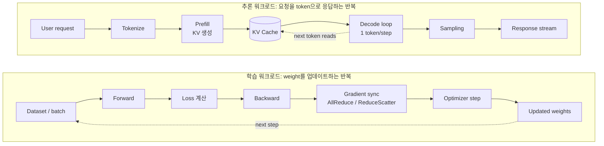
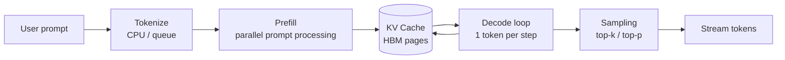
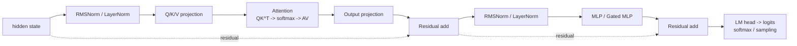
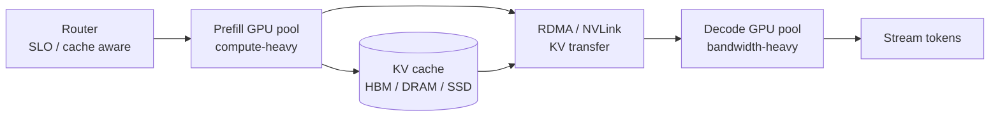

# GPU 스터디 5주차 강의 노트: LLM 추론 구조와 병목 이해

## Index
1. [이번 주차의 위치](#1-이번-주차의-위치)
2. [학습 워크로드와 추론 워크로드](#2-학습-워크로드와-추론-워크로드)
3. [LLM 추론을 한 문장으로 보기](#3-llm-추론을-한-문장으로-보기)
4. [Transformer 추론 흐름](#4-transformer-추론-흐름)
5. [Prefill과 Decode](#5-prefill과-decode)
6. [KV Cache](#6-kv-cache)
7. [성능 지표: TTFT, TPOT, Throughput](#7-성능-지표-ttft-tpot-throughput)
8. [Batching과 Scheduler](#8-batching과-scheduler)
9. [Single-node 병목](#9-single-node-병목)
10. [Multi-node 병목: TP, PP, DP](#10-multi-node-병목-tp-pp-dp)
11. [Prefill-Decode Disaggregation](#11-prefill-decode-disaggregation)
12. [운영 관점 디버깅 순서](#12-운영-관점-디버깅-순서)
13. [정리 및 점검 질문](#13-정리-및-점검-질문)

---

## 1. 이번 주차의 위치

스터디의 큰 목표는 AI 서비스를 GPU 하드웨어, 서버 시스템, 네트워크, LLM 서빙 런타임 관점에서 함께 이해하는 것이다.

Week 2와 Week 3에서는 GPU 내부 구조, HBM, PCIe, NVLink, CPU/GPU/NIC 연결을 봤고, Week 4에서는 InfiniBand, RoCE, RDMA, NCCL, collective communication을 봤다.

Week 5에서는 이 지식들을 LLM 추론으로 연결한다.

핵심 질문은 다음 하나다.

> LLM이 다음 token을 만들 때, 지금 느린 이유는 GPU 계산인가, HBM인가, KV cache인가, PCIe/NVLink인가, 아니면 네트워크인가?

이번 강의의 목표:

- LLM 추론이 `Prefill`과 `Decode`로 나뉘는 이유를 설명할 수 있다.
- Decode가 왜 자주 HBM bandwidth-bound가 되는지 설명할 수 있다.
- KV cache 크기를 대략 계산하고, context/batch 증가가 어떤 문제를 만드는지 설명할 수 있다.
- TTFT, TPOT/ITL, throughput을 구분할 수 있다.
- TP, PP, DP, PD disaggregation이 어떤 병목을 해결하려는 전략인지 구분할 수 있다.

---

## 2. 학습 워크로드와 추론 워크로드

LLM을 이해할 때 가장 먼저 나눠야 하는 것은 학습(training)과 추론(inference)이다. 둘 다 GPU를 많이 쓰지만, 반복 구조와 병목이 다르다.



학습은 보통 "큰 batch로 계산하고 gradient를 맞춘 뒤 weight를 업데이트하는" 반복이다. 추론은 "사용자 요청이 들어오면 첫 token을 빨리 내고, 그 뒤 token을 일정한 간격으로 계속 내는" 반복이다.

| 구분 | 학습 워크로드 | 추론 워크로드 |
|---|---|---|
| 목적 | loss를 줄이도록 weight 업데이트 | 이미 학습된 weight로 token 생성 |
| 반복 단위 | training step | request, prefill, decode iteration |
| 주요 상태 | weight, gradient, optimizer state | weight, KV cache, request queue |
| 대표 통신 | gradient AllReduce, ReduceScatter, AllGather | TP collective, KV transfer, request routing |
| 주 지표 | step time, samples/sec, GPU utilization | TTFT, TPOT/ITL, p95/p99, tokens/sec |
| 병목 모양 | 동기화가 늦으면 모든 rank가 기다림 | queue/KV/decode cadence가 사용자 latency로 보임 |

이 차이를 먼저 잡아야 한다. Week 4의 NCCL/collective 지식은 학습에서는 gradient 동기화로, 추론에서는 tensor parallel collective나 prefill-decode KV transfer로 다시 등장한다.

```text
학습에서 중요한 질문:
  이 step에서 어떤 gradient/activation이 rank 사이를 이동하는가?

추론에서 중요한 질문:
  이 요청에서 첫 token과 다음 token을 늦추는 자원이 무엇인가?
```

이제부터는 추론 워크로드에 집중한다.

---

## 3. LLM 추론을 한 문장으로 보기

LLM 추론은 입력 prompt를 token으로 바꾸고, transformer layer를 반복해서 다음 token 확률을 계산한 뒤, sampling으로 token을 하나씩 뽑아내는 과정이다.

```text
사용자 prompt
  -> tokenize
  -> prefill: prompt 전체를 병렬 처리하고 KV cache 생성
  -> decode loop: KV cache를 보며 다음 token을 하나씩 생성
  -> sampling
  -> stream response
```



중요한 점은 prefill과 decode가 같은 transformer를 지나지만 병목 성격이 다르다는 것이다.

| 단계 | 하는 일 | 주 병목 | 왜 병목인가 | 나빠지는 지표 | 대표 레버 |
|---|---|---|---|---|---|
| Tokenize / Queue | 문자열 처리, 요청 대기 | CPU, queue | GPU 계산 전에 CPU가 문자열을 token id로 쪼개고 요청을 배치해야 하므로, tokenizer thread나 queue가 밀리면 GPU가 비어 있어도 첫 token이 늦어진다. | TTFT | tokenizer 병렬화, admission control |
| Embedding | token id를 vector로 변환 | HBM/메모리 접근 | token id는 결국 거대한 embedding table의 특정 row를 읽는 lookup이므로, 계산보다 메모리에서 필요한 vector를 빨리 가져오는 능력이 중요하다. | TTFT | embedding locality, quantized embedding, vocab/model parallel |
| Prefill | prompt 전체를 한 번에 처리 | Tensor Core compute, attention IO | 많은 prompt token을 한 번에 행렬곱하므로 GPU 계산기를 꽉 채우기 쉽다. | TTFT | FlashAttention, chunked prefill, prefix cache |
| KV Cache | 과거 K/V 저장 | HBM capacity | context와 batch가 늘수록 저장해야 할 K/V가 선형으로 커져 HBM을 먼저 채운다. | max context, concurrency, OOM | PagedAttention, KV quant, offload |
| Decode | 다음 token 1개씩 생성 | HBM bandwidth, KV read | 매 token마다 weight와 과거 KV를 반복해서 읽지만 한 번에 계산할 token은 적어 메모리 읽기 속도가 앞을 막는다. | TPOT/ITL | continuous batching, GQA/MQA, speculative decoding |
| Multi-GPU | shard 결과 동기화 | NVLink/IB/RDMA | 여러 GPU가 나눠 계산한 결과를 매 layer 또는 stage마다 맞춰야 해서 interconnect 지연이 그대로 latency에 들어온다. | TTFT, TPOT, p99 | TP를 NVLink 안에, PP/DP 조합 |

---

## 4. Transformer 추론 흐름

Decoder-only transformer layer는 대략 아래 흐름을 반복한다.



각 연산의 감각:

| 연산 | 직관 | 병목 관점 |
|---|---|---|
| Embedding | token id를 vector로 바꿈 | 큰 table lookup이라 HBM 접근 |
| Norm | hidden 값을 안정화 | FLOP보다 read/write가 많음 |
| Q/K/V projection | attention용 query/key/value 생성 | prefill은 GEMM, decode는 작은 GEMV 성격 |
| Attention | 지금 token이 과거 token 중 무엇을 볼지 결정 | decode에서는 과거 KV scan이 HBM bandwidth를 씀 |
| MLP / FFN | token별 비선형 변환 | prefill은 compute-bound, decode는 weight read가 큼 |
| Logits / Sampling | vocab 확률에서 다음 token 선택 | vocab projection, sampling overhead |

조금 더 풀어보면:

| 용어 | 부연 설명 |
|---|---|
| Norm | `LayerNorm` 또는 `RMSNorm`처럼 hidden vector의 스케일을 안정화하는 단계다. 값의 크기가 layer를 지나며 너무 커지거나 작아지는 것을 줄여 다음 projection이 안정적으로 동작하게 한다. 추론에서는 계산량보다 hidden을 읽고 쓰는 메모리 접근과 kernel launch 비용이 더 눈에 띌 수 있다. |
| MLP | Multi-Layer Perceptron의 약자다. Transformer block 안에서는 attention이 섞어 온 정보를 token별로 다시 변환하는 feed-forward 계산이다. 보통 `up projection -> activation -> down projection` 구조를 가진다. |
| FFN | Feed-Forward Network의 약자다. Transformer 문맥에서는 MLP와 거의 같은 블록을 가리키는 말로 쓰인다. 요즘 LLM은 단순 FFN 대신 `SwiGLU` 같은 gated MLP를 많이 쓴다. |
| Logits | 아직 확률이 아닌 raw score다. 마지막 hidden state를 vocabulary 크기의 vector로 바꾼 값이며, 각 vocab token에 대한 점수라고 보면 된다. |
| Softmax | logits를 확률 분포로 바꾸는 함수다. temperature를 적용하면 softmax 전에 logits의 스케일을 조정한다. |
| Sampling | softmax로 얻은 확률 분포에서 실제 다음 token을 고르는 정책이다. greedy decoding은 가장 큰 token을 고르고, top-k/top-p sampling은 후보를 제한한 뒤 확률적으로 고른다. |

따라서 `Logits`와 `Sampling`은 Softmax와 같은 말이 아니다.

```text
hidden state
  -> LM head / vocab projection
  -> logits: vocab별 raw score
  -> temperature / top-k / top-p 같은 logit processing
  -> softmax: 확률 분포
  -> sampling 또는 argmax: 실제 다음 token 선택
```

Attention을 조금 더 풀면:

```text
Q = 지금 token이 던지는 질문
K = 과거 token들의 색인
V = 과거 token들의 내용

Q와 K를 비교해서 어떤 과거 token을 많이 볼지 정하고,
그 가중치로 V를 모아 다음 hidden state를 만든다.
```

---

## 5. Prefill과 Decode

### 5.1. Prefill

Prefill은 prompt token 전체를 한 번에 처리한다.

예를 들어 prompt가 8,000 token이면, 모델은 이 8,000개 token을 병렬적으로 transformer에 통과시키며 각 layer의 K/V를 만든다.

```text
Prompt tokens: t1 t2 t3 ... t8000
  -> transformer layers
  -> KV cache 생성
  -> 첫 decode 준비 완료
```

Prefill 병목:

- Operation: Q/K/V projection, attention, MLP의 큰 batched GEMM
- Saturated resource: Tensor Core compute, attention IO
- Reason: prompt token을 병렬 처리하므로 arithmetic intensity가 높다.
- Metric: TTFT
- Lever: FlashAttention, chunked prefill, FP8/BF16 kernel, prefix caching

### 5.2. Decode

Decode는 output token을 하나씩 만든다.

다음 token은 이전에 생성한 token에 의존하므로 완전히 병렬화하기 어렵다.

```text
step 1: token_1 생성
step 2: token_1을 보고 token_2 생성
step 3: token_1, token_2를 보고 token_3 생성
...
```

Decode 병목:

- Operation: one-token forward, 과거 KV scan, weight read
- Saturated resource: HBM bandwidth, HBM capacity
- Reason: 매 step마다 weight와 KV를 반복해서 읽지만, batch가 작으면 Tensor Core를 충분히 채우기 어렵다.
- Metric: TPOT / ITL
- Lever: continuous batching, GQA/MQA, KV quantization, speculative decoding, HBM bandwidth가 큰 GPU

### 5.3. Roofline 직관

```text
낮은 arithmetic intensity                 높은 arithmetic intensity
        |                                             |
        v                                             v
Decode: bytes를 많이 읽음                 Prefill: 큰 GEMM을 많이 계산
HBM bandwidth-bound                        Tensor Core compute-bound
```

Prefill과 decode를 같은 방식으로 튜닝하면 안 된다. Prefill이 느리면 계산과 attention kernel을 보고, decode가 느리면 HBM bandwidth, KV cache, batching, sampling overhead를 먼저 본다.

---

## 6. KV Cache

KV cache는 이미 읽은 token의 key/value activation을 저장해 두는 메모장이다.

KV cache가 없으면 decode step마다 prompt 전체를 다시 읽어야 한다. KV cache가 있으면 compute는 절약되지만, 대신 HBM capacity와 HBM bandwidth를 계속 사용한다.

### 6.1. KV cache 공식

```text
KV bytes
= layers
  x batch
  x seq_len
  x 2(K + V)
  x num_kv_heads
  x head_dim
  x dtype_bytes
```

중요한 선형 관계:

- `seq_len`이 4배가 되면 KV cache도 4배가 된다.
- `batch`가 2배가 되면 KV cache도 2배가 된다.
- `num_kv_heads`가 줄면 KV cache도 줄어든다.

### 6.2. MHA, GQA, MQA

| 방식 | 의미 | KV cache 영향 |
|---|---|---|
| MHA | attention head 수와 KV head 수가 같음 | KV가 큼 |
| GQA | 여러 query head가 더 적은 KV head를 공유 | KV가 줄어듦 |
| MQA | KV head를 거의 1개로 공유 | KV가 더 크게 줄어듦 |

GQA/MQA는 decode 병목에서 중요하다. KV 저장량과 KV read bytes가 줄어들기 때문이다.

### 6.3. KV cache 크기 예시

BF16/FP16 KV, batch=1 기준의 대략적인 감각이다.

| 모델 class | 가정 | 8k context | 32k context | 128k context |
|---|---:|---:|---:|---:|
| 8B GQA | 32 layers, 8 KV heads | 약 1 GiB | 약 4 GiB | 약 16 GiB |
| 70B GQA | 80 layers, 8 KV heads | 약 2.5 GiB | 약 10 GiB | 약 40 GiB |
| 405B GQA | 126 layers, 8 KV heads | 약 3.9 GiB | 약 15.8 GiB | 약 63 GiB |

이 값은 request 하나의 KV cache다. 동시 요청 수가 늘면 batch/concurrency에 비례해 증가한다.

> [!note] 운영에서 중요한 질문
> "모델 weight가 GPU에 들어가는가?"만 보면 부족하다. 실제 serving에서는 weight, KV cache, activation/workspace, fragmentation 여유가 모두 HBM에 들어가야 한다.

### 6.4. KV cache 최적화

| 기법 | 해결하려는 문제 | 병목 관점 |
|---|---|---|
| PagedAttention | 요청 길이가 달라 생기는 fragmentation | HBM capacity 절약 |
| Prefix caching | 반복 system prompt/RAG template 재사용 | prefill compute 절약, TTFT 개선 |
| KV quantization | KV 저장량과 read bytes 감소 | HBM capacity/bandwidth 완화 |
| CPU DRAM offload | HBM 부족 시 cold KV를 host로 이동 | PCIe/DRAM latency가 p99를 키울 수 있음 |
| NVMe offload | 장기 prefix 저장 | HBM보다 매우 느려 hot path에는 위험 |

---

## 7. 성능 지표: TTFT, TPOT, Throughput

LLM serving 성능은 하나의 숫자로 설명하면 안 된다.

| 지표 | 의미 | 주로 보는 병목 |
|---|---|---|
| TTFT | 요청 후 첫 token까지 걸리는 시간 | queue, tokenization, prefill, first decode |
| TPOT / ITL | 첫 token 이후 token 간 간격 | decode loop, HBM bandwidth, sampling overhead |
| Latency | 요청 전체 완료 시간 | TTFT + output length x TPOT |
| Request throughput | 초당 처리 요청 수 | scheduler, batching, admission |
| Token throughput | 초당 처리 token 수 | GPU utilization, batch size |
| p99 | 99% 요청이 이 시간 안에 끝나는 tail latency | congestion, queue, long prompt, straggler |

### 7.1. 지표 간 trade-off

큰 batch는 token throughput을 올릴 수 있지만, queue time과 KV footprint를 키워 TTFT와 p99를 악화시킬 수 있다.

```text
batch 증가
  -> GPU utilization 증가
  -> token throughput 증가
  -> 하지만 queue 증가, KV 증가
  -> TTFT/p99 악화 가능
```

워크로드별 우선순위:

| 워크로드 | 우선 지표 | 튜닝 방향 |
|---|---|---|
| Chatbot / coding assistant | TTFT, ITL, p95/p99 | continuous batching, prefix cache, speculative decoding |
| RAG / document QA | TTFT, goodput | chunked prefill, prompt compression, prefix cache |
| Agent / tool use | end-to-end p95, ITL | low queue, KV reuse, model tiering |
| Offline batch | TPS, cost/token | large batch, relaxed SLO, quantization |

---

## 8. Batching과 Scheduler

### 8.1. Static batching

Static batch는 한 묶음이 끝날 때까지 기다리는 방식에 가깝다.

```text
Batch 1:
Req A: [work work work work]
Req B: [work work pad  pad ]
Req C: [work wait wait wait]
```

문제:

- 짧은 요청이 긴 요청을 기다린다.
- padding/waiting으로 GPU slot이 낭비된다.
- interactive serving에서는 p99가 흔들릴 수 있다.

### 8.2. Continuous batching

Continuous batching은 decode iteration마다 완료된 요청을 빼고 새 요청을 넣는다.

```text
t1: A decode | B decode | C prefill
t2: A decode | C decode | D prefill
t3: C decode | D decode | E prefill
```

핵심:

- join/leave 단위가 request 전체가 아니라 decode iteration이다.
- GPU utilization을 높이면서 decode token cadence를 유지하려는 전략이다.
- 그러나 무작정 batch를 키우면 KV cache와 queue가 커진다.

### 8.3. Chunked prefill

긴 prompt prefill이 들어오면 decode를 오래 막을 수 있다. Chunked prefill은 긴 prompt를 여러 prefill chunk로 자르고, decode slot 사이에 끼워 넣는다.

```text
Long prompt P = P1 + P2 + P3

iteration budget:
P1 prefill | A decode | B decode | P2 prefill
```

병목 관점:

- Operation: prefill chunk와 decode step을 한 scheduler iteration에 섞음
- Saturated resource: Tensor Core compute, HBM bandwidth, scheduler token budget
- Reason: 긴 prefill이 decode를 독점하면 ITL/p99가 나빠진다.
- Metric: TTFT와 TPOT/ITL 사이 균형
- Lever: `max_num_batched_tokens`, `max_num_seqs`, prefill chunk size, priority scheduling

---

## 9. Single-node 병목

Single node에서는 GPU 안의 HBM, GPU 간 NVLink/NVSwitch, CPU-GPU 사이 PCIe, CPU DRAM/NUMA가 주 경계다.

### 9.1. A100 vs H100 감각

| 항목 | A100 80GB SXM | H100 80GB SXM | 추론 관점 |
|---|---:|---:|---|
| HBM capacity | 80GB | 80GB | 같은 80GB라도 KV 여유는 모델 weight 이후 남는 공간으로 결정 |
| HBM bandwidth | 약 2.0 TB/s | 약 3.35 TB/s | decode TPOT에 직접 영향 |
| BF16/FP16 Tensor Core | A100보다 낮음 | A100 대비 큼 | prefill TTFT에 영향 |
| NVLink | 약 600 GB/s | 약 900 GB/s | TP collective 손실에 영향 |
| PCIe | Gen4급 | Gen5급 | CPU offload/host path에 영향 |

정확한 스펙보다 중요한 판단은 이것이다.

```text
Prefill이 느리다 -> Tensor Core compute / FlashAttention / prompt 길이
Decode가 느리다 -> HBM bandwidth / KV cache / batch / sampling
TP가 느리다 -> NVLink/NVSwitch/NCCL path
CPU offload가 느리다 -> PCIe / CPU DRAM / NUMA
```

### 9.2. CPU/NVMe offload가 자주 느린 이유

CPU DRAM과 NVMe는 HBM보다 크지만 훨씬 멀다.

```text
GPU HBM
  <-> PCIe
  <-> CPU DRAM
  <-> NVMe
```

Hot KV나 매 layer weight가 이 경로를 반복해서 지나면 PCIe/NVMe가 바로 병목이 된다. Offload는 hot path가 아니라 cold KV, reusable prefix, capacity overflow를 다루는 보조 수단으로 보는 편이 안전하다.

---

## 10. Multi-node 병목: TP, PP, DP

여러 GPU를 쓰는 방식은 "모델을 어떤 축으로 나누는가"로 이해하면 쉽다.

### 10.1. TP: Tensor Parallelism

TP는 레이어 묶음을 나누는 것이 아니라, 각 레이어 안의 큰 weight/activation 차원을 여러 GPU가 나눠 계산한다.

```text
Layer 1: GPU0=W0 | GPU1=W1 | GPU2=W2
Layer 2: GPU0=W0 | GPU1=W1 | GPU2=W2
Layer 3: GPU0=W0 | GPU1=W1 | GPU2=W2

각 layer마다 partial result를 all-reduce/all-gather로 합친다.
```

병목:

- Operation: all-reduce, reduce-scatter, all-gather
- Saturated resource: NVLink/NVSwitch, 또는 cross-node IB/RDMA
- Reason: layer마다 동기화가 들어간다.
- Rule: 가능하면 TP는 같은 NVLink/NVSwitch domain 안에 묶는다.

### 10.2. PP: Pipeline Parallelism

PP는 전체 layer stack을 stage 단위로 나눈다.

```text
GPU0: Layer 1-10
GPU1: Layer 11-20
GPU2: Layer 21-30
GPU3: Layer 31-40
```

각 stage는 자기 layer를 처리하고 activation을 다음 stage로 넘긴다.

병목:

- Operation: stage activation handoff
- Saturated resource: inter-stage link, pipeline bubble
- Reason: microbatch가 충분하지 않거나 stage 시간이 불균형하면 GPU가 쉰다.
- Rule: 모델이 한 노드에 안 들어갈 때 PP를 node 경계에 맞춰 고려한다.

### 10.3. DP: Data Parallelism

DP는 모델 전체 replica를 여러 GPU/노드에 복제하고, request를 나눠 보낸다.

```text
Replica 0: full model -> Req A
Replica 1: full model -> Req B
Replica 2: full model -> Req C
```

추론에서 DP는 학습처럼 gradient all-reduce가 핵심은 아니다. 대신 replica마다 weight와 KV cache를 들고 있어야 한다.

병목:

- Operation: request routing, replica-local decode
- Saturated resource: HBM capacity per replica, load balancer queue
- Reason: weights/KV가 replica마다 복제된다.
- Rule: 모델이 replica 단위로 들어가고 traffic이 많으면 DP가 단순하고 강력하다.

### 10.4. 선택 규칙

| 상황 | 우선 선택 |
|---|---|
| 7B/8B가 GPU 한 장에 들어감 | single GPU 또는 DP |
| 70B weight가 한 GPU에 안 들어감 | node 내부 TP=2/4 고려 |
| 405B+처럼 노드 하나에도 어려움 | TP+PP, quantization, multi-node |
| long context가 KV 때문에 큼 | GQA/MQA, KV quant, context parallel, offload 검토 |
| MoE 모델 | expert parallel, all-to-all 병목 확인 |

---

## 11. Prefill-Decode Disaggregation

Colocated serving은 prefill과 decode를 같은 GPU pool에서 섞는다.

문제:

- Prefill은 compute-heavy다.
- Decode는 bandwidth-heavy이고 latency-sensitive하다.
- 긴 prefill batch가 decode ITL/p99를 흔들 수 있다.

PD disaggregation은 prefill pool과 decode pool을 분리한다.



PD가 해결하는 것:

- prefill과 decode의 자원 경쟁 완화
- prefill-heavy GPU와 decode-heavy GPU를 다르게 sizing 가능
- SLO별 routing과 cache locality 활용 가능

PD가 새로 만드는 문제:

- prefill이 만든 KV를 decode 쪽으로 옮겨야 한다.
- KV transfer가 TTFT handoff와 p99의 새 병목이 된다.
- RDMA, NIC, PCIe, KV layout 변환, congestion이 모두 중요해진다.

### 11.1. KV transfer 감각

70B GQA, BF16 KV, batch=1, effective network throughput 80% 가정:

| Context | KV size | 100G | 200G | 400G |
|---:|---:|---:|---:|---:|
| 8k | 약 2.5 GiB | 약 268 ms | 약 134 ms | 약 67 ms |
| 32k | 약 10 GiB | 약 1.07 s | 약 537 ms | 약 268 ms |
| 128k | 약 40 GiB | 약 4.3 s | 약 2.15 s | 약 1.07 s |

해석:

- 8k도 interactive TTFT에는 보일 수 있다.
- 32k 이상에서는 overlap, compression, prefix locality 없이는 PD 자체가 TTFT 병목이 될 수 있다.
- 128k에서는 400G라도 KV transfer가 1초급이 될 수 있다.

---

## 12. 운영 관점 디버깅 순서

### 12.1. TTFT가 나쁘다

확인 순서:

1. queue time
2. tokenization time
3. prompt length histogram
4. prefill latency
5. prefix cache hit ratio
6. first decode latency
7. PD 구조라면 KV transfer time

대표 레버:

- chunked prefill
- prefix caching
- admission control
- prefill pool scale-out

### 12.2. TPOT/ITL이 나쁘다

확인 순서:

1. decode batch size
2. HBM bandwidth utilization
3. KV cache bytes/request
4. sampling/logits overhead
5. TP collective latency
6. scheduler iteration time

대표 레버:

- continuous batching
- KV quantization
- GQA/MQA 모델 선택
- speculative decoding
- faster HBM GPU

### 12.3. OOM 또는 max concurrency가 낮다

확인 순서:

1. model weight memory
2. KV cache memory
3. context length
4. batch/concurrency
5. fragmentation
6. CUDA graph/workspace 여유

대표 레버:

- max context 제한
- PagedAttention
- KV quantization
- prefix eviction
- cold KV offload

### 12.4. Multi-node에서 scaling이 안 된다

확인 순서:

1. TP traffic이 node 밖으로 나가는가?
2. NCCL이 NVLink/IB/GDRDMA path를 쓰는가?
3. TCP/socket fallback이 있는가?
4. GPU-NIC locality가 맞는가?
5. RoCE라면 PFC/ECN/MTU/GID 설정이 맞는가?
6. rank skew 또는 straggler가 있는가?

대표 레버:

- TP를 NVLink domain 내부로 제한
- PP/DP로 분할 방식 변경
- GPUDirect RDMA 확인
- topology-aware placement

---

## 13. 정리 및 점검 질문

### 13.1. 핵심 요약

1. LLM 추론은 `Prefill`과 `Decode`로 나누어 봐야 한다.
2. Prefill은 prompt 전체를 병렬 처리하므로 대체로 Tensor Core compute-bound다.
3. Decode는 token을 하나씩 만들고 weight/KV를 반복해서 읽으므로 대체로 HBM bandwidth-bound다.
4. KV cache는 compute를 줄여주지만 HBM capacity와 bandwidth를 계속 소비한다.
5. Context length, batch, concurrency는 KV cache를 선형으로 키운다.
6. TTFT는 prefill/queue 중심이고, TPOT/ITL은 decode loop 중심이다.
7. Continuous batching은 GPU utilization을 높이지만, SLO와 KV footprint를 함께 봐야 한다.
8. TP는 layer 내부 tensor 축, PP는 layer 깊이 축, DP는 request/replica 축으로 나눈다.
9. Multi-node에서는 NVLink, InfiniBand/RoCE/RDMA, NCCL path가 추론 latency에 직접 들어온다.
10. PD disaggregation은 prefill/decode 자원 경쟁을 줄이지만 KV transfer라는 새 병목을 만든다.

### 13.2. 스스로 점검할 질문

> [!note] 강의 후 체크
> - Prefill과 Decode의 병목 자원이 왜 다른지 설명할 수 있는가?
> - TTFT와 TPOT/ITL을 구분해 병목을 추론할 수 있는가?
> - KV cache 공식에서 context length와 batch가 어떤 영향을 주는지 설명할 수 있는가?
> - GQA/MQA가 decode와 KV cache에 왜 유리한지 설명할 수 있는가?
> - TP, PP, DP를 “모델을 나누는 축”으로 구분할 수 있는가?
> - CPU/NVMe offload가 왜 자주 PCIe/NVMe-bound가 되는지 설명할 수 있는가?
> - PD disaggregation에서 KV transfer가 왜 TTFT handoff와 p99 병목이 되는지 설명할 수 있는가?

### 13.3. 강의 중 던지기 좋은 질문

1. "같은 80GB GPU라도 A100과 H100에서 decode 성능이 달라질 수 있는 이유는 무엇인가?"
2. "긴 RAG prompt 서비스에서 먼저 봐야 할 지표는 TTFT인가 TPOT인가?"
3. "128k context에서 batch를 4로 올리면 KV cache는 어떻게 변하는가?"
4. "TP를 node 밖으로 늘리면 어떤 collective 병목이 생길 수 있는가?"
5. "PD disaggregation을 도입했는데 더 느려졌다면 어느 경로부터 볼 것인가?"

---

## 부록. 용어 미니 사전

| 용어 | 풀 네임 | 강의용 설명 |
|---|---|---|
| TTFT | Time To First Token | 요청 후 첫 token까지 기다리는 시간 |
| TPOT / ITL | Time Per Output Token / Inter-Token Latency | token 사이 간격 |
| p99 | 99th Percentile Latency | 100개 중 99번째로 느린 요청까지 포함한 tail latency |
| HBM | High Bandwidth Memory | GPU 가까이에 있는 빠른 메모리 |
| KV Cache | Key/Value Cache | 과거 token의 attention 재료를 저장한 메모리 |
| Attention | Attention Mechanism | 지금 token이 과거 token 중 무엇을 볼지 정하는 계산 |
| GEMM | General Matrix-Matrix Multiplication | 큰 행렬 곱셈. Prefill에서 prompt token들을 한 번에 처리할 때 Tensor Core를 많이 쓰는 대표 연산 |
| TP | Tensor Parallelism | layer 내부 tensor/weight 차원을 여러 GPU가 나눔 |
| PP | Pipeline Parallelism | layer stack을 stage별로 여러 GPU가 나눔 |
| DP | Data Parallelism | full model replica를 여러 GPU에 복제하고 요청을 나눔 |
| RDMA | Remote Direct Memory Access | CPU 개입을 줄이고 memory 사이를 직접 잇는 데이터 이동 모델 |
| SLO | Service Level Objective | 서비스가 만족해야 하는 latency/goodput 목표 |
