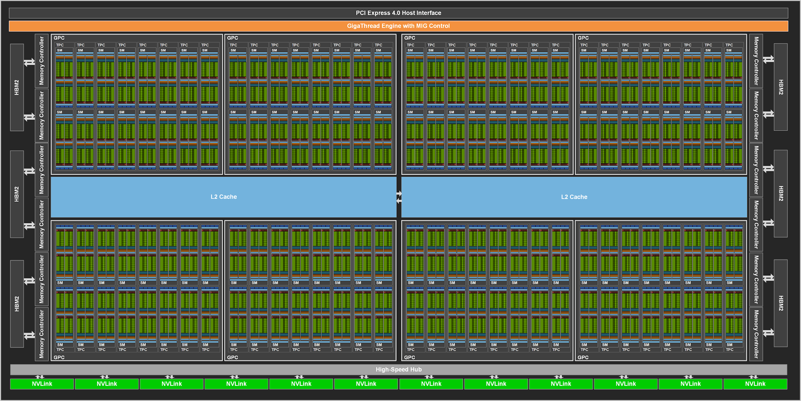
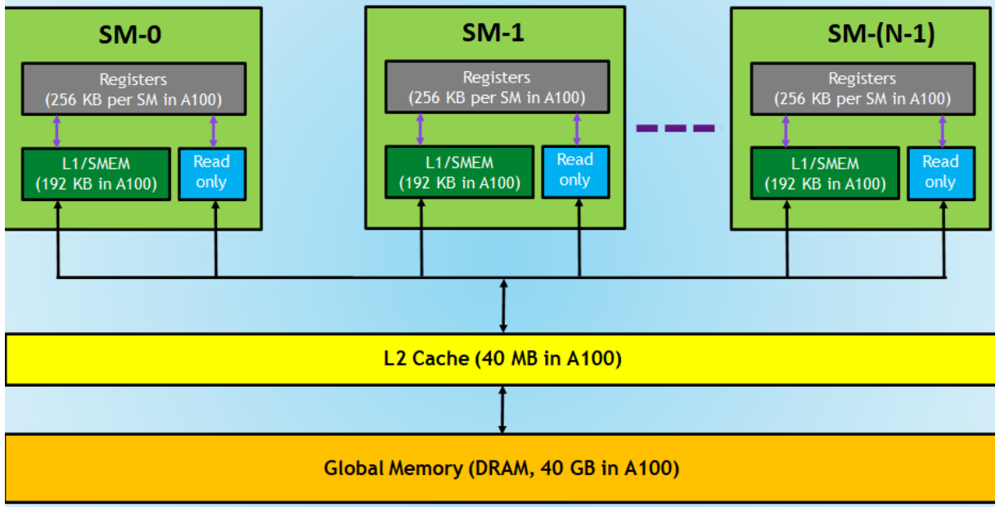
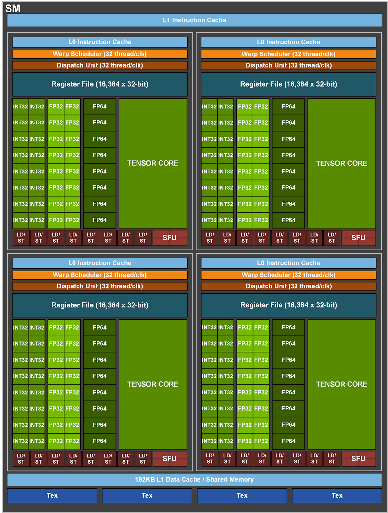

# Week 2: GPU 아키텍처 및 병렬 연산의 필요성

> AI 인프라 스터디 · Week 2 자료
> 대상: GPU/HPC 입문~중급 · NVIDIA 아키텍처 기준

---

## 1. 왜 병렬 연산이 필요한가

### 1.1 CPU의 한계: 순차 실행의 벽

CPU는 복잡한 제어 흐름과 분기 예측에 최적화된 프로세서다. 코어 하나의 IPC(Instructions Per Clock)를 극대화하는 방향으로 수십 년간 발전해왔다. 파이프라인 깊이를 늘리고, 비순차 실행(Out-of-Order Execution)을 도입하고, 분기 예측기를 정교하게 만드는 식이다.

문제는 AI 워크로드의 본질이 이 설계 철학과 맞지 않는다는 점이다. LLM 추론 한 번에 일어나는 연산을 보면:

```
GPT-3 175B 파라미터 기준, 토큰 1개 생성 시:
- Forward pass FLOPs ≈ 2N = 2 × 175B = 350 GFLOPs/token
  (N = 파라미터 수, scaling law 근사식)
- 각 행렬 곱셈 연산은 독립적 — element-wise로 병렬 처리 가능
- 16-core CPU + AVX-512 ≈ 1~2 TFLOP/s (이론치)
- → 토큰 하나에 수백 ms~수 초, 단일 사용자는 가능하나 서빙 불가능
- GPU(A100 FP16 312 TFLOP/s) → 이론상 토큰당 1ms 수준
```

핵심은 이것이다: **AI 연산은 단순하지만 양이 압도적이고, 대부분의 연산이 서로 독립적이다.** 행렬 A×B의 각 출력 원소는 다른 원소와 무관하게 계산할 수 있다. 이 "embarrassingly parallel"한 특성이 GPU가 존재하는 이유다.

### 1.2 SIMT: GPU의 실행 모델

GPU는 CPU와 근본적으로 다른 트레이드오프를 선택했다.

| 설계 요소 | CPU | GPU |
|-----------|-----|-----|
| 코어 수 | 8~128개 (고성능 코어) | 수천~수만 개 (경량 코어) |
| 코어당 제어 로직 | 크고 복잡 (OoO, 분기예측) | 작고 단순 |
| 캐시 | 코어당 대용량 L1/L2 | 코어당 소용량, 공유 메모리 활용 |
| 처리 방식 | MIMD (각 코어가 독립 명령) | SIMT (같은 명령, 다른 데이터) |
| 지향점 | Latency 최소화 | Throughput 최대화 |

**SIMT(Single Instruction, Multiple Threads)** — GPU의 실행 모델이다. 수천 개의 스레드가 동일한 명령어를 서로 다른 데이터에 대해 동시에 실행한다. 행렬 곱셈에서 각 출력 원소를 하나의 스레드가 담당한다고 생각하면 된다.

### 1.3 AI 워크로드에서의 실제 의미

Transformer의 핵심 연산을 분해하면:

```
Linear Layer (FC):  Y = XW + b   → GEMM (General Matrix Multiply)
Attention:          softmax(QK^T / √d) × V  → BatchedGEMM + Softmax
LayerNorm:          각 토큰별 정규화 → Element-wise 연산
```

이 중 **GEMM이 전체 추론 시간의 65~85%** 를 차지한다 (LLM.int8() 논문, Dettmers et al. 2022 기준 6.7B 이상 모델에서 FFN + Attention projection의 행렬 곱셈 비중). GEMM은 완전히 병렬화 가능한 연산이고, 이것이 GPU가 AI에 압도적인 이유다.

참고 수치 — A100 80GB 기준:
- FP16 GEMM: **312 TFLOP/s**
- 메모리 대역폭: **2 TB/s**
- 동시 실행 스레드: **수십만 개**

CPU 대비 단순 FLOP/s만 비교해도 50~100배 차이가 나지만, 실제 AI 워크로드에서는 메모리 대역폭과 스레드 스케줄링 효율까지 합쳐져서 체감 격차는 더 크다.

---

## 2. NVIDIA GPU 아키텍처 심층 분석

### 2.1 전체 구조: GPC → TPC → SM

NVIDIA GPU는 계층적 구조로 설계되어 있다.

```
GPU (전체 칩)
├── GPC (Graphics Processing Cluster) × N개 (아키텍처별 상이)
│   ├── Raster Engine (데이터센터 GPU는 대부분 비활성)
│   └── TPC (Texture Processing Cluster) × M개 (GPC당)
│       └── SM (Streaming Multiprocessor) × 2개 (TPC당, 고정)
│           ├── CUDA Core (FP32/INT32)
│           ├── Tensor Core
│           ├── Warp Scheduler
│           ├── Register File
│           ├── Shared Memory / L1 Cache
│           └── Load/Store Unit
├── L2 Cache (전체 공유)
├── Memory Controller
└── HBM / GDDR (VRAM)
```



> **TPC당 SM은 항상 2개**로 고정 (Volta 이후). GPC당 TPC 개수는 아키텍처마다 다름.
> 예: H100 full GH100 = 8 GPCs × 9 TPCs/GPC × 2 SMs/TPC = **144 SM** (실제 SXM5는 132 SM 활성)
> A100 full GA100 = 8 GPCs × 8 TPCs/GPC × 2 SMs/TPC = **128 SM** (실제 A100은 108 SM 활성)

**핵심 단위는 SM(Streaming Multiprocessor)** 이다. GPU의 연산 능력은 결국 SM 개수 × SM당 처리 능력으로 결정된다. 데이터센터 GPU에서 GPC와 TPC는 주로 SM들을 그룹화하는 물리적/논리적 단위 역할을 하며, Hopper 이후 Thread Block Cluster를 통해 같은 GPC 내 SM 간 직접 통신(DSMEM)이 가능해진 것이 중요한 변화다.

### 2.2 SM 내부 구조 (Ampere A100 기준)

A100의 SM 하나를 들여다보면:

```
SM (1개)
├── 4개 Processing Block (= Sub-partition)
│   ├── Warp Scheduler (1개) + Dispatch Unit (1개)
│   ├── Register File: 16,384 × 32-bit registers
│   ├── FP32 CUDA Cores: 16개
│   ├── INT32 CUDA Cores: 16개 (FP32와 동시 실행 가능)
│   ├── FP64 CUDA Cores: 8개
│   ├── Tensor Core: 1개 (3세대)
│   ├── Load/Store Unit: 8개
│   └── SFU (Special Function Unit): 4개
├── Shared Memory / L1 Cache: 192 KB (구성 가능)
└── 합계 per SM: 64 FP32 + 64 INT32 + 32 FP64 + 4 Tensor Core
```

**FP32와 INT32 분리는 V100부터 도입된 설계다.** 이`전 아키텍처에서는 하나의 CUDA Core가 FP32/INT32를 시분할로 처리했지만, Volta부터 분리되어 **동시 실행**이 가능해졌다. 포인터 연산(INT32)과 부동소수점 연산(FP32)이 섞인 루프에서 처리량이 향상된다.

#### 왜 분리하는가 — 인덱싱은 GPU의 숨겨진 비용

GPU 커널을 보면 부동소수점 연산만 있을 것 같지만, 실제로는 **모든 부동소수점 연산 옆에 정수 연산이 따라다닌다.** 행렬 곱셈 커널 예시:

```c
__global__ void matmul(float* A, float* B, float* C, int M, int N, int K) {
    int row = blockIdx.y * blockDim.y + threadIdx.y;   // INT32 산술
    int col = blockIdx.x * blockDim.x + threadIdx.x;   // INT32 산술
    
    float sum = 0.0f;
    for (int k = 0; k < K; k++) {                       // INT32 비교, 증가
        sum += A[row * K + k] * B[k * N + col];         // FP32 곱셈/덧셈
        //       ^^^^^^^^^^^^^     ^^^^^^^^^^^^^
        //       INT32 주소 계산    INT32 주소 계산
    }
    C[row * N + col] = sum;                             // INT32 주소 계산 + FP32 저장
}
```

**FP32 연산 1번 할 때마다 INT32 연산이 3~5번씩 일어난다.** 배열 인덱스 계산, 루프 카운터, 포인터 산술 — 전부 INT32다. NVIDIA는 이를 "pointer arithmetic"이라 부른다.

**시분할 구조 (Pre-Volta)** 에서는 두 연산이 데이터 의존성으로 묶여 직렬화된다:
```
사이클 1: FP32 연산 (INT32 대기)
사이클 2: INT32 연산 (FP32 대기)
사이클 3: FP32 연산 (INT32 대기)
...
```

**분리 데이터패스 (Volta 이후)** 에서는 동시 실행 가능:
```
사이클 1: FP32 연산 || INT32 연산 (동시)
사이클 2: FP32 연산 || INT32 연산
사이클 3: FP32 연산 || INT32 연산
...
```

NVIDIA Ampere whitepaper 원문: *"Each iteration of a pipelined loop can update addresses (INT32 pointer arithmetic) and load data for the next iteration while simultaneously processing the current iteration in FP32."*

즉 한 warp가 현재 반복의 FP32 곱셈을 하는 동안, 다음 반복의 INT32 인덱스 계산을 미리 처리한다. **파이프라이닝이 더 깊어지는 구조**다.

**트레이드오프** — 분리는 공짜가 아니다. INT32 ALU를 별도로 추가하면 다이 면적/전력 소비가 늘고, Warp Scheduler가 복잡해진다. Pre-Volta 시대에는 면적 절약이 우선이었지만, 딥러닝이 메인 워크로드가 되면서 인덱싱-heavy 패턴(GEMM, Convolution)이 늘어나 분리의 이득이 비용을 초과하게 됐다.

**흥미로운 반전 — RTX 50 시리즈**: 컨슈머 Blackwell(GB202, RTX 5090)에서는 SM당 128 CUDA core 전부가 FP32 또는 INT32를 처리 가능하지만 **동시에는 불가**한 절충 구조로 돌아갔다. 게이밍 워크로드는 INT 비중이 낮아 유연성을 택한 것. 반면 **데이터센터 GPU(A100, H100, B200)는 여전히 FP32/INT32 분리 유지** — AI 워크로드에는 분리가 명확히 더 이득이라는 의미.

**Week 4 연결**: Prefill 단계(큰 GEMM, 인덱싱 비중 낮음)보다 Decode 단계(작은 GEMV + KV-Cache 인덱싱 빈번)에서 INT32 ALU 사용량이 상대적으로 크다. vLLM PagedAttention처럼 메모리 주소 계산이 복잡한 커널일수록 분리 데이터패스의 이득이 커진다.

---

**Warp Scheduler가 이해의 핵심이다.** 각 Processing Block의 Warp Scheduler가 매 사이클마다 Ready 상태인 Warp 하나를 골라서 명령어를 발행(issue)한다. SM 하나에 Warp Scheduler가 4개이므로, 매 사이클 최대 4개 Warp(= 128 스레드)가 동시에 명령어를 실행할 수 있다.

### 2.3 Warp: GPU 실행의 기본 단위

**Warp = 32개 스레드가 묶인 실행 단위**. GPU의 모든 명령어 발행은 Warp 단위로 이루어진다.

```
Thread Block (= CUDA Block)
├── Warp 0: Thread 0~31
├── Warp 1: Thread 32~63
├── Warp 2: Thread 64~95
└── ...
```

Warp 내 32개 스레드는 **동일한 명령어를 같은 사이클에 실행**한다(lockstep). 만약 조건 분기(if-else)로 스레드마다 다른 경로를 타야 하면, **Warp Divergence**가 발생한다:

```c
// Warp Divergence 예시
if (threadIdx.x % 2 == 0) {
    do_something();    // 짝수 스레드만 실행 — 나머지는 대기
} else {
    do_other_thing();  // 홀수 스레드만 실행 — 나머지는 대기
}
// → 두 경로를 순차 실행 → 처리량 절반으로 감소
```

AI 워크로드(행렬 곱셈, element-wise 연산)에서는 모든 스레드가 동일한 경로를 타기 때문에 Divergence가 거의 발생하지 않는다. 이것이 GPU가 AI에 유독 강한 또 다른 이유다.

### 2.4 Tensor Core: AI 전용 연산기

Tensor Core는 **행렬 곱셈(FMA)을 단일 사이클에 묶어서 처리**하는 전용 하드웨어다. 1세대 Volta Tensor Core 기준으로 보면:

```
D = A × B + C
여기서 A, B, C, D는 4×4 행렬
- A, B: FP16 (또는 BF16, TF32, INT8, FP8 — 세대에 따라)
- C, D: FP32 (accumulator)

Volta 1세대: 클록당 4×4×4 = 64 FMA per Tensor Core
Ampere 3세대: 클록당 256 FMA per Tensor Core (4배)
Hopper 4세대: 클록당 추가 2배 (FP8 도입으로 처리량 또 2배)
```

일반 CUDA Core가 스레드당 1 FMA(2 FP ops)인 것과 비교하면 밀도가 압도적이다. 또한 세대가 올라가면서 클록당 처리하는 FMA 수가 늘어났을 뿐 아니라, SM당 Tensor Core 개수는 줄어들었다(Volta/Turing: 8개/SM → Ampere/Hopper: 4개/SM). 개수는 줄어도 개별 Tensor Core의 처리량이 더 커서 SM 전체 처리량은 증가하는 구조.

세대별 Tensor Core 발전:

| 세대 | 아키텍처 | 지원 정밀도 | 주요 변화 |
|------|---------|-----------|----------|
| 1세대 | Volta (V100) | FP16 | Tensor Core 도입 |
| 2세대 | Turing (T4) | FP16, INT8, INT4, INT1 | 추론 정밀도 확대 |
| 3세대 | Ampere (A100) | FP16, BF16, TF32, FP64, INT8, INT4 | TF32 기본, 구조적 희소성 |
| 4세대 | Hopper (H100) | + FP8 | Transformer Engine, 2× 처리량 |
| 5세대 | Blackwell (B200) | + FP4 | 2세대 Transformer Engine |

**TF32(TensorFloat-32)** — A100부터 도입. FP32의 지수부(8bit) + FP16의 가수부(10bit) = 19bit. FP32 코드를 수정 없이 Tensor Core에서 가속할 수 있게 해준다. cuBLAS에서 기본 활성화.

**Transformer Engine (H100~)** — FP8과 FP16을 레이어별로 자동 전환한다. 각 레이어의 텐서 통계를 추적해서, 정밀도 손실이 적은 레이어는 FP8로 내리고 민감한 레이어는 FP16을 유지한다. 사용자 개입 없이 거의 2배 처리량 향상.

---

## 3. GPU 메모리 계층 구조

### 3.1 메모리 계층 전체 그림

```
                         ┌─────────────────────────┐
                         │   HBM (VRAM)             │
                         │   용량: 32~192 GB        │
                         │   대역폭: 0.9~8 TB/s     │
                         │   레이턴시: ~수백 cycles  │
                         └────────────┬──────────────┘
                                      │
                         ┌────────────▼──────────────┐
                         │   L2 Cache                 │
                         │   용량: 6~96 MB            │
                         │   전체 SM 공유             │
                         └────────────┬──────────────┘
                                      │
              ┌───────────────────────▼────────────────────────┐
              │              SM 내부                              │
              │  ┌──────────────────┐  ┌──────────────────┐    │
              │  │ L1 / Shared Mem  │  │  Register File   │    │
              │  │ 192 KB (구성가능) │  │  256 KB per SM   │    │
              │  │ ~수십 cycles      │  │  ~1 cycle         │    │
              │  └──────────────────┘  └──────────────────┘    │
              └────────────────────────────────────────────────┘
```

> 정확한 latency cycle 수치는 GPU 세대마다 다르다. 참고로 H100(GH100)의 HBM2e pointer-chase latency는 ~658 cycles로 측정된다 (Dissecting Blackwell Architecture, 2025).

### 3.2 각 계층의 역할과 LLM 추론에서의 의미

**Register File** — SM당 256KB(65,536 × 32-bit). 가장 빠르지만 가장 작다. 각 스레드가 자기 연산에 필요한 값을 보관. Warp 내 스레드 간 데이터 교환은 Shuffle 명령어로 레지스터 수준에서 가능.

**Shared Memory / L1 Cache** — SM 내 모든 스레드가 공유하는 고속 메모리. A100 기준 192KB를 Shared Memory와 L1 Cache 사이에서 비율 조정 가능 (예: Shared 164KB + L1 28KB). GEMM에서 행렬 타일을 여기에 올려놓고 재사용하는 것이 핵심 최적화.

**HBM (High Bandwidth Memory)** — GPU의 메인 메모리. 모델 가중치, KV-Cache, activation이 모두 여기 상주한다.

| GPU | HBM 세대 | 용량 | 대역폭 |
|-----|---------|------|--------|
| V100 | HBM2 | 32 GB | 900 GB/s |
| A100 40GB | HBM2 | 40 GB | 1,555 GB/s |
| A100 80GB | HBM2e | 80 GB | 2,039 GB/s (SXM) |
| H100 | HBM3 | 80 GB | 3.35 TB/s |
| H200 | HBM3e | 141 GB | 4.8 TB/s |
| B200 | HBM3e | 192 GB | 8.0 TB/s |

### 3.3 Roofline Model: 연산 병목 vs 메모리 병목

GPU 성능을 이해하는 가장 중요한 프레임워크가 **Roofline Model**이다.

```
Arithmetic Intensity (AI) = FLOPs / Bytes Transferred

                  ▲ Performance (FLOP/s)
                  │         ┌──────────── Compute Bound (평탄)
                  │        ╱
                  │       ╱
                  │      ╱  ← Memory Bound (기울기 = 대역폭)
                  │     ╱
                  │    ╱
                  │   ╱
                  │──╱──────────────────→ Arithmetic Intensity
                       ↑
                   Ridge Point (전환점)
```

- **Arithmetic Intensity가 낮으면** (데이터 이동 대비 연산이 적으면): **Memory Bound** → 메모리 대역폭이 병목
- **Arithmetic Intensity가 높으면** (연산이 많으면): **Compute Bound** → 연산 유닛이 병목

**LLM 추론에서의 적용:**

```
Prefill (프롬프트 입력 처리):
  - 배치로 한꺼번에 처리 → Arithmetic Intensity 높음
  - → Compute Bound → Tensor Core 활용률이 성능 결정

Decode (토큰 생성):
  - 토큰 1개씩 순차 생성 → Batch size 1인 GEMV
  - → Arithmetic Intensity 매우 낮음
  - → Memory Bound → HBM 대역폭이 성능 결정
```

이것이 Week 4에서 다룰 TTFT/TPOT 지표와 직접 연결된다. Prefill은 Compute Bound라 FLOP/s가, Decode는 Memory Bound라 GB/s가 지배적 변수다.

---

## 4. CUDA 소프트웨어 스택

### 4.1 CUDA란 무엇인가

**CUDA(Compute Unified Device Architecture)** 는 NVIDIA GPU에서 범용 병렬 연산을 수행하기 위한 플랫폼이자 프로그래밍 모델이다. 2006년 최초 공개 이후 NVIDIA GPU 생태계의 핵심 소프트웨어 인프라로 자리잡았으며, 현재 최신 버전은 CUDA Toolkit 13.2 (2026년 3월)이다.

CUDA가 중요한 이유는 단순하다 — **GPU 하드웨어와 AI 프레임워크 사이의 모든 것이 CUDA 위에 올라간다.** PyTorch에서 `model.cuda()`를 호출하면, 그 아래에서 cuBLAS가 GEMM을 실행하고, cuDNN이 Convolution과 Attention을 최적화하고, CUDA Runtime이 메모리 할당과 커널 스케줄링을 처리한다.

### 4.2 CUDA 소프트웨어 스택 구조

전체 스택을 아래에서 위로 보면:

```
┌─────────────────────────────────────────────────────────────┐
│  AI 프레임워크 / 서빙 엔진                                      │
│  PyTorch, TensorFlow, vLLM, llama.cpp, TensorRT-LLM          │
├─────────────────────────────────────────────────────────────┤
│  CUDA-X 라이브러리 (도메인별 최적화)                             │
│  cuBLAS  │ cuDNN  │ cuFFT  │ NCCL  │ cuSPARSE │ TensorRT   │
├─────────────────────────────────────────────────────────────┤
│  CUDA Runtime API                                             │
│  cudaMalloc, cudaMemcpy, cudaLaunchKernel, Stream, Event     │
├─────────────────────────────────────────────────────────────┤
│  CUDA Driver API                                              │
│  cuCtxCreate, cuModuleLoad, cuLaunchKernel                    │
├─────────────────────────────────────────────────────────────┤
│  GPU Driver (커널 모듈)                                        │
│  nvidia.ko / nvidia-uvm.ko                                    │
├─────────────────────────────────────────────────────────────┤
│  GPU Hardware (SM, Tensor Core, HBM, NVLink ...)              │
└─────────────────────────────────────────────────────────────┘
```

각 계층의 역할:

**GPU Driver** — OS 커널 모듈. GPU 하드웨어를 OS에 노출하고, 메모리 관리(UVM 포함), 커널 디스패치, GPU 간 통신을 담당한다. CUDA Toolkit 13.0부터 Windows 드라이버가 더 이상 번들되지 않으며 별도 설치가 필요하다. 드라이버는 하위 호환(backward compatible) — 새 드라이버에서 이전 CUDA 버전으로 컴파일된 앱이 동작한다.

**CUDA Driver API** — 가장 로우레벨의 프로그래밍 인터페이스. GPU 컨텍스트 생성, 모듈 로드, 커널 런치를 직접 제어. 일반적으로 직접 사용하지 않지만, 고성능 서빙 엔진(vLLM, TensorRT-LLM)은 이 계층을 직접 다루기도 한다.

**CUDA Runtime API** — 대부분의 CUDA 프로그래밍이 이루어지는 계층. Driver API 위에 구축된 고수준 인터페이스로, 메모리 할당(`cudaMalloc`), 데이터 전송(`cudaMemcpy`), 커널 런치(`<<<blocks, threads>>>` 구문), 스트림/이벤트 기반 비동기 실행을 제공한다.

**CUDA-X 라이브러리** — 특정 도메인에 최적화된 라이브러리 모음. AI 워크로드에서 핵심적인 것들:

| 라이브러리 | 역할 | AI에서의 의미 |
|-----------|------|-------------|
| **cuBLAS** | BLAS (행렬 연산) GPU 구현 | GEMM의 실제 실행 주체. Tensor Core 활용, TF32/FP16/FP8 자동 선택 |
| **cuDNN** | DNN 프리미티브 (Conv, Attention, BN 등) | Attention, LayerNorm 등 연산 최적화. Flash Attention도 cuDNN 기반 구현 존재 |
| **NCCL** | Multi-GPU 집합 통신 | AllReduce, AllGather 등. 분산 학습/서빙의 GPU 간 통신 담당 |
| **TensorRT** | 추론 최적화 엔진 | 그래프 최적화, 레이어 퓨전, 양자화 적용. 프로덕션 추론 배포에 사용 |
| **cuFFT** | FFT (고속 푸리에 변환) | 신호 처리, 일부 Convolution 구현 |
| **cuSPARSE** | 희소 행렬 연산 | 구조적 희소성(2:4) 활용 시 |

### 4.3 CUDA 프로그래밍 모델: Thread → Block → Grid

CUDA 커널은 3단계 계층으로 실행된다:

```
Grid (커널 호출 1회 = Grid 1개)
├── Block (0,0)     Block (0,1)     Block (0,2)
├── Block (1,0)     Block (1,1)     Block (1,2)
└── ...
    각 Block 내부:
    ├── Thread (0,0) ... Thread (0,31)   → Warp 0
    ├── Thread (1,0) ... Thread (1,31)   → Warp 1
    └── ...
```

- **Thread**: 최소 실행 단위
- **Block (Thread Block)**: 동일 SM에서 실행, Shared Memory 공유, Block 간 동기화 불가
- **Grid**: 전체 Block의 집합

**Block이 SM에 매핑되는 방식:** Block 하나가 SM 하나에 할당된다 (여러 Block이 같은 SM에 동시 상주 가능). Block 내 스레드들은 Shared Memory를 통해 고속 통신이 가능하지만, 서로 다른 Block의 스레드 간에는 Global Memory(HBM)를 통해서만 통신 가능.

### 4.4 커널 실행과 스트림

CUDA에서 GPU 연산은 **커널(Kernel)** 이라는 함수 단위로 실행된다. 호스트(CPU)에서 디바이스(GPU)로 커널을 비동기적으로 런치하고, GPU가 독립적으로 실행한다.

```c
// 커널 정의
__global__ void vector_add(float* a, float* b, float* c, int n) {
    int idx = blockIdx.x * blockDim.x + threadIdx.x;
    if (idx < n) c[idx] = a[idx] + b[idx];
}

// 커널 런치: <<<Grid 크기, Block 크기>>>
vector_add<<<(n+255)/256, 256>>>(d_a, d_b, d_c, n);
```

**CUDA Stream** — 커널 런치, 메모리 복사 등의 연산을 순서대로 실행하는 큐. 서로 다른 스트림의 연산은 동시에 실행될 수 있다(overlap). 이것이 LLM 서빙에서 중요한 이유:

```
Stream 0: [Prefill 연산] ──────────────────→
Stream 1:        [HBM→Host 메모리 복사] ──→   ← Prefill과 동시 실행
Stream 2:              [다음 배치 Decode] ──→
```

vLLM의 Continuous Batching이나 llama.cpp의 파이프라이닝이 바로 이 멀티 스트림 실행에 기반한다.

### 4.5 Occupancy: SM 활용률

**Occupancy = SM에서 활성 Warp 수 / SM이 수용 가능한 최대 Warp 수**

A100 기준 SM당 최대 64 Warp(= 2048 스레드). Occupancy가 높을수록 메모리 레이턴시를 숨길 수 있다 — 한 Warp가 메모리 대기 중이면 Scheduler가 다른 Ready Warp로 전환하는 방식이다.

Occupancy를 제한하는 리소스:
- **레지스터 사용량**: 스레드당 레지스터를 많이 쓰면 SM에 올라갈 수 있는 Block 수가 줄어듦
- **Shared Memory 사용량**: Block당 Shared Memory를 많이 쓰면 동일
- **Block 크기**: Block당 스레드 수가 Warp 크기(32)의 배수가 아니면 잔여 스레드 낭비

실무적으로, Occupancy는 50% 이상이면 대부분의 케이스에서 충분하다. 100%가 항상 최적은 아님 — 레지스터를 더 쓰는 대신 Occupancy를 낮추는 것이 나을 때도 있다.

### 4.6 CUDA 생태계와 AI 서빙 프레임워크의 관계

실제 AI 서빙 스택에서 CUDA가 어떻게 쓰이는지 보면:

```
사용자 요청 → vLLM / TensorRT-LLM / llama.cpp
                │
                ├── 모델 가중치 로드 → cudaMalloc + cudaMemcpy (CUDA Runtime)
                ├── Attention 연산 → FlashAttention 커널 (cuDNN 또는 커스텀 CUDA 커널)
                ├── Linear Layer → cuBLAS GEMM (Tensor Core 활용)
                ├── 멀티 GPU 통신 → NCCL AllReduce
                ├── KV-Cache 관리 → cudaMalloc + 커스텀 메모리 풀
                └── 결과 반환 → cudaMemcpy D2H
```

**llama.cpp**의 경우는 조금 다르다 — cuBLAS를 사용하되 자체 GGML 텐서 라이브러리로 커널을 관리하고, CPU/GPU 하이브리드 실행(GPU Offload)을 지원한다. Week 5 실습에서 `--n-gpu-layers` 옵션으로 몇 개 레이어를 GPU에 올릴지 조절하게 되는데, 이 과정이 바로 CUDA 메모리 할당과 직결된다.

**NVIDIA가 아닌 환경:**
- **AMD GPU**: ROCm + HIP (CUDA API와 유사한 인터페이스, 소스 레벨 호환 도구 hipify 제공)
- **Apple Silicon**: Metal + MPS (Metal Performance Shaders). llama.cpp는 Metal 백엔드 지원
- **CPU**: AVX-512, AMX 명령어 활용. GGML의 CPU 백엔드가 이를 처리

Week 5 실습에서 하드웨어 트랙을 나눌 때, 결국 이 소프트웨어 스택의 차이가 성능 차이의 주요 원인이 된다. 동일 모델이라도 cuBLAS(NVIDIA) vs rocBLAS(AMD) vs Accelerate(Apple)에서 GEMM 구현이 다르고, Tensor Core 유무에 따라 처리량이 달라진다.

---

## 5. NVIDIA GPU 세대별 비교 (AI 관점)

### 5.1 데이터센터 GPU 라인업

| | V100 | A100 (40/80) | H100 | H200 | B200 |
|---|---|---|---|---|---|
| 아키텍처 | Volta (2017) | Ampere (2020) | Hopper (2022) | Hopper+ (2024) | Blackwell (2024) |
| 공정 | 12nm | 7nm | TSMC 4N | TSMC 4N | TSMC 4NP |
| SM 수 | 80 | 108 | 132 | 132 | 148 |
| FP16 Tensor (dense) | 125 TFLOP/s | 312 TFLOP/s | 1,979 TFLOP/s | 1,979 TFLOP/s | 2,250 TFLOP/s |
| FP8 Tensor (dense) | - | - | 3,958 TFLOP/s | 3,958 TFLOP/s | 4,500 TFLOP/s |
| FP4 Tensor (dense) | - | - | - | - | 9,000 TFLOP/s |
| HBM 용량 | 32 GB | 40 GB / 80 GB | 80 GB | 141 GB | 192 GB |
| HBM 타입 | HBM2 | HBM2 / HBM2e | HBM3 | HBM3e | HBM3e |
| HBM 대역폭 | 900 GB/s | 1,555 / 2,039 GB/s | 3.35 TB/s | 4.8 TB/s | 8.0 TB/s |
| NVLink 대역폭 | 300 GB/s | 600 GB/s | 900 GB/s | 900 GB/s | 1,800 GB/s |
| TDP | 300W | 400W (SXM) | 700W | 700W | 1000W |

> A100은 40GB(HBM2)와 80GB(HBM2e) 두 SKU가 존재. 메모리 용량뿐 아니라 대역폭도 다름(SXM4 기준 1,555 GB/s vs 2,039 GB/s). 출처: NVIDIA A100 Datasheet.
> 모든 Tensor Core 수치는 dense(비-희소) 기준이며 SXM 폼팩터. 2:4 구조적 희소성 활용 시 2배. FP16 Tensor는 FP16 accumulate 기준이며, FP32 accumulate일 때는 절반.

### 5.2 아키텍처별 핵심 혁신

**Volta (V100)** — Tensor Core 최초 도입. FP16 Mixed Precision Training을 실용화. 이 시점부터 AI 학습이 폭발적으로 가속.

**Ampere (A100)** — TF32 도입으로 FP32 코드의 무수정 가속. 구조적 희소성(Structured Sparsity) 지원 — 2:4 패턴(4개 중 2개를 0으로 만들면 2배 가속). Multi-Instance GPU(MIG)로 하나의 GPU를 최대 7개 독립 인스턴스로 분할 가능.

**Hopper (H100)** — Transformer Engine(FP8 자동 전환). NVLink 4.0 + NVSwitch로 GPU 간 900 GB/s 양방향 통신. **Thread Block Cluster** 도입 — 여러 SM에 걸친 Thread Block들이 Distributed Shared Memory로 직접 통신 가능. DSMEM(Distributed Shared Memory)으로 SM 간 Shared Memory 직접 접근 — Global Memory를 거치지 않아도 된다.

**Blackwell (B200)** — 2개 다이를 NVLink 칩렛으로 연결한 단일 GPU. FP4 지원으로 추론 처리량 2배. 5세대 NVLink(1.8 TB/s). 2세대 Transformer Engine.

### 5.3 컨슈머 GPU (로컬 서빙 관점)

스터디에서 실습할 때 쓸 수 있는 컨슈머 GPU:

| | RTX 3090 | RTX 4090 | RTX 5090 |
|---|---|---|---|
| 아키텍처 | Ampere | Ada Lovelace | Blackwell |
| CUDA Cores | 10,496 | 16,384 | 21,760 |
| VRAM | 24 GB GDDR6X | 24 GB GDDR6X | 32 GB GDDR7 |
| 메모리 대역폭 | 936 GB/s | 1,008 GB/s | 1,792 GB/s |
| FP16 Tensor (dense, FP32 acc) | 71 TFLOP/s | 165 TFLOP/s | 209 TFLOP/s |
| TDP | 350W | 450W | 575W |

> FP16 Tensor 값은 NVIDIA 아키텍처 whitepaper의 **dense / FP32 accumulate** 기준 (출처: Ampere GA102 / Ada / Blackwell whitepaper). FP16 accumulate는 2배(소비자 GPU는 NVIDIA가 트레이닝 성능 차별화를 위해 FP16 acc만 풀 스피드), 2:4 sparsity 활용 시 추가 2배.

LLM 로컬 서빙에서 가장 중요한 스펙은 **VRAM 용량**과 **메모리 대역폭**이다 (Decode가 Memory Bound이므로). 24GB면 7B 모델 FP16 또는 13B 모델 Q4 양자화 정도가 들어간다.

---

## 6. 핵심 요약 및 Week 4 연결

### 이번 주 핵심 takeaway

1. **AI 연산은 병렬성이 극도로 높다** — GEMM이 추론 시간의 65~85%, 완전 병렬화 가능
2. **GPU의 핵심은 SM** — Warp Scheduler가 32-thread Warp 단위로 SIMT 실행
3. **Tensor Core가 AI 가속의 본체** — 4×4 MatMul을 단일 사이클에 처리, 세대마다 지원 정밀도 확대
4. **메모리 계층 이해가 최적화의 시작** — Register → Shared/L1 → L2 → HBM, 각 계층의 용량/대역폭/레이턴시 트레이드오프
5. **Roofline Model로 병목 진단** — Prefill은 Compute Bound, Decode는 Memory Bound
6. **CUDA는 하드웨어와 AI 프레임워크를 잇는 소프트웨어 스택** — Driver → Runtime → cuBLAS/cuDNN/NCCL → vLLM/llama.cpp 계층 이해가 실습의 기반

### Week 4 (LLM 추론 구조)와의 연결

- **KV-Cache**: HBM 용량과 대역폭을 직접 소비하는 주체. 시퀀스가 길수록 KV-Cache가 커지고 Memory Bound 심화
- **Prefill vs Decode**: 오늘 배운 Roofline Model이 두 단계의 병목이 다른 이유를 설명
- **배치 처리**: 여러 요청을 묶으면 Decode도 Arithmetic Intensity를 높여 GPU 활용률 향상 (→ Continuous Batching)
- **양자화**: Tensor Core의 저정밀도 지원(FP8, INT4)이 Week 7 양자화 실습의 하드웨어 기반

---

## 참고 자료

### NVIDIA 공식 문서

- [CUDA C++ Programming Guide](https://docs.nvidia.com/cuda/cuda-c-programming-guide/) — CUDA 프로그래밍 모델, Thread/Block/Grid 계층, 메모리 모델, Warp 실행의 정의 문서. 본 자료의 섹션 2.3(Warp), 4.3(Thread→Block→Grid), 4.5(Occupancy) 내용의 기본 출처.
- [CUDA C++ Best Practices Guide](https://docs.nvidia.com/cuda/cuda-c-best-practices-guide/) — Occupancy 최적화, 메모리 접근 패턴, Warp Divergence 회피 등 성능 최적화 가이드.
- [CUDA Toolkit Documentation](https://docs.nvidia.com/cuda/) — CUDA Toolkit 전체 컴포넌트(Runtime, Driver API, 라이브러리) 목록 및 문서 인덱스.
- [CUDA Toolkit 13.2 Release Notes](https://docs.nvidia.com/cuda/cuda-toolkit-release-notes/) — 최신 CUDA 버전 정보, 드라이버 호환성, 아키텍처 지원 상태 (Maxwell/Pascal/Volta 오프라인 컴파일 제거 등).

### NVIDIA 아키텍처 Whitepaper

- [NVIDIA A100 Tensor Core GPU Architecture Whitepaper](https://images.nvidia.com/aem-dam/en-zz/Solutions/data-center/nvidia-ampere-architecture-whitepaper.pdf) — SM 내부 구조(4 Processing Block, 128 FP32 cores/SM), Shared Memory 192KB 구성, TF32, 구조적 희소성, MIG. 본 자료 섹션 2.2의 기본 출처.
- [NVIDIA H100 Tensor Core GPU Architecture Whitepaper](https://resources.nvidia.com/en-us-tensor-core) — Hopper SM 구조, Thread Block Cluster, DSMEM, Transformer Engine, FP8, NVLink 4.0.
- [NVIDIA Blackwell Architecture Technical Brief](https://www.nvidia.com/en-us/data-center/technologies/blackwell-architecture/) — Dual-die 설계, 5세대 Tensor Core, FP4, NVLink 5.0, 2세대 Transformer Engine.
- [NVIDIA B200 Datasheet](https://www.nvidia.com/en-us/data-center/b200/) — B200 스펙: 192GB HBM3e, 8 TB/s 대역폭, 208B 트랜지스터, 1000W TDP.

### NVIDIA 라이브러리 문서

- [cuBLAS Documentation](https://docs.nvidia.com/cuda/cublas/) — GPU BLAS 구현. GEMM, Tensor Core 활용, TF32/FP16/FP8 자동 선택 관련.
- [cuDNN Documentation](https://docs.nvidia.com/deeplearning/cudnn/) — DNN 프리미티브(Convolution, Attention, BatchNorm 등) 최적화 라이브러리.
- [NCCL Documentation](https://docs.nvidia.com/deeplearning/nccl/) — Multi-GPU 집합 통신 라이브러리. AllReduce, AllGather 등.
- [TensorRT Documentation](https://docs.nvidia.com/deeplearning/tensorrt/) — 추론 최적화 엔진. 그래프 최적화, 레이어 퓨전, INT8/FP8 양자화.

### GPU 성능 분석

- [GPU Performance Background User's Guide](https://docs.nvidia.com/deeplearning/performance/dl-performance-gpu-background/index.html) — NVIDIA 공식 딥러닝 성능 가이드. Roofline Model, Compute Bound vs Memory Bound, Arithmetic Intensity 개념.
- [Roofline: An Insightful Visual Performance Model for Multicore Architectures](https://people.eecs.berkeley.edu/~kubitron/cs252/handouts/papers/RooflineVyNoYellow.pdf) — Williams et al., 2009. Roofline Model 원본 논문.

### Week 5 실습 관련 (선행 참고)

- [llama.cpp GitHub Repository](https://github.com/ggml-org/llama.cpp) — GGML 기반 LLM 추론 엔진. CPU/GPU 하이브리드 실행, GPU Offload, 양자화 포맷(GGUF).
- [vLLM Documentation](https://docs.vllm.ai/) — PagedAttention 기반 LLM 서빙 엔진. Continuous Batching, Tensor Parallelism.
- [AMD ROCm Documentation](https://rocm.docs.amd.com/) — AMD GPU용 CUDA 대안 플랫폼. HIP API, rocBLAS 등.
- [Apple Metal Performance Shaders Documentation](https://developer.apple.com/documentation/metalperformanceshaders) — Apple Silicon GPU 연산 프레임워크.